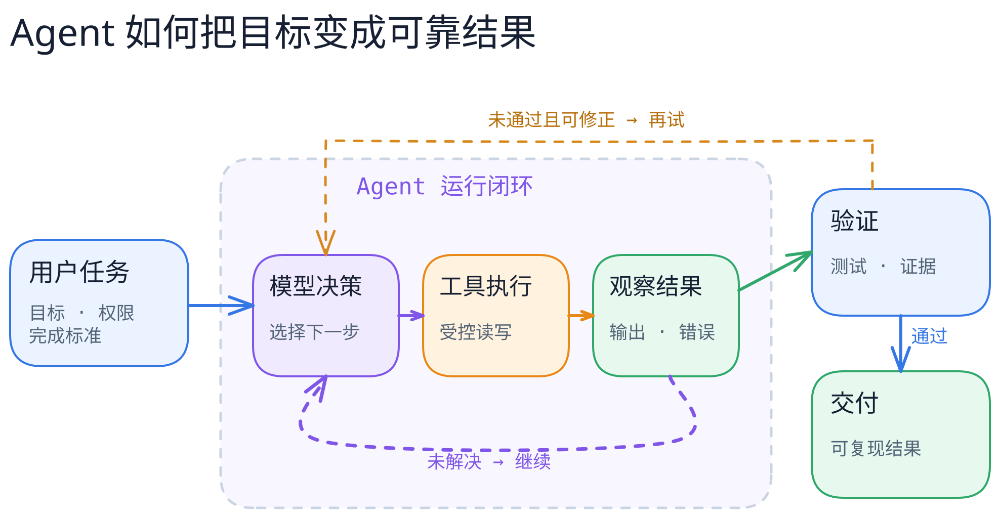

# 图解 Agent 系统

用可编辑的图、简短的文字和可核对的开源实现，理解 Agent 怎样调用工具、管理上下文与记忆、控制权限，以及判断任务是否真正完成。

[编辑这张图](figures/agent-loop/scene.excalidraw) · [PNG 预览](figures/agent-loop/preview.png) · [不看图的文字说明](figures/agent-loop/README.md)

> 当前是建仓草稿。总览图表达通用概念，不代表任何一个项目的实际内部拓扑；系统剖面须在固定源码版本上逐项核验。内容许可与公开发布将在正式发布前确定。

## 从哪里开始

| 你想解决的问题 | 入口 |
| --- | --- |
| Agent 到底怎样工作？ | [按机制学习](docs/concepts/README.md) |
| Pi、Codex 等项目分别怎样实现？ | [按开源系统阅读](docs/systems/README.md) |
| 同一个机制有哪些不同设计？ | [横向对照](docs/comparisons/README.md) |
| 哪些章节已核验，接下来做什么？ | [路线与验收计划](docs/roadmap.md) |

## 这份指南怎样组织

机制是主线，项目是案例。同一张概念图只解释一个问题；项目剖面再把概念对应到真实模块、状态和调用路径。上下文窗口、会话记录、压缩摘要、长期记忆、外部知识库会分开讲，不统称为“记忆”。

每篇项目剖面需要标明分析的仓库和 commit、实际读到的源码或官方文档、适用范围，以及哪些结论仍是推断。项目会变，固定版本的图不会自动变成新版本的事实。[来源规则](sources/README.md)

## 图和文字的关系

每张正式图都提供可编辑的 `.excalidraw`、供 Markdown 展示的 SVG、PNG 预览，以及文字说明。绘图与导出使用 [excalidraw-agent](https://github.com/chicogong/excalidraw-agent)；本地导出和交互画布需要分别检查，不能只凭工具返回“已显示”就宣称两者一致。[图稿规则](figures/README.md)

本项目只收录原创图解、必要的短引文和指向原始资料的链接；不复制其他项目的大段文档，也不公开私人研究笔记。
