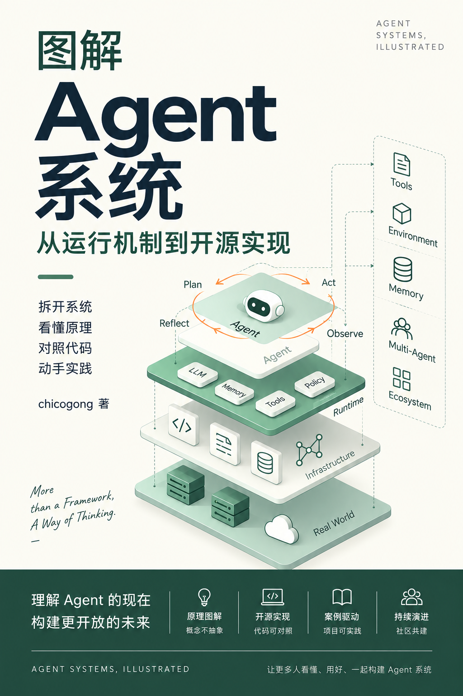

# 图解 Agent 系统

用可编辑的图、简短的文字和可核对的开源实现，理解 Agent 怎样调用工具、管理上下文与记忆、控制权限，以及判断任务是否真正完成。

[第一篇：Pi 的架构与代码路径](docs/systems/pi/README.md) · [Extensions 与 Skills](docs/systems/pi/extensions-and-skills.md) · [编辑图源](figures/pi-architecture/scene.excalidraw) · [PNG 预览](figures/pi-architecture/preview.png)

其余样章按问题进入：

| 关心的问题 | 固定源码样章 |
| --- | --- |
| 循环、工具和停止 | [OpenCode 工具状态](docs/systems/opencode/README.md)、[mini-SWE-agent 退出契约](docs/systems/mini-swe-agent/README.md)、[Qwen Code 延迟工具](docs/systems/qwen-code/README.md) |
| 权限、环境和动作 | [Codex 审批](docs/systems/codex/README.md)、[OpenHands 动作事件](docs/systems/openhands/README.md)、[Browser Use 网页行动](docs/systems/browser-use/README.md)、[OpenClaw 会话路由](docs/systems/openclaw/README.md) |
| 记忆、持久状态和研究 | [Letta Code](docs/systems/letta/README.md)、[Mem0](docs/systems/mem0/README.md)、[LangGraph checkpoint](docs/systems/langgraph/README.md)、[GPT Researcher](docs/systems/gpt-researcher/README.md) |

> 当前是公开预览筹备稿。首页图只解释 Pi 固定源码版本的局部分层，不是所有运行模式的完整拓扑；尚未做运行实测。[通用 Agent loop 概念图](figures/agent-loop/README.md)另列。许可已确定，但仓库公开、正式出版和外部读者验收尚未完成。

## 当前完成度

| 交付 | 当前状态 | 不能据此宣称 |
| --- | --- | --- |
| 12 个系统剖面 | 每个有固定源码版本的一条局部路径；部分另有代码导读 | 已审计整个项目或已做运行验证 |
| 机制与对照 | 6 篇机制专题、2 篇跨系统对照；恢复与评测等主题仍在路线图中 | 一本内容完整的 Agent 教科书 |
| 图稿 | 16 组可编辑图源、SVG、PNG 与文字说明 | 所有交互画布与导出在每种环境下像素一致 |
| 纸书 | 可从 [书稿清单与构建说明](book/README.md)导出 A4 PDF 预览 | 已完成外部试读、许可/印刷终审 |

正文和原创图采用 [CC BY 4.0](LICENSE-CONTENT.md)，`scripts/`、各图目录的 `build.py` 与自动化代码采用 [MIT](LICENSE-CODE)。上游项目仍遵守各自许可；引用链接不意味着它们为本指南背书。

## 书籍预览

[书稿顺序与 PDF 构建](book/README.md)已接入封面、前言、阅读指南、目录、正文、结语、致谢、作者简介和封底。封面是屏幕审稿图，不是 300 PPI 印刷母版；版权、页码与封底文案以仓库可维护的书稿和构建器为准，不直接采用生成图片中的占位文字。

## 从哪里开始

| 你想解决的问题 | 入口 |
| --- | --- |
| Agent 到底怎样工作？ | [按机制学习](docs/concepts/README.md) |
| 文中的状态、记忆、Skill 等词是什么意思？ | [术语表](docs/glossary.md) |
| Pi、Codex 等项目分别怎样实现？ | [按开源系统阅读](docs/systems/README.md) |
| 同一个机制有哪些不同设计？ | [横向对照](docs/comparisons/README.md) |
| 哪些章节已核验，接下来做什么？ | [路线与验收计划](docs/roadmap.md) |
| 怎样收口成书并持续更新？ | [成书与持续更新计划](docs/editorial-plan.md)、[贡献指南](CONTRIBUTING.md) |
| Pi 第一篇具体怎样推进？ | [Pi 实施计划](docs/pi-first.md) |
| 整本书如何并行推进、还会研究哪些系统？ | [实施总图](docs/program.md) |

## 这份指南怎样组织

机制是主线，项目是案例。同一张概念图只解释一个问题；项目剖面再把概念对应到真实模块、状态和调用路径。上下文窗口、会话记录、压缩摘要、长期记忆、外部知识库会分开讲，不统称为“记忆”。

每篇项目剖面需要标明分析的仓库和 commit、实际读到的源码或官方文档、适用范围，以及哪些结论仍是推断。项目会变，固定版本的图不会自动变成新版本的事实。[来源规则](sources/README.md)

## 图和文字的关系

每张正式图都提供可编辑的 `.excalidraw`、供 Markdown 展示的 SVG、PNG 预览，以及文字说明。按问题选择时序、状态、数据流或对照等形式，不把 Pi 的样式套给所有系统。绘图与导出使用 [excalidraw-agent](https://github.com/chicogong/excalidraw-agent)；本地导出和交互画布需要分别检查，不能只凭工具返回“已显示”就宣称两者一致。[图稿规则](figures/README.md) · [设计原则](figures/STYLE.md)

本项目只收录原创图解、必要的短引文和指向原始资料的链接；不复制其他项目的大段文档，也不公开私人研究笔记。
