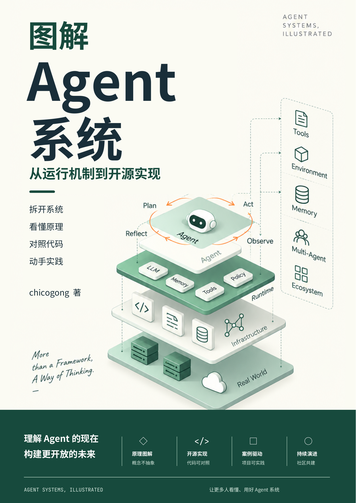

# 图解 Agent 系统

用图、可读的文字和可核对的开源实现，理解 Agent 怎样决定下一步、调用工具、管理上下文与记忆，以及在权限和失败边界下完成任务。

这是一部持续写作的开源指南，不是某个 Agent 项目的说明书。**机制是主线，项目是有版本边界的案例，横向对照解释不同实现的取舍。** 当前仓库是预览筹备稿；静态源码阅读不等于运行验证，也不代表已完成外部试读或正式出版。

## 从问题进入

| 想了解什么 | 阅读入口 |
| --- | --- |
| Agent loop、工具、上下文、记忆、权限与扩展怎样工作？ | [按机制学习](docs/concepts/README.md) |
| 模型、Harness、CLI、Skill、MCP 到底各负责什么？ | [从一项任务看五层职责](docs/concepts/model-harness-cli-mcp-skill.md) |
| Pi、Codex、OpenCode、Letta 等开源系统怎样实现一条具体路径？ | [按开源系统阅读](docs/systems/README.md) |
| 同一问题为何有不同设计？ | [横向对照](docs/comparisons/README.md) |
| 先查术语，还是按书的顺序阅读？ | [术语表](docs/glossary.md) · [阅读指南](book/frontmatter/reading-guide.md) |

第一次读可以从[五层职责](docs/concepts/model-harness-cli-mcp-skill.md)进入，再读 [Agent loop](docs/concepts/agent-loop.md)，然后分别看 [Pi 的循环与会话](docs/systems/pi/README.md)、[Codex 的执行审批](docs/systems/codex/README.md) 或 [Letta Code 的记忆可见性](docs/systems/letta/README.md)。这些图各回答一个问题，不合成一张虚构的“通用 Agent 内部架构图”。[完整系统目录](docs/systems/README.md)列出目前所有案例。

## 在哪里读

| 方式 | 用途 |
| --- | --- |
| GitHub Markdown | 直接沿正文链接阅读，查看可编辑图源、图的文字说明和固定源码链接。 |
| [可携带 Markdown 阅读包](book/README.md#markdown-阅读包) | 从同一书稿清单生成 ZIP，解压后可在普通 Markdown 阅读器或 Obsidian 中打开；章节链接与图片保留相对路径。 |
| [A4 PDF 预览](book/README.md#pdf-预览) | 定时构建供排版与打印校稿；不是自动发布的正式版本。 |

三种阅读方式共享 Markdown 正文；[书稿清单](book/manifest.txt)决定 PDF 和阅读包的章节顺序，不维护第二份复制粘贴的书稿。[写作与校稿方法](docs/editorial-plan.md)说明一章怎样从问题、来源、图稿走到可合入的内容。

## 目前的范围

现有 7 篇机制专题、12 个固定源码版本的系统局部剖面、2 篇跨系统对照和 17 组可编辑图。它们是**预览稿**：恢复与评测等机制、更多横向对照、二次来源复核及外部读者验收仍待完成。[当前状态与下一步](docs/roadmap.md)是唯一进度入口；[选题地图](docs/program.md)收录候选，但列入候选不等于已经核验。

每篇系统剖面应说明上游仓库与 commit、读到的源码或官方文档、结论适用范围，以及事实、推断和未知的区别。[来源规则](sources/README.md) · [图稿与导出规则](figures/README.md) · [贡献指南](CONTRIBUTING.md)

原创正文和图采用 [CC BY 4.0](LICENSE-CONTENT.md)，脚本与工作流采用 [MIT](LICENSE-CODE)。上游项目遵守各自许可；链接不表示它们为本书背书。仓库公开、正式出版、许可终审与印刷验收是独立步骤，不由构建成功自动完成。
