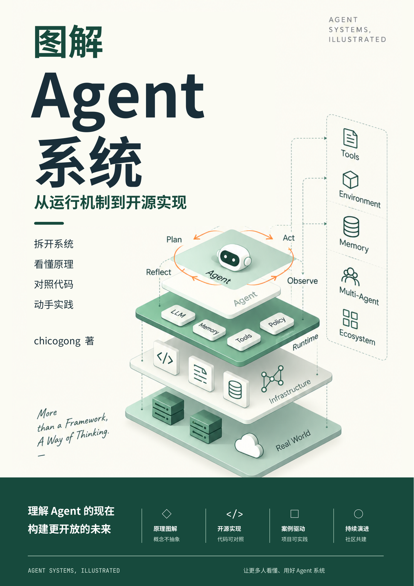
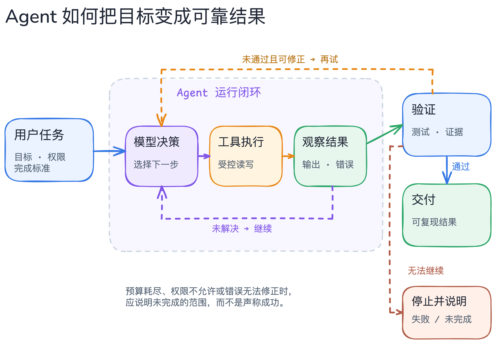
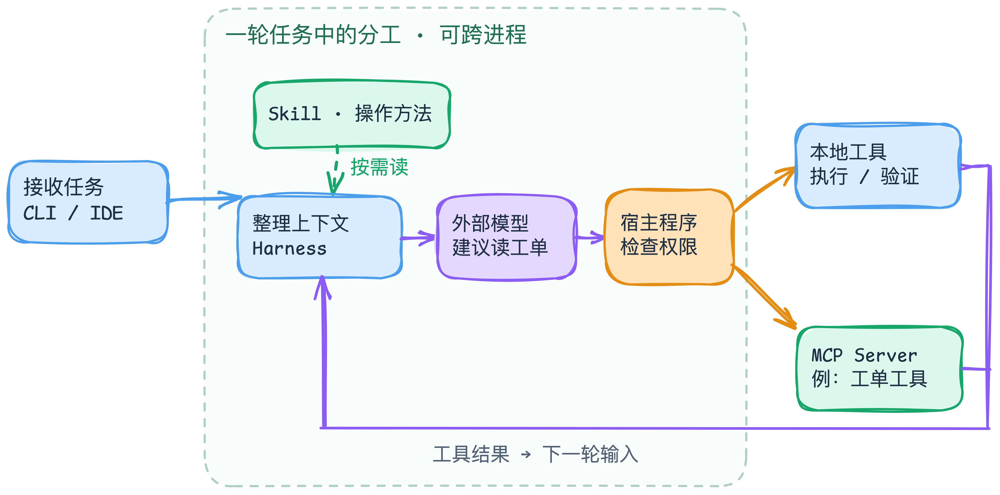
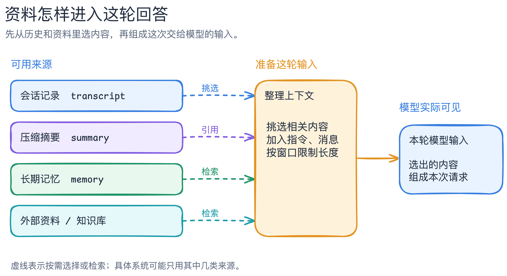
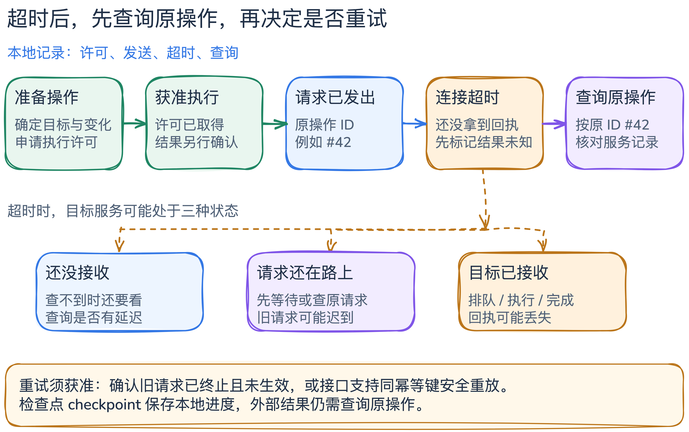
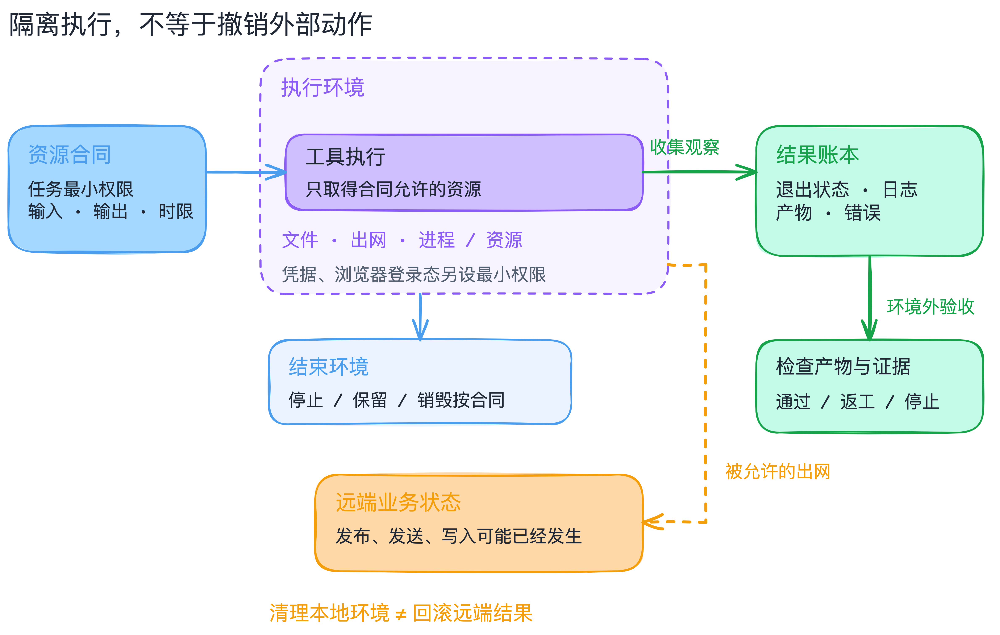
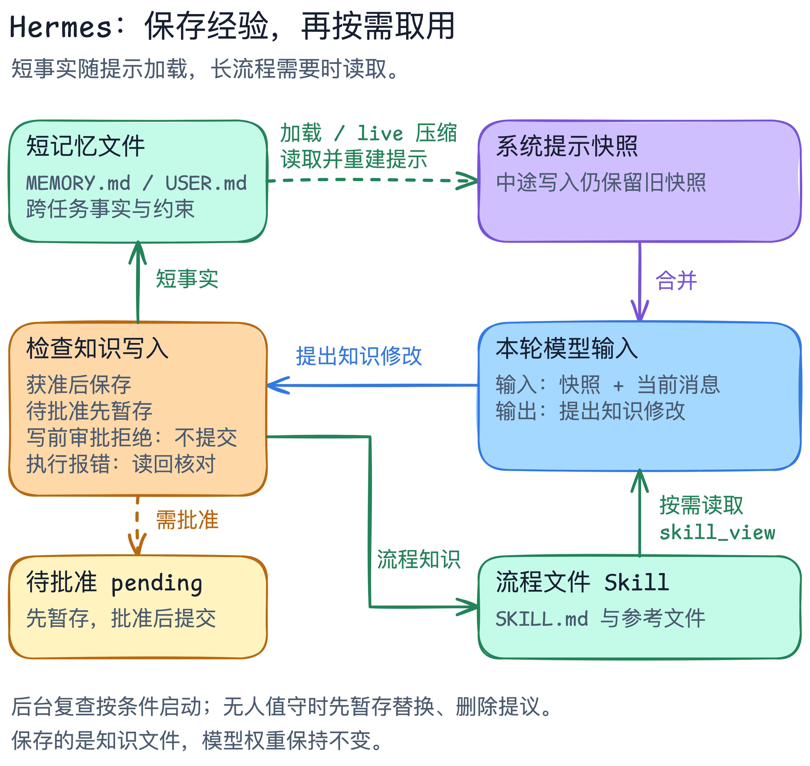

# 图解 Agent 系统

**从第一轮 Agent 循环，到 Pi、Codex 等开源实现：看图理解原理，沿代码核对边界，动手验证结果。**

[在线阅读](https://books.aimake.cc/) · [从零开始](docs/learning-path.md) · [按书序阅读](book/CONTENTS.md) · [PDF 电子校样](https://books.aimake.cc/pdf) · [反馈勘误](https://books.aimake.cc/feedback)

一个 Agent 不只是“模型会调用工具”。它要决定下一步、获得执行许可、处理工具返回、选择进入下一轮的上下文，并在失败或中断后说明**到底发生了什么**。这本书围绕这些问题展开：先给读得懂的机制图与练习，再走进固定版本的开源代码，最后比较不同设计的取舍。

这是**持续更新的公开预览稿**，不是产品排行榜，也不是“所有 Agent 共用一套内部架构”的示意图。系统篇只解释已定位的局部源码路径；没有运行过的行为不会写成实测。

## 翻几张图，看看书里怎么讲

图不是装饰：每张图只回答一个问题，章节会把正常路径、失败分支、关键代码和适用边界讲清楚。点缩略图可打开原尺寸 SVG；每组图另有可编辑 `.excalidraw` 和不看图也能读的文字版。

| 从目标到可验收结果 | 模型、Harness、CLI、Skill、MCP 怎样分工 |
| --- | --- |
|  |  |
| [读 Agent loop 与第一条练习](docs/concepts/agent-loop.md) | [读五层职责与工具边界](docs/concepts/model-harness-cli-mcp-skill.md) |
| **存着，不等于模型这轮看见** | **超时后为什么要先对账** |
|  |  |
| [读上下文与记忆](docs/concepts/context-vs-memory.md) | [读审批、恢复与回执丢失实验](docs/comparisons/permission-and-recovery.md) |
| **清理沙箱，不等于撤销远端动作** | **知识暂存、正式保存、本轮可见不是一回事** |
|  |  |
| [读沙箱与生命周期](docs/concepts/sandbox-execution.md) | [读 Hermes 的知识维护路径](docs/systems/hermes/README.md) |

这些是缩略预览，不用缩略图判断小字是否清晰；需要放大时打开 SVG。完整图册及导出约束见[图稿索引](figures/README.md)。

## 你可以怎样读

- **第一次接触 Agent：**沿[四层学习路线](docs/learning-path.md)走。先看循环，再运行[提案、执行与验收练习](docs/labs/first-agent-loop.md)；不需要 API Key，Python 标准库即可。随后用[上下文预算练习](docs/labs/context-budget.md)区分保存与可见，再尝试[回执丢失后的对账练习](docs/labs/remote-effect.md)，理解“没有收到答复”为什么不等于“没有执行”。
- **想读懂一个项目：**从 [Pi 的运行核心与外壳](docs/systems/pi/README.md)或[Codex 的命令审批与执行](docs/systems/codex/README.md)开始。系统篇给出上游仓库、固定 commit、关键源码位置、正常/失败路径与未验证范围，不要求把整个仓库从头读完。
- **正在设计自己的系统：**按问题查[机制](docs/concepts/README.md)、[跨系统对照](docs/comparisons/README.md)和[术语表](docs/glossary.md)。例如工具权限、上下文预算、记忆可见性、委派交接、checkpoint、评测和外部副作用，不必先选“最佳框架”。

## 内容地图

| 章节类型 | 你会得到什么 | 从这里试看 |
| --- | --- | --- |
| **机制图解** | 一条任务怎样经过模型、工具、上下文、记忆、权限和恢复；图旁写明例子与反例 | [Agent loop](docs/concepts/agent-loop.md) · [MCP、Skill 与工具](docs/concepts/mcp-skill-tool-lifecycle.md) · [观察与评测](docs/concepts/observation-evaluation.md) |
| **开源源码剖面** | 固定版本中的一条可追踪调用链：入口、状态、关键分支、副作用、停止条件 | [Pi](docs/systems/pi/README.md) · [OpenCode](docs/systems/opencode/README.md) · [LangGraph](docs/systems/langgraph/README.md) |
| **横向对照** | 同一问题的不同设计与代价，不拿不同层次的产品凑功能榜 | [循环与停止](docs/comparisons/loop-and-stop.md) · [四种状态](docs/comparisons/four-kinds-of-state.md) · [权限与恢复](docs/comparisons/permission-and-recovery.md) |
| **动手练习** | 可运行的输入、预期轨迹、测试、自测题和明确的模拟边界 | [第一轮 Agent](docs/labs/first-agent-loop.md) · [上下文预算](docs/labs/context-budget.md) · [远端结果未知](docs/labs/remote-effect.md) |

系统案例覆盖 Pi、DSH（DeepSeek Harness）、Codex、OpenCode、mini-SWE-agent、OpenHands、Browser Use、Qwen Code、Kimi Code、MiMo Code、Letta Code、Hermes Agent、Mem0、LangGraph、OpenClaw 与 GPT Researcher。它们分属编码助手、运行框架、记忆组件等不同层次；**入书理由是能解释一种架构取舍，不是热度或 Star 数。**逐篇范围见[系统索引](docs/systems/README.md)，候选及后续教学安排见[选题地图](docs/program.md)与[扩写计划](docs/curriculum-expansion.md)。

执行面也单独讲：[沙箱](docs/concepts/sandbox-execution.md)区分容器、gVisor、microVM、远端环境和策略治理；[Computer／Browser Use](docs/concepts/computer-and-browser-use.md)拆开截图坐标、DOM／AX与宿主动作。再用[不可信观察与假完成练习](docs/labs/evidence-contract.md)检查“危险提案被拒绝”和“工具成功但证据不合格”——不需要先装一套复杂框架。

## 选择顺手的阅读方式

| 入口 | 适合什么场景 |
| --- | --- |
| [在线阅读站](https://books.aimake.cc/) | 手机阅读、章节导航、搜索和反馈；公开站按人工发布批次更新。 |
| [GitHub 书序目录](book/CONTENTS.md) | 直接看唯一的 Markdown 源稿、代码链接、图源和修订历史。 |
| [可携带 Markdown 阅读包](book/README.md#markdown-阅读包) | 导入 Obsidian 或普通 Markdown 阅读器；相对链接、图与入门练习的代码随包保留。 |
| [PDF 电子校样](https://books.aimake.cc/pdf) | 固定页序浏览、批注和下载；它不是印刷母版，更新不由每周 Action 自动覆盖。 |

正文只维护一份。`book/manifest.txt` 决定 GitHub 目录、网站、PDF 和阅读包的书序；导出物不是第二份稿件。线上站与本地仓库可能处于不同发布批次，**精确篇数、页数和验收缺口以[当前状态](docs/roadmap.md)为准**。

## 证据、图源与参与

每篇系统文章区分**源码事实、官方文档、运行观察、工程推断与未知**；上游版本记录在[来源台账](sources/README.md)。图的 `.excalidraw`、SVG、PNG 与文字说明成组维护；图稿排版遵循[风格与可读性规则](figures/STYLE.md)。通过脚本测试不等于真实产品通过端到端验证，更不等于读者已经读懂。[写作与校稿方法](docs/editorial-plan.md)和[出版验收单](docs/publication-checklist.md)公开了进入预览稿、正式版和印刷版各自的门槛。

欢迎带着**具体章节、固定版本链接、复现步骤或图中哪条箭头有问题**提交反馈：[网站勘误入口](https://books.aimake.cc/feedback) · [贡献指南](CONTRIBUTING.md)。作者联系邮箱：[ghr7719@gmail.com](mailto:ghr7719@gmail.com)。

本书原创文字与图使用 [CC BY 4.0](LICENSE-CONTENT.md)，构建脚本使用 [MIT](LICENSE-CODE)；上游项目、商标和第三方素材遵守各自许可。本仓公开的是持续完善的预览稿，不表示完整源码审计、外部读者验收或正式出版已经完成。[封面与书脊设计参考](book/assets/README.md)也不等同于印厂可直接使用的文件。
