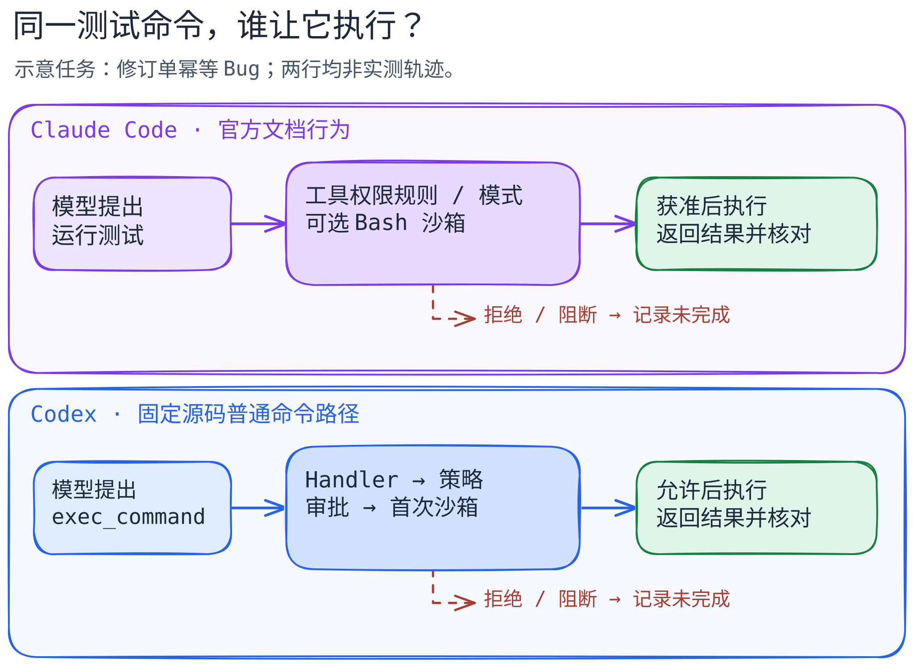

# Claude Code 与 Codex：同一修复任务如何执行与受控？

[返回横向对照](README.md) · [先读五层职责](../concepts/model-harness-cli-mcp-skill.md) · [Codex 命令路径](../systems/codex/README.md)

读完本篇，应能在一次编码任务里分清四件事：**模型建议做什么、运行器允许做什么、沙箱让进程实际触及什么、工具结果证明了什么**。两套产品都能从终端接收任务并反复使用工具，但具体权限取决于入口、配置和环境，不能把“命令出现在对话中”当作“命令已执行”。

> **证据范围（2026-09-23 核对）。** Codex 的命令关口引用官方开源仓库 [`openai/codex@c44deff7b1083e9660ac55d02122481f1cdf139b`](https://github.com/openai/codex/tree/c44deff7b1083e9660ac55d02122481f1cdf139b) 的 Rust core；CLI、Skill、MCP 和一般安全用法同时参照官方文档。Claude Code 只按官方产品文档描述外部可观察的行为与配置接口；本篇没有对应的公开 harness 源码版本可作同粒度对照。下方任务是**推演示例，不是两套产品的同环境实测**。官方文档会更新，固定源码结论仅适用于所引提交和路径。

[可编辑图源](../../figures/claude-code-codex/scene.excalidraw) · [PNG 预览](../../figures/claude-code-codex/preview.png) · [图的文字版](../../figures/claude-code-codex/README.md)

## 先固定同一任务

本篇使用一条独立的教学任务：假设同一份干净仓库有一个订单幂等性 Bug，使用同一幂等键重复 `POST /orders` 时出现两笔订单。给两边的请求完全相同：“先读项目规则和工单 #731，补一个失败的回归测试，再改实现并跑相关测试；不要提交或推送，只给出补丁摘要与测试结果。”工单、文件名和输出均为**虚构样本**。假设已配置能读取工单的 MCP 服务，且仓库有可选的测试方法 Skill。对比前还须固定仓库提交、工作区脏状态、模型、环境、权限模式、可用连接与测试命令；本篇没有做这样的运行实验。

用这条任务读两边，可按以下观察点记录轨迹：

1. **进入与取上下文。** 人从 `claude` 或 `codex` 提交目标；非交互入口分别可用 [`claude -p`](https://code.claude.com/docs/en/headless) 与 [`codex exec`](https://learn.chatgpt.com/docs/non-interactive-mode)。Claude Code 文档称启动目录、Git 状态和 `CLAUDE.md` 可进入其工作上下文；Codex 的项目指令入口是 `AGENTS.md`。这决定模型可能先读到哪些约束，但项目指令不是 OS 权限。[Claude Code 工作方式](https://code.claude.com/docs/en/how-claude-code-works) · [Codex `AGENTS.md`](https://learn.chatgpt.com/docs/agent-configuration/agents-md)
2. **读取工单与方法。** 两边都可通过已配置的 MCP 连接访问外部工具，也可按需加载 Skill 的做事说明。Skill 中的“先写测试”是流程指导；MCP 服务的连接、身份与权限才决定能否读取工单。若连接失败，轨迹应写“工单未核对”，不能用模型摘要补足证据。[Claude Code MCP](https://code.claude.com/docs/en/mcp) · [Claude Code Skills](https://code.claude.com/docs/en/skills) · [Codex MCP](https://learn.chatgpt.com/docs/extend/mcp?surface=cli) · [Codex Skills](https://learn.chatgpt.com/docs/build-skills)
3. **提出本地行动。** 模型可能建议搜索代码、编辑测试、运行 `npm test -- orders`。Claude Code 官方将循环概括为收集上下文、行动、验证，工具结果返回下一步判断；这是产品文档层面的行为，不代表已知内部调度函数。Codex 的固定源码可继续追到普通 `exec_command`：Handler 解析参数与权限，Unified Exec 取得策略决定，再由 Orchestrator 处理审批和执行。[Claude Code 循环](https://code.claude.com/docs/en/how-claude-code-works) · [Codex 代码导读](../systems/codex/code-walkthrough.md)
4. **过行动关口。** Claude Code 的有效权限规则、模式与沙箱设置共同影响测试命令是否被询问、允许或拒绝：启用沙箱且 `autoAllowBashIfSandboxed` 生效时，沙箱边界可替代某些整工具 Bash 询问；内容限定的 ask 和显式 deny 等规则仍适用。命令运行时，OS 沙箱限制其及子进程的文件与网络访问。Codex 固定源码中的普通命令先得到 `Skip`、`NeedsApproval` 或 `Forbidden`；允许继续后，沙箱选择仍是另一阶段。`Skip` 不等于无沙箱，沙箱拒绝也不保证提权重试。[Claude Code 权限与沙箱交互](https://code.claude.com/docs/en/permissions#how-permissions-interact-with-sandboxing) · [Codex 策略映射](https://github.com/openai/codex/blob/c44deff7b1083e9660ac55d02122481f1cdf139b/codex-rs/core/src/exec_policy.rs#L394-L460) · [Codex 编排](https://github.com/openai/codex/blob/c44deff7b1083e9660ac55d02122481f1cdf139b/codex-rs/core/src/tools/orchestrator.rs#L151-L309)
5. **验证与停止。** 测试工具返回退出码和输出后，模型可继续修补或报告结果。若命令被拒绝、沙箱挡住、MCP 无法连接，或测试失败，应分别报告实际状态；“写出了补丁”“测试通过”“工单已更新”“用户接受”互不蕴含。本任务禁止提交、推送，故最终交付只应是变更摘要与已有验证证据，而非远端副作用。

## 同一尺度看控制边界

| 问题 | Claude Code：官方文档可见 | Codex：固定源码与官方文档可见 |
| --- | --- | --- |
| 谁推动下一步？ | 模型根据工具结果继续选择；Claude Code 提供工具与上下文管理。官方把任务过程概括为收集、行动、验证。 | 模型提出工具调用；本篇固定源码只追 `exec_command` 的执行关口，不推断全部回合调度。 |
| 项目约定从哪里来？ | `CLAUDE.md` 是文档化入口；其他文件需按任务读取。 | `AGENTS.md` 是文档化入口。两者都是指令上下文，不会自行授予工具权限。 |
| 命令何时能运行？ | 有效权限模式、allow/ask/deny 规则、可选 hook 与沙箱设置共同影响是否询问和继续；沙箱可替代部分整工具 Bash 询问，具体结果须看有效设置。 | 此提交的普通 `exec_command` 经 Handler、exec policy、Orchestrator；`Forbidden` 停止，`NeedsApproval` 请求批准，`Skip` 免普通询问。 |
| 沙箱限制什么？ | 文档化的 sandboxed Bash 对 shell 命令及子进程施加文件系统和网络限制；并非所有工具都由 Bash 沙箱覆盖。 | 沙箱与审批分别判断；首次尝试及有条件重试见固定源码。各 OS 与执行环境的实际效果需要另测。 |
| Skill / MCP 做什么？ | Skill 是按需使用的指导；MCP 给外部服务工具。连接和权限配置仍决定动作。 | 官方文档也分别提供 Skills 与 MCP；本篇没有把它们误写成上述 `exec_command` 的同一调用栈。 |
| 能证明修复成功吗？ | 必须检查实际 diff、测试输出和要求的外部状态。文档中的循环描述不能替代任务轨迹。 | 同理；固定源码能证明关口的可能分支，不能证明本例测试已跑或 Bug 已修复。 |

这不是性能、安全性或“谁更自主”的排名：表格两列证据颗粒度不同。Claude Code 的权限文档描述了可配置的产品行为，Codex 的源码只覆盖某一实现版本的局部命令路径。不能因为右列能列出 Rust 类型名，就假设左列也有同构类型、相同默认值或相同失败恢复顺序。

## 容易走错的三处

**审批与隔离各回答一个问题。** 审批回答“这次工具动作是否获准”；沙箱回答“运行的进程实际能访问哪里”。Claude Code 文档区分工具权限和只覆盖 Bash 等命令的 OS 沙箱，但两层配置会共同影响询问行为；Codex 固定源码在策略决定之后选择首次执行沙箱。若一个 MCP 工具能写远端工单，它不因为本地 shell 有沙箱就自动受到相同限制。[Claude Code 边界](https://code.claude.com/docs/en/permissions#how-permissions-interact-with-sandboxing) · [Codex 首次沙箱](https://github.com/openai/codex/blob/c44deff7b1083e9660ac55d02122481f1cdf139b/codex-rs/core/src/tools/orchestrator.rs#L222-L309)

**失败结果仍是下一轮的输入。** 工单读取失败就缺少复现依据；命令审批被拒绝就没有该次测试结果；命令运行了但测试失败，才有真实的失败输出可用于修补。Codex 的沙箱拒绝是否重试受具体条件约束，不能画成必经成功路径；Claude Code 的官方文档没有给出与这段 Codex 源码一一对应的内部重试函数，所以这里保持未知。[Codex 重试分支](https://github.com/openai/codex/blob/c44deff7b1083e9660ac55d02122481f1cdf139b/codex-rs/core/src/tools/orchestrator.rs#L310-L506)

**上下文会变化，记录不等于当前可见。** Claude Code 文档说明会话可保存和续接，长上下文会自动压缩；早期细节可能丢失。Codex 的本篇固定路径没有覆盖上下文压缩；[官方对长任务的说明](https://developers.openai.com/blog/run-long-horizon-tasks-with-codex)只可帮助理解一般循环，不能补成同级源码比较。要验证长任务是否仍遵守“不要推送”，应查看实际有效指令与行动轨迹，不能只凭会话文件存在。[Claude Code 上下文](https://code.claude.com/docs/en/how-claude-code-works)

## 新手怎样读源码与文档

先沿[五层职责](../concepts/model-harness-cli-mcp-skill.md)区分模型、Harness、CLI、Skill、MCP，再把上面的任务写成“输入 → 工具提案 → 权限/沙箱 → 工具结果 → 下一轮或停止”。读 Codex 时，从 [`ExecCommandHandler::handle_call`](https://github.com/openai/codex/blob/c44deff7b1083e9660ac55d02122481f1cdf139b/codex-rs/core/src/tools/handlers/unified_exec/exec_command.rs#L170-L245) 出发，接 [`UnifiedExecProcessManager::open_session_with_sandbox`](https://github.com/openai/codex/blob/c44deff7b1083e9660ac55d02122481f1cdf139b/codex-rs/core/src/unified_exec/process_manager.rs#L1435-L1535)、[`exec_policy`](https://github.com/openai/codex/blob/c44deff7b1083e9660ac55d02122481f1cdf139b/codex-rs/core/src/exec_policy.rs#L394-L460) 与 [`ToolOrchestrator::run`](https://github.com/openai/codex/blob/c44deff7b1083e9660ac55d02122481f1cdf139b/codex-rs/core/src/tools/orchestrator.rs#L116-L220)。特殊 `apply_patch` 分支、平台沙箱和其他工具要另读，不可外推。[逐步代码导读](../systems/codex/code-walkthrough.md)

读 Claude Code 时，以[工作方式](https://code.claude.com/docs/en/how-claude-code-works)、[权限](https://code.claude.com/docs/en/permissions)、[沙箱](https://code.claude.com/docs/en/sandboxing)、[MCP](https://code.claude.com/docs/en/mcp)和[Skill](https://code.claude.com/docs/en/skills)的公开接口为入口。能记录“这套设置下命令是否被问询、是否运行、返回了什么”；不能据界面反推出未公开的 harness 函数名、判断顺序或提示内容。若将来需要实测，保存去敏的配置、两套 CLI 版本、同一仓库提交、完整工具事件与测试日志，再把观察结果作为第三种证据加入，而不是改写成源码事实。

## 读完自测

1. 模型写出 `npm test`，能否说测试已执行？不能；先查工具是否获准与实际结果。
2. 审批通过是否意味着命令能访问任意文件和网络？不能；沙箱与环境边界仍可能限制它。
3. 两边都有 Skill 和 MCP，能否把它们配置成同一套文件并声称行为相同？不能；只能比较它们在任务中的职责，具体加载和权限需分别核对。
