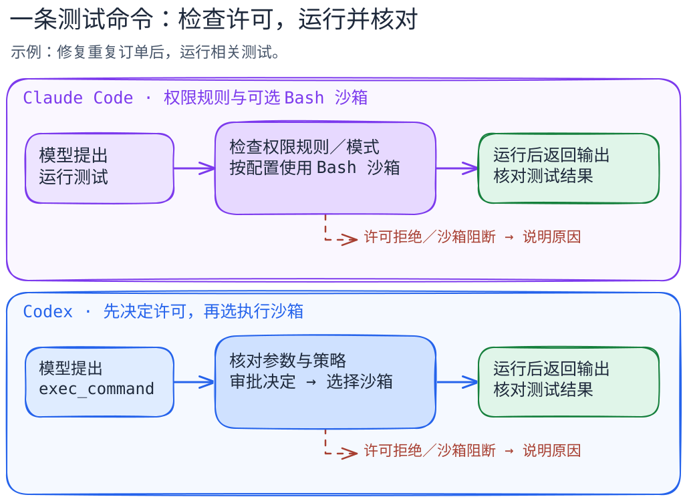

# Claude Code 与 Codex：同一修复任务如何执行与受控？

[返回横向对照](README.md) · [先读五层职责](../concepts/model-harness-cli-mcp-skill.md) · [Codex 命令路径](../systems/codex/README.md)

让编码助手修一个 Bug，你希望最后拿到两样东西：相关文件的改动，以及检查这些改动的测试结果。Claude Code 和 Codex 都能从终端接收任务、使用工具、根据结果继续工作。下面沿一次修复过程，看看模型提出建议后，运行器怎样安排执行，权限和沙箱又放在哪里。

> **证据范围（2026-09-23 核对）。** Codex 的命令关口引用官方开源仓库 [`openai/codex@c44deff7b1083e9660ac55d02122481f1cdf139b`](https://github.com/openai/codex/tree/c44deff7b1083e9660ac55d02122481f1cdf139b) 的 Rust core；CLI、Skill、MCP 和一般安全用法同时参照官方文档。Claude Code 只按官方产品文档描述外部可观察的行为与配置接口；本篇没有对应的公开 harness 源码版本可作同粒度对照。下方任务是**推演示例，不是两套产品的同环境实测**。官方文档会更新，固定源码结论仅适用于所引提交和路径。

[可编辑图源](../../figures/claude-code-codex/scene.excalidraw) · [PNG 预览](../../figures/claude-code-codex/preview.png) · [图的文字版](../../figures/claude-code-codex/README.md)

## 先固定同一任务

假设一个订单服务有这样的 Bug：同一请求重复发送时，产生了两笔订单。服务原本应按“幂等键”识别重复请求——同一操作的标记保持相同，服务按规则返回原结果。给两边相同的要求：“先读项目规则和工单 #731，补一个失败的回归测试，再改实现并跑相关测试；不要提交或推送，只给出补丁摘要与测试结果。”

这是虚构的教学任务。我们假设已配置读取工单的 MCP 服务，还有可选的测试方法 Skill（任务做法说明）。先用图理解流程；真正做公平的运行比较时，还要固定仓库提交、已有改动、模型、环境、权限、连接和测试命令。本篇尚未进行这种实验。

用这条任务读两边，可按以下观察点记录轨迹：

1. **提交任务，读取约定。** 人从 `claude` 或 `codex` 提交目标；自动化入口分别有 [`claude -p`](https://code.claude.com/docs/en/headless) 与 [`codex exec`](https://developers.openai.com/codex/noninteractive)。Claude Code 文档说明启动目录、Git 状态和 `CLAUDE.md` 可进入工作上下文；Codex 使用 `AGENTS.md` 读取项目指令。这些文件说明怎么做，工具权限另有配置。[Claude Code 工作方式](https://code.claude.com/docs/en/how-claude-code-works) · [Codex `AGENTS.md`](https://developers.openai.com/codex/guides/agents-md)
2. **取回工单，加载方法。** MCP 连接提供工单读取工具，连接的身份与权限决定可访问内容；Skill 可以提供“先写测试”的方法说明。助手拿到工单原文后，再用它定位问题。连接失败时，就把“工单未核对”列为待办。[Claude Code MCP](https://code.claude.com/docs/en/mcp) · [Claude Code Skills](https://code.claude.com/docs/en/skills) · [Codex MCP](https://developers.openai.com/codex/mcp) · [Codex Skills](https://developers.openai.com/codex/skills)
3. **提出搜索、修改和测试动作。** 模型可能选择搜索代码、编辑测试、运行 `npm test -- orders`。Claude Code 官方将过程概括为收集上下文、行动、验证。Codex 源码可进一步追到 `exec_command`：Handler 解析调用参数，Unified Exec 获取策略决定，Orchestrator（执行编排器）处理审批与执行。[Claude Code 循环](https://code.claude.com/docs/en/how-claude-code-works) · [Codex 代码导读](../systems/codex/code-walkthrough.md)
4. **按权限和沙箱设置执行。** Claude Code 的规则、模式与沙箱共同影响测试命令是否询问、允许或拒绝。启用沙箱且 `autoAllowBashIfSandboxed` 生效时，可省去某些整工具 Bash 询问；内容限定的 ask 和显式 deny 仍适用。命令运行时，OS 沙箱限制它和子进程的文件与网络访问。Codex 普通命令先得到 `Skip`（免普通询问）、`NeedsApproval`（请求确认）或 `Forbidden`（禁止）；允许后再选沙箱。重试也有单独条件。[Claude Code 权限与沙箱交互](https://code.claude.com/docs/en/permissions#how-permissions-interact-with-sandboxing) · [Codex 策略映射](https://github.com/openai/codex/blob/c44deff7b1083e9660ac55d02122481f1cdf139b/codex-rs/core/src/exec_policy.rs#L394-L460) · [Codex 编排](https://github.com/openai/codex/blob/c44deff7b1083e9660ac55d02122481f1cdf139b/codex-rs/core/src/tools/orchestrator.rs#L151-L309)
5. **查看测试，交付结果。** 测试返回后，模型根据输出继续修补或形成报告。报告列出改动文件、实际运行的命令和结果，再列未完成项。本任务只允许本地修复，所以交付是补丁摘要与测试记录；工单更新、提交和推送需要另外授权。

## 同一尺度看控制边界

| 问题 | Claude Code：官方文档可见 | Codex：固定源码与官方文档可见 |
| --- | --- | --- |
| 谁推动下一步？ | 模型根据工具结果继续选择；Claude Code 提供工具与上下文管理。官方把任务过程概括为收集、行动、验证。 | 模型提出工具调用；本篇固定源码只追 `exec_command` 的执行关口，不推断全部回合调度。 |
| 项目约定从哪里来？ | `CLAUDE.md` 是文档化入口；其他文件需按任务读取。 | `AGENTS.md` 是文档化入口。两者都是指令上下文，不会自行授予工具权限。 |
| 命令何时能运行？ | 有效权限模式、allow/ask/deny 规则、可选 hook 与沙箱设置共同影响是否询问和继续；沙箱可替代部分整工具 Bash 询问，具体结果须看有效设置。 | 此提交的普通 `exec_command` 经 Handler、exec policy、Orchestrator；`Forbidden` 停止，`NeedsApproval` 请求批准，`Skip` 免普通询问。 |
| 沙箱限制什么？ | 文档化的 sandboxed Bash 对 shell 命令及子进程施加文件系统和网络限制；并非所有工具都由 Bash 沙箱覆盖。 | 沙箱与审批分别判断；首次尝试及有条件重试见固定源码。各 OS 与执行环境的实际效果需要另测。 |
| Skill / MCP 做什么？ | Skill 是按需使用的指导；MCP 给外部服务工具。连接和权限配置仍决定动作。 | 官方文档也分别提供 Skills 与 MCP；本篇没有把它们误写成上述 `exec_command` 的同一调用栈。 |
| 修复怎样检查？ | 查看实际 diff、测试输出和任务要求的外部状态。 | 查看同样的任务产物；源码定位帮助解释命令经过哪些判断。 |

两列的阅读入口不同：Claude Code 以公开配置和产品行为为主，Codex 还可沿某个版本的 Rust 代码深入。因此可以比较控制职责，内部类型、默认值和恢复顺序则要各自核对。

## 遇到不同结果时怎样处理

**审批与隔离各回答一个问题。** 审批回答“这次工具动作是否获准”；沙箱回答“运行的进程实际能访问哪里”。Claude Code 文档区分工具权限和只覆盖 Bash 等命令的 OS 沙箱，但两层配置会共同影响询问行为；Codex 固定源码在策略决定之后选择首次执行沙箱。若一个 MCP 工具能写远端工单，它不因为本地 shell 有沙箱就自动受到相同限制。[Claude Code 边界](https://code.claude.com/docs/en/permissions#how-permissions-interact-with-sandboxing) · [Codex 首次沙箱](https://github.com/openai/codex/blob/c44deff7b1083e9660ac55d02122481f1cdf139b/codex-rs/core/src/tools/orchestrator.rs#L222-L309)

**按返回结果选择下一步。** 工单读取失败，就先补复现依据；命令被拒绝，就先处理许可；测试跑了但失败，就用失败输出继续修补。Codex 的沙箱拒绝能否重试，按对应条件判断。Claude Code 文档未公开同粒度的内部重试函数，这部分留待其他证据。[Codex 重试分支](https://github.com/openai/codex/blob/c44deff7b1083e9660ac55d02122481f1cdf139b/codex-rs/core/src/tools/orchestrator.rs#L310-L506)

**长任务里也要保留关键要求。** Claude Code 文档说明会话可保存、续接，长上下文会自动压缩，早期细节可能丢失。“不要推送”这样的限制，应在实际有效指令与行动记录中核对。Codex 的本篇路径未覆盖压缩；[官方长任务说明](https://developers.openai.com/blog/run-long-horizon-tasks-with-codex)可作为额外阅读。[Claude Code 上下文](https://code.claude.com/docs/en/how-claude-code-works)

## 源码与文档入口（可选深入）

先沿[五层职责](../concepts/model-harness-cli-mcp-skill.md)区分模型、Harness、CLI、Skill、MCP，再把上面的任务写成“输入 → 工具提案 → 权限/沙箱 → 工具结果 → 下一轮或停止”。读 Codex 时，从 [`ExecCommandHandler::handle_call`](https://github.com/openai/codex/blob/c44deff7b1083e9660ac55d02122481f1cdf139b/codex-rs/core/src/tools/handlers/unified_exec/exec_command.rs#L170-L245) 出发，接 [`UnifiedExecProcessManager::open_session_with_sandbox`](https://github.com/openai/codex/blob/c44deff7b1083e9660ac55d02122481f1cdf139b/codex-rs/core/src/unified_exec/process_manager.rs#L1435-L1535)、[`exec_policy`](https://github.com/openai/codex/blob/c44deff7b1083e9660ac55d02122481f1cdf139b/codex-rs/core/src/exec_policy.rs#L394-L460) 与 [`ToolOrchestrator::run`](https://github.com/openai/codex/blob/c44deff7b1083e9660ac55d02122481f1cdf139b/codex-rs/core/src/tools/orchestrator.rs#L116-L220)。特殊 `apply_patch` 分支、平台沙箱和其他工具要另读，不可外推。[逐步代码导读](../systems/codex/code-walkthrough.md)

读 Claude Code 时，以[工作方式](https://code.claude.com/docs/en/how-claude-code-works)、[权限](https://code.claude.com/docs/en/permissions)、[沙箱](https://code.claude.com/docs/en/sandboxing)、[MCP](https://code.claude.com/docs/en/mcp)和[Skill](https://code.claude.com/docs/en/skills)的公开接口为入口。能记录“这套设置下命令是否被问询、是否运行、返回了什么”；不能据界面反推出未公开的 harness 函数名、判断顺序或提示内容。若将来需要实测，保存去敏的配置、两套 CLI 版本、同一仓库提交、完整工具事件与测试日志，再把观察结果作为第三种证据加入，而不是改写成源码事实。

## 试着写一份任务说明

给自己常用的编码助手写五行：目标、允许修改的文件、测试命令、需要你确认的动作、最终交付内容。用本篇图在每行旁标出它对应的入口，再检查执行结果。即使暂时不运行代码，这也是一份可用的任务约定。

本篇比较控制流程，尚未比较两套产品的速度、安全性或同任务完成率。Claude Code 的闭源内部实现保持未知，Codex 的特殊 `apply_patch`、平台沙箱及其他工具也需要另读。
