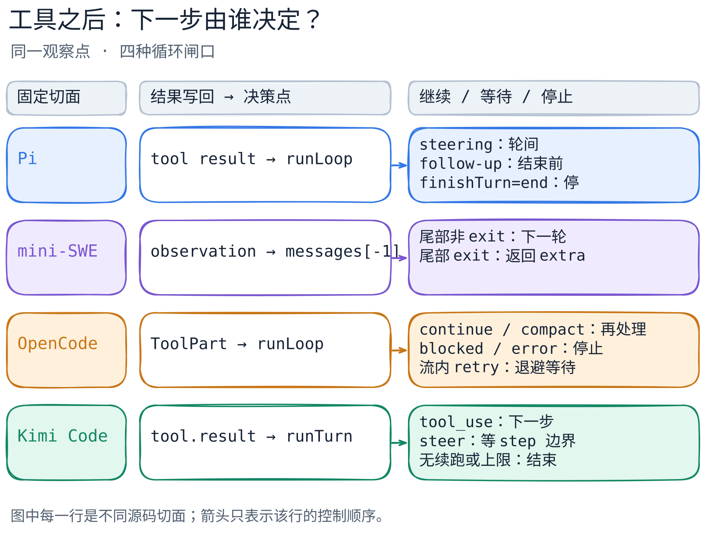

# 一轮工具调用后，谁决定下一步？

[返回横向对照](README.md)

假设模型要求运行一条命令，命令已经返回。**工具返回只是一个观察点，不等于 Agent 结束。**下一步可能再请求模型、等待当前调用或人工处理、也可能结束；决定权落在各项目的循环和停止契约中。下表对齐的是固定源码的一条路径，不是四个产品的功能排名。四篇均于 2026-09-23 核对，均为静态源码阅读，未录制同一任务的运行轨迹。

[图的文字版](../../figures/loop-and-stop/README.md) · [可编辑图源](../../figures/loop-and-stop/scene.excalidraw) · [PNG 预览](../../figures/loop-and-stop/preview.png)

| 固定范围 | 触发：谁决定下一步 | 状态：看什么 | 工具结果写回 | 停止、拒绝与等待 |
| --- | --- | --- | --- | --- |
| [Pi 核心循环](../systems/pi/code-walkthrough.md) | `runLoop`；`finishTurn` 可改判。 | 消息、工具批次、steering / follow-up 队列。 | tool result；执行失败标 `isError`。 | `finishTurn=end` 优先停；steering 等轮间，follow-up 等结束点。 |
| [mini-SWE 基类](../systems/mini-swe-agent/code-walkthrough.md) | `run()` 每轮检查消息尾部。 | `messages[-1].role`。 | 环境 observation 追加到 `messages`。 | 尾部 `exit` 返回；格式错误可反馈再试，一般异常重抛。 |
| [OpenCode 会话](../systems/opencode/code-walkthrough.md) | processor 返回结果；`runLoop` 再判断。 | `ToolPart` 状态与会话状态分开。 | `tool-result/error` 收束 part。 | `stop` 结束；模型流故障可在 processor 内退避重试；`compact` 转压缩。 |
| [Kimi Code 单 turn](../systems/kimi-code/code-walkthrough.md) | `runTurn`；非 `tool_use` 时问停止回调。 | steer 缓冲、步数、取消信号。 | 工具批次排空 `tool.result` 事件。 | `tool_use` 续步；steer 等步边界；取消/上限可终止。 |

### 固定源码证据

- **Pi** · `earendil-works/pi@898ab804050730e9dcefb4443875d5a932aa6a32`：[回合与队列决策](https://github.com/earendil-works/pi/blob/898ab804050730e9dcefb4443875d5a932aa6a32/packages/agent/src/agent-loop.ts#L162-L320)、[工具结果和前置拒绝](https://github.com/earendil-works/pi/blob/898ab804050730e9dcefb4443875d5a932aa6a32/packages/agent/src/agent-loop.ts#L703-L861)、[整批结果的 `terminate` 判断](https://github.com/earendil-works/pi/blob/898ab804050730e9dcefb4443875d5a932aa6a32/packages/agent/src/agent-loop.ts#L685-L687)。`finishTurn=end` 优先于自然结束点的 follow-up。`terminate` 检查针对整批已收束结果，其中可能有执行前形成的错误结果；它影响后续循环，单凭该标记不能断言工具都执行成功或 Agent 最终结束。coding-agent 还在 [`message_end` 记录常规消息](https://github.com/earendil-works/pi/blob/898ab804050730e9dcefb4443875d5a932aa6a32/packages/coding-agent/src/core/agent-session.ts#L921-L943)，这是外层职责。
- **mini-swe-agent** · `SWE-agent/mini-swe-agent@04d809ceab9df28f9adaed044884180159172930`：[循环、异常与尾部判定](https://github.com/SWE-agent/mini-swe-agent/blob/04d809ceab9df28f9adaed044884180159172930/src/minisweagent/agents/default.py#L88-L157)、[本地提交哨兵](https://github.com/SWE-agent/mini-swe-agent/blob/04d809ceab9df28f9adaed044884180159172930/src/minisweagent/environments/local.py#L24-L56)。限额、成功提交、连续格式错误达阈值可产生 `exit`；一般异常先记录再抛出。[默认 CLI 的交互子类](https://github.com/SWE-agent/mini-swe-agent/blob/04d809ceab9df28f9adaed044884180159172930/src/minisweagent/agents/interactive.py#L58-L94)另有人工确认，表格未覆盖。
- **OpenCode** · `anomalyco/opencode@18ef3cc7c5a25b82114c953a80ccc09f4988f74e`：[外层退出检查](https://github.com/anomalyco/opencode/blob/18ef3cc7c5a25b82114c953a80ccc09f4988f74e/packages/opencode/src/session/prompt.ts#L1081-L1132)、[processor 结果进入 loop](https://github.com/anomalyco/opencode/blob/18ef3cc7c5a25b82114c953a80ccc09f4988f74e/packages/opencode/src/session/prompt.ts#L1272-L1335)、[ToolPart 结果与清理](https://github.com/anomalyco/opencode/blob/18ef3cc7c5a25b82114c953a80ccc09f4988f74e/packages/opencode/src/session/processor.ts#L383-L420)、[停止和退避](https://github.com/anomalyco/opencode/blob/18ef3cc7c5a25b82114c953a80ccc09f4988f74e/packages/opencode/src/session/processor.ts#L641-L695)、[可重试故障判定与上限](https://github.com/anomalyco/opencode/blob/18ef3cc7c5a25b82114c953a80ccc09f4988f74e/packages/opencode/src/session/retry.ts#L85-L205)。`ToolPart` 的 `completed/error` 与会话的 `busy/retry/idle` 是两层；未收束 part 可在[清理](https://github.com/anomalyco/opencode/blob/18ef3cc7c5a25b82114c953a80ccc09f4988f74e/packages/opencode/src/session/processor.ts#L585-L610)时记为 interrupted error。单个 part `error` 不自动令 session 停止或重试。
- **Kimi Code** · `MoonshotAI/kimi-code@75a894e9ad5e8d49509664b3daaa1bbc9bb39432`：[通用循环](https://github.com/MoonshotAI/kimi-code/blob/75a894e9ad5e8d49509664b3daaa1bbc9bb39432/packages/agent-core/src/loop/run-turn.ts#L74-L128)、[工具批次与 step 封口](https://github.com/MoonshotAI/kimi-code/blob/75a894e9ad5e8d49509664b3daaa1bbc9bb39432/packages/agent-core/src/loop/turn-step.ts#L123-L176)、[steer 的缓冲与刷新](https://github.com/MoonshotAI/kimi-code/blob/75a894e9ad5e8d49509664b3daaa1bbc9bb39432/packages/agent-core/src/agent/turn/index.ts#L578-L657)。新 steer 在活动 turn 中先[入缓冲](https://github.com/MoonshotAI/kimi-code/blob/75a894e9ad5e8d49509664b3daaa1bbc9bb39432/packages/agent-core/src/agent/turn/index.ts#L130-L143)，不立即取消 step。工具[授权回调](https://github.com/MoonshotAI/kimi-code/blob/75a894e9ad5e8d49509664b3daaa1bbc9bb39432/packages/agent-core/src/agent/turn/index.ts#L658-L692)位于执行前；拒绝后的完整消息路径尚未核对。

## 怎样读这些差别

Pi 和 Kimi Code 都有“忙时新输入”，但等待点不相同：Pi 明分 steering 与 follow-up 两条队列；Kimi Code 将活动 turn 的 steer 暂存在 `steerBuffer`，在下一 step 或停止回调处刷新。mini-swe-agent 的基类把结束折成消息尾部 `exit`；OpenCode 同时保留调用级的 `ToolPart` 和会话级的处理器结果。**这些是控制结构差异，不是速度、可靠性或用户体验的实测比较。**

读者练习：给四套路径各放入“命令返回权限错误，随即用户又发来一句新指令”。先标出错误进入哪种账本或状态，再指出下一次模型请求之前必须经过哪个判断。若证据只覆盖基类、单 turn 或处理器，不要替缺失的 CLI/提供商行为补答案。

## 失败与未知

- **失败不自动重试。** Pi 的工具错误可成为 `isError` 结果；mini-swe-agent 的格式错误反馈与一般异常分流；OpenCode 仅对策略接受的模型流故障退避重试；Kimi Code 此切面仅证明工具批次、停止与授权闸口，未验证工具拒绝消息如何呈现。
- **覆盖范围不等。** Pi 行连接 agent-core 与部分 coding-agent 外壳；mini-swe-agent 只覆盖 `DefaultAgent`/本地环境，默认 CLI 的交互子类另算；OpenCode 只读 `session` 路径，未审计所有 provider、MCP 和插件；Kimi Code 只读 `agent-core` 的单个 turn，未追踪 CLI 输入接线、外层 goal 运行或持久化恢复。
- **均无同任务运行观察。** 没有测并发工具副作用、人工等待时长、取消竞态、故障恢复或发布版本对应关系。正文中的“可继续”只说明固定源码允许该分支，不承诺现实任务一定成功。
