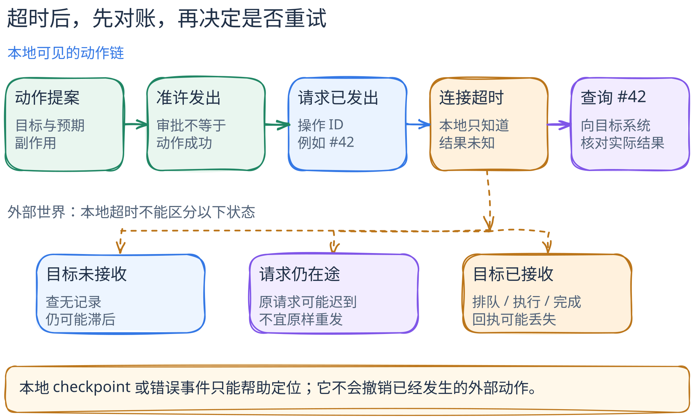

# 批准过了，超时后能重试吗？

[返回横向对照](README.md) · [批准与沙箱](../concepts/approval-vs-sandbox.md) · [四种状态](four-kinds-of-state.md)

读完本篇，应能把一次动作拆成三个独立的问题：**谁准许它开始、系统记下了什么、外部世界究竟发生了什么**。前两项有时能从 Agent 框架的状态中回答；第三项在超时、进程崩溃或网络断开后，通常还需要向目标系统对账。

> **证据范围（2026-09-24 核对）。** 本文只比较四个已写系统剖面的固定源码切面：Codex 的普通 `exec_command` 审批与执行、OpenHands SDK 的 `LocalConversation.run()` / `Agent.step()`、OpenCode 的 `session` 工具调用状态、LangGraph Python `Pregel` 的 checkpoint 路径。以下故障是**教学推演，不是同环境运行实测**。空白处表示本次切面没有证据，不表示产品没有该能力；源码、官方文档和实际部署也不自动等价。

[图的文字版、可编辑源与 PNG](../../figures/permission-and-recovery/README.md)。图中的虚线表示三类尚未区分的**可能世界**，并非三条都执行过的路径；它是教学抽象，不是四个项目共同的内部调用链。

## 一个请求，三类可能的状态

设想 Agent 要为一个已通过测试的补丁触发部署。操作者同意执行；Agent 发起请求后连接超时，尚未收到部署服务的结果。请求可能没到达、还在途中，也可能已被接收而正在排队、执行或已经完成。**把超时当作失败并原样重试，可能制造第二次部署。**这个例子不暗示下列四套系统都自带部署工具；它只是把同一个判断题放到各自已核对的局部机制上。

第一道问题是“这次动作能不能发出”：策略、人工确认和沙箱在动作前发挥作用。第二道问题是“中断后从哪里继续”：事件、工具状态或 checkpoint 可以留下不同粒度的线索。第三道问题是“部署服务是否已经接受”：必须用部署 ID、幂等键或服务端状态查证，不能从本地 `error`、未配对事件或旧 checkpoint 直接推出。

## 四条路径分别看见了什么

| 固定切面 | 动作前能核对的关口 | 中断后可核对的本地状态 | 不能据此推出 |
| --- | --- | --- | --- |
| [Codex：普通 `exec_command`](../systems/codex/README.md) | 命令策略给出 `Forbidden`、`NeedsApproval`、`Skip`；未被禁止后仍要选择执行沙箱。 | 首次沙箱拒绝有**条件性**终止、再询问或第二次尝试；本篇切面没有审计跨进程动作日志。 | `Skip` 等于无沙箱；批准或重试等于远端动作成功。 |
| [OpenHands：本地会话](../systems/openhands/README.md) | `ActionEvent` 先进入事件路径，需确认时停在 `WAITING_FOR_CONFIRMATION`；拒绝会配对 `UserRejectObservation`，不调用工具。 | 当前分支中无对应结果的动作可由下一次 `Agent.step()` 找回并执行；观察或错误事件可与动作配对。 | “有动作事件”代表工具已运行；找回未配对动作便保证只执行一次。 |
| [OpenCode：会话处理器](../systems/opencode/README.md) | 这个固定 `session` 切面可见重复调用的 `doom_loop` 许可点；**一般权限规则不在已审计路径内**。 | `ToolPart` 按 `callID` 区分 `pending`、`running`、`completed`、`error`；清理未收束调用时可记为 `interrupted` 错误。 | part 的 `error` 证明外部副作用没有发生；模型流退避等于重试该工具。 |
| [LangGraph：Python 图与 checkpointer](../systems/langgraph/README.md) | 本篇固定的 checkpoint 切面**没有审计人类批准或工具授权**。 | 可按 thread / namespace / checkpoint 选择图状态，从旧状态创建新分支；可用快照还受 saver 与 `durability` 设置约束。 | 恢复图状态等于撤销已经发生的 HTTP、邮件或部署动作。 |

这些不是四种“安全等级”。Codex 和 OpenHands 行提供了已读路径中的动作前关口；OpenCode 行提供调用级结果账本；LangGraph 行提供图执行版本。它们解决的不是同一个问题，所以不能给 `ToolPart.error`、`ActionEvent` 和 `StateSnapshot` 都贴上“可恢复”标签，再按功能数排名。

## 关键分岔：事前拒绝、返回错误、结果未知

**动作前被拒绝。**在 Codex 固定路径中，`Forbidden` 不进入普通命令执行；`NeedsApproval` 被拒绝也不能当作一次成功调用。OpenHands 的确认闸门位于工具执行前，明确拒绝产生 `UserRejectObservation`。这类轨迹相对容易解释，但只限于对应的工具路径；不要把本地命令沙箱外推到另一个 MCP 服务的远端写入权限。[Codex 策略与审批](https://github.com/openai/codex/blob/c44deff7b1083e9660ac55d02122481f1cdf139b/codex-rs/core/src/tools/orchestrator.rs#L151-L220) · [OpenHands 确认分支](https://github.com/OpenHands/software-agent-sdk/blob/6ebd820d10794f1b52bb06ef6c19512888a1401b/openhands-sdk/openhands/sdk/agent/response_dispatch.py#L163-L190) · [OpenHands 拒绝配对](https://github.com/OpenHands/software-agent-sdk/blob/6ebd820d10794f1b52bb06ef6c19512888a1401b/openhands-sdk/openhands/sdk/conversation/impl/local_conversation.py#L2610-L2648)

**调用返回错误。**Codex 的第一次沙箱拒绝仅在源码规定条件下进入重试判断；它不是“所有命令失败后自动提权”。OpenCode 的 `tool-result` / `tool-error` 可把匹配且正在运行的 part 收束为 `completed` / `error`，模型流故障另有退避处理；两种重试对象不能混称。普通测试命令的非零退出码、执行器拒绝和远端 API 超时也应保留原始错误类型，而不是统一写成“任务失败”；收到错误事件本身不证明副作用发生或未发生。[Codex 条件性重试](https://github.com/openai/codex/blob/c44deff7b1083e9660ac55d02122481f1cdf139b/codex-rs/core/src/tools/orchestrator.rs#L310-L506) · [OpenCode 结果与清理](https://github.com/anomalyco/opencode/blob/18ef3cc7c5a25b82114c953a80ccc09f4988f74e/packages/opencode/src/session/processor.ts#L383-L420) · [OpenCode 模型流退避](https://github.com/anomalyco/opencode/blob/18ef3cc7c5a25b82114c953a80ccc09f4988f74e/packages/opencode/src/session/processor.ts#L641-L695)

**没有拿到结果。**OpenHands 以动作与观察事件的配对发现待处理动作；OpenCode 清理时可把未收束 `ToolPart` 标为中断错误；LangGraph 可从 checkpoint 恢复图的可调度状态。这些记录有助于定位“下一步从哪里查”，却都不是远端事实收据。尤其是 OpenHands 的事件存储可能采用内存后备；LangGraph 的 `InMemorySaver` 明确用于调试/测试，而 `async`、`sync`、`exit` 的持久化时机不同。**本篇没有运行崩溃注入或生产 saver 测试，不声称任何一条路径提供端到端恰好一次执行。**[OpenHands 未配对动作](https://github.com/OpenHands/software-agent-sdk/blob/6ebd820d10794f1b52bb06ef6c19512888a1401b/openhands-sdk/openhands/sdk/conversation/state.py#L677-L716) · [OpenHands 存储回退](https://github.com/OpenHands/software-agent-sdk/blob/6ebd820d10794f1b52bb06ef6c19512888a1401b/openhands-sdk/openhands/sdk/conversation/state.py#L506-L541) · [OpenCode 中断清理](https://github.com/anomalyco/opencode/blob/18ef3cc7c5a25b82114c953a80ccc09f4988f74e/packages/opencode/src/session/processor.ts#L585-L610) · [LangGraph 持久化模式](https://github.com/langchain-ai/langgraph/blob/bdb85b5aa87a21de68371d2e534b81aeed398f57/libs/langgraph/langgraph/pregel/main.py#L2705-L2711)

## 真要上线，应怎样选择与对账？

如果重点是**限制本地命令越权**，先检查执行入口的规则、审批模式和实际沙箱；Codex 的这条路径说明三者不能合成一个“已批准”开关。如果重点是**人工先看动作再放行**，检查 OpenHands 式事件与确认顺序，尤其要能区分“已提出”“已批准”“已执行”。如果重点是**看清一批工具调用哪里中断**，OpenCode 式调用级状态比仅有会话 `busy` 更有诊断价值。如果重点是**从图的某个状态版本再出发**，LangGraph 式 checkpoint/分支更贴题，但须选择适当 saver 与持久化模式。这是按已核对机制给出的**设计选择规则**，不是这些产品的完整能力评测。

对有外部副作用的任务，选择任何一种框架后仍需补上应用层协议：动作发出前分配稳定操作 ID；能用幂等键时交给目标服务；超时后先按 ID 查询目标状态。**一次“查无记录”不是“确认未发生”**：查询可能滞后，原请求也可能尚在途中。只有目标服务给出可信的终态否定且能保证旧请求不会迟到，或支持用相同幂等键安全重放，才可考虑重试；已发生则记录结果，仍不确定就停下交人工核对。把“先查再重试”写成流程，不保证目标服务支持幂等或强一致查询。这条建议是根据上述源码边界作出的**工程推断**，不是四个项目原生提供同一套事务语义。

反例是把审批通过视作部署成功，或者把 checkpoint 分叉视作“重新部署也安全”。审批只回答能否尝试；checkpoint 只回答某个图状态是否可取。一个已经送出的部署请求不会因本地历史回退而自动消失。[LangGraph 快照字段](https://github.com/langchain-ai/langgraph/blob/bdb85b5aa87a21de68371d2e534b81aeed398f57/libs/langgraph/langgraph/types.py#L711-L733) · [LangGraph 从旧状态保存新版本](https://github.com/langchain-ai/langgraph/blob/bdb85b5aa87a21de68371d2e534b81aeed398f57/libs/langgraph/langgraph/pregel/main.py#L1640-L1676)

## 看图与自测

图把本地可见链放在上方：提案、审批、请求发出、超时、按 ID 查询；下方列出“未接收”“仍在途”“已接收”三类可能，最后一类还要区分排队、执行与完成。读图时尤其注意：**超时后向查询前进，而不是直接重试**。目标服务若无法提供可靠查询或幂等重放，图中的终点并不能自动变成确定结果，应暂停并记录未知。

1. 有 `ActionEvent` 却没有 `ObservationEvent`，能断言工具从未运行吗？不能；要先查动作阶段和外部系统状态。
2. Codex 的 `Skip` 或 OpenHands 的批准，能推出命令不受沙箱限制、远端请求一定成功吗？不能；权限、执行边界和结果是三件事。
3. LangGraph 从旧 checkpoint 生成新分支，原部署会被撤销吗？不会由 checkpoint 自动撤销。若原请求结果不明，先对账，再决定是否重试。

**固定来源。**[Codex `c44deff7`](https://github.com/openai/codex/tree/c44deff7b1083e9660ac55d02122481f1cdf139b) · [OpenHands SDK `6ebd820d`](https://github.com/OpenHands/software-agent-sdk/tree/6ebd820d10794f1b52bb06ef6c19512888a1401b) · [OpenCode `18ef3cc7`](https://github.com/anomalyco/opencode/tree/18ef3cc7c5a25b82114c953a80ccc09f4988f74e) · [LangGraph `bdb85b5a`](https://github.com/langchain-ai/langgraph/tree/bdb85b5aa87a21de68371d2e534b81aeed398f57)。以上仅为静态源码与上游测试断言的解释；没有对四套系统进行同任务、同配置、同外部服务的运行比较。
