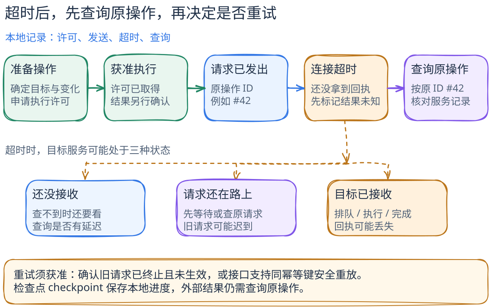

# 批准过了，超时后能重试吗？

[返回横向对照](README.md) · [批准与沙箱](../concepts/approval-vs-sandbox.md) · [四种状态](four-kinds-of-state.md)

一次外部动作可以按三步理解：先获得许可，执行并留下记录，再查看目标系统的结果。比如部署补丁，操作者确认后，助手给这次操作分配编号并记下来，再发出请求。本例假设部署服务支持按这个编号查询，助手就能查询状态并报告结果。Agent 框架主要帮助安排前两步；目标服务的查询接口帮助完成第三步。

> **范围（2026-09-24 核对）。** 对照 Codex 普通 `exec_command`、OpenHands SDK 的本地会话、OpenCode 的 `session` 工具状态，以及 LangGraph Python `Pregel` 的 checkpoint 路径。部署与超时是教学推演，尚无同环境实测；固定版本见末节。

[图的文字说明](../../figures/permission-and-recovery/README.md) · [单独打开 SVG 放大阅读](../../figures/permission-and-recovery/diagram.svg)。图中虚线表示超时后尚未区分的三种可能状态；各项目的具体实现见下表。

初读时沿图走一遍“收到回执”和“改用查询”两条路径就够了。想亲手观察，可以选[不联网的对账练习](../labs/remote-effect.md)，再回来对照下面的源码位置。

## 一个请求，三类可能的状态

继续上面的部署任务：操作者同意执行，助手发出了请求，但这次连接超时。现在先用发送前记下的操作编号查询结果。查询时需要区分三种情况：请求尚未被接收、仍在途中，或已被接收并处于排队／执行／完成中的某一步。直接换一个编号重发，可能又建一个部署任务。

有些服务只在回执里返回任务编号。回执丢了，就得使用它提供的其他可靠查询办法；暂时无法查询时，记录“结果未知”，等待核对。编号是否可查、查询是否及时，要看服务的具体规则。

把两边的记录摆在一起会更清楚：本地的策略与确认记录告诉你动作怎样获准，事件和 checkpoint（执行状态快照）告诉你程序走到哪一步，部署 ID 与服务状态告诉你远端做到哪一步。沙箱另负责限制进程可访问的文件和网络。这四个位置各司其职。

## 四条路径分别看见了什么

| 固定切面 | 动作前的控制点 | 中断后的本地记录 | 使用时还要接上什么 |
| --- | --- | --- | --- |
| [Codex：普通 `exec_command`](../systems/codex/README.md) | `Forbidden` 禁止、`NeedsApproval` 请求确认、`Skip` 免普通询问；允许后再选择执行沙箱。 | 首次沙箱拒绝后，可按条件停止、再询问或第二次尝试；本篇未核对跨进程动作日志。 | 实际执行结果与远端状态查询。`Skip` 跳过的是普通询问，沙箱仍另选。 |
| [OpenHands：本地会话](../systems/openhands/README.md) | `ActionEvent` 先记录，需确认时停在 `WAITING_FOR_CONFIRMATION`。宿主取得用户确认后才再次 `run()`；拒绝会配对 `UserRejectObservation`，工具不执行。 | 下一次 `Agent.step()` 可找回当前分支无对应结果的动作并执行；观察或错误事件与动作配对。 | 宿主的确认入口，以及恢复前的外部结果查询。再次 `run()` 本身会被 SDK 视为隐式批准。 |
| [OpenCode：会话处理器](../systems/opencode/README.md) | 此路径可见重复调用的 `doom_loop` 许可点；一般权限规则需另查。 | `ToolPart` 按 `callID` 区分等待、运行、完成、错误；清理未收束调用时可记为 `interrupted`。 | 保留原错误类型，再按操作 ID 查外部结果；模型流重试与工具重试分别判断。 |
| [LangGraph：Python 图与 checkpointer](../systems/langgraph/README.md) | 此 checkpoint 路径主要处理执行状态；人类批准和工具授权需另查。 | 按 thread／namespace／checkpoint 选择状态或新建分支；可用快照受 saver 与 `durability` 设置影响。 | 目标系统的查询、取消或补偿接口；图状态恢复与远端动作分别处理。 |

按职责读这张表：Codex 和 OpenHands 帮助你找到动作前的控制点，OpenCode 给出调用级记录，LangGraph 给出图执行版本。先按你的需要选择观察位置，比把它们排成四种“安全等级”更有用。

## 关键分岔：事前拒绝、返回错误、结果未知

**动作前被拒绝，就查许可记录。** Codex 的 `Forbidden` 和被拒绝的 `NeedsApproval` 都停在普通命令执行前。OpenHands 明确拒绝时，用 `UserRejectObservation` 配对待办动作。等待确认后再次调用 `run()` 会清除等待态并找回动作，因此宿主应先收集人的确认，再调用它。[Codex 策略与审批](https://github.com/openai/codex/blob/c44deff7b1083e9660ac55d02122481f1cdf139b/codex-rs/core/src/tools/orchestrator.rs#L151-L220) · [OpenHands 确认分支](https://github.com/OpenHands/software-agent-sdk/blob/6ebd820d10794f1b52bb06ef6c19512888a1401b/openhands-sdk/openhands/sdk/agent/response_dispatch.py#L163-L190) · [OpenHands 拒绝配对](https://github.com/OpenHands/software-agent-sdk/blob/6ebd820d10794f1b52bb06ef6c19512888a1401b/openhands-sdk/openhands/sdk/conversation/impl/local_conversation.py#L2610-L2648) · [隐式确认与清除等待态](https://github.com/OpenHands/software-agent-sdk/blob/6ebd820d10794f1b52bb06ef6c19512888a1401b/openhands-sdk/openhands/sdk/conversation/impl/local_conversation.py#L1977-L1995)

**调用返回错误，就保留原错误类型。** 测试失败有测试输出，执行器拒绝有拒绝原因，远端超时则还要查询结果。Codex 只在源码规定条件下考虑沙箱拒绝后的重试。OpenCode 用 `tool-result`／`tool-error` 收束匹配且正在运行的 part；模型流故障另有延迟重试路径。辨认重试的是模型请求还是工具动作，才能选对处理方法。[Codex 条件性重试](https://github.com/openai/codex/blob/c44deff7b1083e9660ac55d02122481f1cdf139b/codex-rs/core/src/tools/orchestrator.rs#L310-L506) · [OpenCode 结果与清理](https://github.com/anomalyco/opencode/blob/18ef3cc7c5a25b82114c953a80ccc09f4988f74e/packages/opencode/src/session/processor.ts#L383-L420) · [OpenCode 模型流退避](https://github.com/anomalyco/opencode/blob/18ef3cc7c5a25b82114c953a80ccc09f4988f74e/packages/opencode/src/session/processor.ts#L641-L695)

**没有拿到结果，就结合本地进度查询远端。** OpenHands 通过动作／观察配对找待处理动作；OpenCode 将未收束调用标成中断错误；LangGraph 从 checkpoint 找可继续的图状态。它们帮你定位进度，目标服务的查询再补上外部结果。

保存方式也要一起看：OpenHands 事件可能采用内存后备；LangGraph 的 `InMemorySaver` 用于调试／测试，`async`、`sync`、`exit` 则有不同持久化时机。本篇尚未做崩溃注入或生产 saver 测试。[OpenHands 未配对动作](https://github.com/OpenHands/software-agent-sdk/blob/6ebd820d10794f1b52bb06ef6c19512888a1401b/openhands-sdk/openhands/sdk/conversation/state.py#L677-L716) · [OpenHands 存储回退](https://github.com/OpenHands/software-agent-sdk/blob/6ebd820d10794f1b52bb06ef6c19512888a1401b/openhands-sdk/openhands/sdk/conversation/state.py#L506-L541) · [OpenCode 中断清理](https://github.com/anomalyco/opencode/blob/18ef3cc7c5a25b82114c953a80ccc09f4988f74e/packages/opencode/src/session/processor.ts#L585-L610) · [LangGraph 持久化模式](https://github.com/langchain-ai/langgraph/blob/bdb85b5aa87a21de68371d2e534b81aeed398f57/libs/langgraph/langgraph/pregel/main.py#L2705-L2711)

## 把机制用到实际任务

按当前需要找阅读入口：

- 限制本地命令的访问范围：读 Codex 的命令策略、审批与沙箱。
- 让人先看动作再放行：读 OpenHands 的事件与确认顺序，并设计宿主确认入口。
- 查一批工具调用在哪中断：读 OpenCode 的调用级状态。
- 从图的旧状态继续：读 LangGraph 的 checkpoint／分支，再选 saver 与持久化模式。

这是按已读机制组织的设计思路，各产品的完整能力还需看其他路径。

涉及邮件、部署等外部变化时，再接上应用层流程：发送前分配稳定操作 ID；目标服务支持幂等键时，按它的规则使用；超时后先按 ID 查询。查到已发生，就记录结果；结果仍不清楚，就暂停并交人工核对。

一次“查无记录”还要结合查询延迟和旧请求是否在途。可考虑重试的依据是：目标服务给出可信的终态否定并保证旧请求不会迟到，或明确支持同键安全重放。这是从源码范围提出的工程建议，具体规则需要向目标服务核对。

比如从旧 checkpoint 建一个新分支，只改变图接下来使用的状态；已经发送的部署仍在远端。先查那次部署，再决定新分支是否发起动作。[LangGraph 快照字段](https://github.com/langchain-ai/langgraph/blob/bdb85b5aa87a21de68371d2e534b81aeed398f57/libs/langgraph/langgraph/types.py#L711-L733) · [LangGraph 从旧状态保存新版本](https://github.com/langchain-ai/langgraph/blob/bdb85b5aa87a21de68371d2e534b81aeed398f57/libs/langgraph/langgraph/pregel/main.py#L1640-L1676)

## 看图并写一张恢复卡

图上方是本地记录：提案、审批、发送、超时、查询；下方是目标服务的三种可能状态，已接收又分排队、执行和完成。沿箭头先走到查询；无法可靠查询或安全重放时，终点就写“未知，等待核对”。

给部署任务写三行：**许可记录、程序进度、服务结果**。在图上找到每行的查询入口；外部结果未知时写明“按原 ID 查询，确认后再决定”。这张卡片完整时，你应能解释授权由谁取得、恢复从哪里开始，以及远端结果怎样核对。

## 适用范围与固定来源

部署例子用于说明判断方法，四个项目的已读路径各有不同；本篇未声称它们都自带部署工具。本地命令沙箱、事件配对和 checkpoint 也各有适用对象。外部操作的安全重放要由目标服务实现，端到端只执行一次仍需独立测试。

**固定来源。**[Codex `c44deff7`](https://github.com/openai/codex/tree/c44deff7b1083e9660ac55d02122481f1cdf139b) · [OpenHands SDK `6ebd820d`](https://github.com/OpenHands/software-agent-sdk/tree/6ebd820d10794f1b52bb06ef6c19512888a1401b) · [OpenCode `18ef3cc7`](https://github.com/anomalyco/opencode/tree/18ef3cc7c5a25b82114c953a80ccc09f4988f74e) · [LangGraph `bdb85b5a`](https://github.com/langchain-ai/langgraph/tree/bdb85b5aa87a21de68371d2e534b81aeed398f57)。以上仅为静态源码与上游测试断言的解释；没有对四套系统进行同任务、同配置、同外部服务的运行比较。
