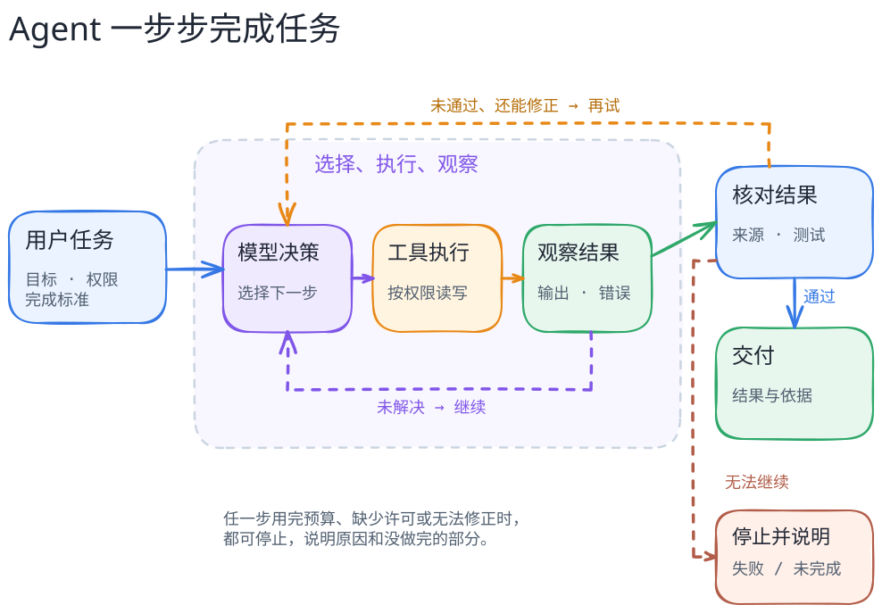

# Agent loop：一次行动怎样闭环

Agent 不只是“模型回答了一次”。对需要行动的任务，宿主通常要反复处理四类东西：本轮模型输入、模型提出的下一步、工具执行后的观察、继续或结束的判定。**模型建议调用工具**和**工具已经执行**之间还可能有参数校验、审批、沙箱及扩展钩子；**模型说完成了**和**结果真的可交付**之间也可能需要测试或人的验收。



[图的文字版](../../figures/agent-loop/README.md)说明了这只是教学模型，不是 Pi、Codex 或任何项目的真实内部拓扑。

## 先看一次正常完成

假设读书会资料助手要回答：“这周活动何时、在哪里，要报名吗？请标出处。”为看清流程，下面的三份材料及编号都是**虚构的教学资料**，不是本书已经运行的 Agent 记录：`D1` 日程写“周六 14:00 开始”；`D2` 场地写“图书馆二楼”；`D3` 报名说明写“周五 18:00 前提交表单”。

1. **决定读什么。** 模型在当前输入里看见问题和可用的读取工具，提出先读相关材料。此时它只是提出动作；还没有取得 `D1`、`D2` 或 `D3` 的正文。
2. **读回并继续。** 宿主按允许的材料范围检查参数，调用读取工具，再把实际返回的内容送入下一轮。模型此时才可以依据返回的正文整理时间、地点和报名要求。读了三份材料不一定要发三轮模型请求：具体批次由宿主和工具设计决定。
3. **给出可核对的回答。** 一个候选答复是：“活动周六 14:00 开始 [D1]，地点是图书馆二楼 [D2]；需要在周五 18:00 前报名 [D3]。”最后仍要对照原任务和材料，检查三个判断各有出处、没有把旧活动混进来。回答流畅、工具返回成功，都不自动完成这一步。

沿上图看，这三步分别落在**提出动作 → 获准执行 → 观察进入下一轮 → 候选结果验证**。如果 `D3` 没有读到，助手可以说明时间和地点已有依据，但报名要求仍未知；不能把“工具没返回”补写成“无需报名”。如果三份正文一开始就已经在本轮输入里，这个只读任务也可能不需要再次调用工具。图描述的是控制关系，不规定每个任务都必须转满一圈。

到这里不需要运行代码。试着把 `D2` 换成“只给出场地网页地址、没有写楼层”：仅凭当前返回内容，还能说“二楼”吗？关键不是记住这道题的答案，而是指出**哪份内容实际进入了本轮、哪一句回答仍待读取或核对**。后文的[上下文与记忆](context-vs-memory.md)继续讨论“资料存着却没进入本轮”，[完成与证据](../comparisons/completion-and-evidence.md)讨论“说完成后还要核对什么”。

## 用一条最小轨迹来读

```text
用户目标与边界 → 装配本轮输入 → 模型提出动作
             → 宿主校验/授权 → 工具执行 → 观察写回
             → 宿主判断继续、停止或失败 → 候选结果验证
```

沿这条线读源码，至少要找到三个控制点：谁组装模型能看到的输入，谁有权执行带副作用的动作，谁决定何时停止。不要把“模型返回一个 tool call”误当成执行日志，也不要把“退出循环”误当成任务成功。图中的最终验证是读者理解完整任务生命周期的**建议检查点**；它不声称下面三个项目都内置同一个验收器。

想边读边问，可以用[AI 陪读方法](../../book/frontmatter/reading-guide.md#和-ai-一起读)先复述上面的读书会例子，再自己改变一份材料，检查回答应怎样变化；不必先运行程序。

想亲自观察时，再选[本书的本地练习](../labs/first-agent-loop.md)：其中 `propose(observations, mode)` 代替模型提案，`run()` 先批准或拒绝写入，`execute()` 才真的改临时文件，终态检查再判断是否达到目标。它把“输入装配”简化成向固定脚本传递 `observations`，没有模拟真实项目的提示词、上下文选择与模型调用。下面的源码案例补上不同实现的复杂性；运行练习不是阅读它们的前置条件。

## 三种具体实现揭示不同边界

在固定版本的 [Pi](../systems/pi/README.md) 中，`Agent.prompt()` 进入运行循环；`runLoop` 组织模型请求、工具结果、steering 与 follow-up。coding-agent 的会话持久化在外壳层，不应画成 agent-core 本身的文件存储。[`runLoop` 源码](https://github.com/earendil-works/pi/blob/898ab804050730e9dcefb4443875d5a932aa6a32/packages/agent/src/agent-loop.ts#L162-L320)

[mini-SWE-agent](../systems/mini-swe-agent/README.md) 给出更短的对照：`DefaultAgent.step()` 组合 `query()` 与 `execute_actions()`，观察被追加进消息账本；基类 `run()` 看最后一条消息是否为 `role=exit`。资源上限、格式错误或提交哨兵也可能使循环结束，因此“停了”要继续问**因何而停**。[循环源码](https://github.com/SWE-agent/mini-swe-agent/blob/04d809ceab9df28f9adaed044884180159172930/src/minisweagent/agents/default.py#L88-L157)

[OpenCode](../systems/opencode/README.md) 把一次工具调用的 `pending/running/completed/error` 与整个 Session 的 `busy/retry/idle` 分开。跟踪失败时，先确定自己观察的是调用状态，还是会话状态；两者不是同一台状态机。[工具调用状态](https://github.com/anomalyco/opencode/blob/18ef3cc7c5a25b82114c953a80ccc09f4988f74e/packages/opencode/src/session/processor.ts#L216-L253) · [SessionStatus](https://github.com/anomalyco/opencode/blob/18ef3cc7c5a25b82114c953a80ccc09f4988f74e/packages/opencode/src/session/status.ts#L30-L48)

## 失败和停止路径不能省略

工具可能被拒绝、执行失败、超时或返回不可信结果；调用中断后可能留下尚未对账的状态。mini-SWE-agent 的格式错误反馈会进入下一轮，但连续错误达到阈值会退出；一般未捕获异常虽然也写 `exit` 消息，却会重新抛出。[格式错误与异常分支](https://github.com/SWE-agent/mini-swe-agent/blob/04d809ceab9df28f9adaed044884180159172930/src/minisweagent/agents/default.py#L100-L124) 这说明“结束”至少要分成正常交付、预算/限制停止、用户或宿主中断、异常失败几类，不能只画一条通往“完成”的箭头。

读真实项目时，先画**一条固定版本的正常路径**，再追一个失败分支；最后问有没有运行轨迹证明时序。以上三个案例仍是静态源码阅读，没有在本书中复现模型调用、命令执行或最终用户验收。
