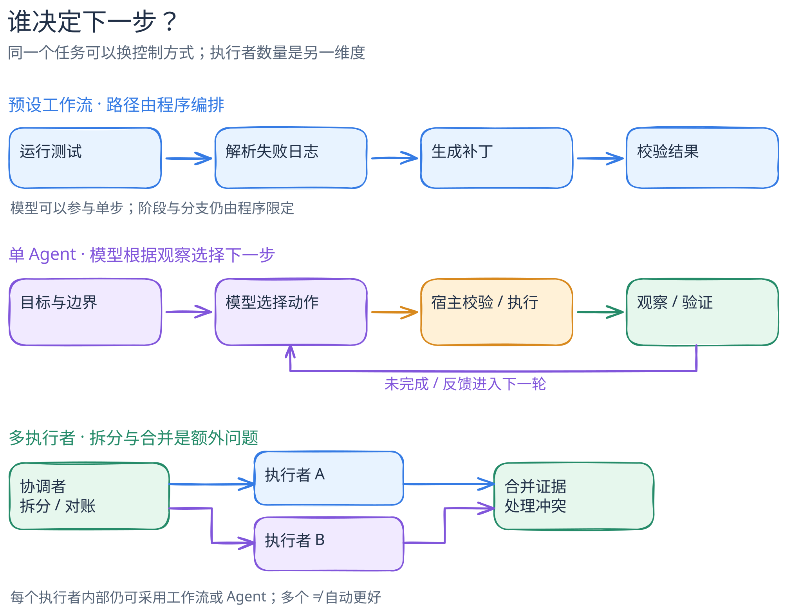

# Agent、工作流与多 Agent：谁决定下一步？

[返回机制目录](README.md) · [图源](../../figures/agent-workflow-multiagent/scene.excalidraw) · [PNG](../../figures/agent-workflow-multiagent/preview.png)

同一个任务可以交给一次模型调用、预设工作流、一个 Agent，或多个执行者。先别数“调用了几次模型”，而要问：**谁决定下一步做什么？** 再问：**任务由几个独立执行者承担，结果由谁合并？** 这是两个维度，不是一条从低级到高级的阶梯。

[图的文字版](../../figures/agent-workflow-multiagent/README.md)可在不看图时独立阅读。本图是教学抽象，不声称某项目恰好有这些节点。

## 同一个任务，三种组织方式

假设目标是“找出一个仓库中失败的测试，并给出可核对的修复”。

| 组织方式 | 下一步由谁决定 | 一个可能的执行过程 | 适用边界 |
| --- | --- | --- | --- |
| 预设工作流 | 程序定义阶段和分支；模型可以在某一步分类或生成内容 | 固定执行测试 → 读取失败日志 → 模型提出补丁 → 再执行测试 | 阶段可预先列出，易审计；新情况超出预设分支时需要另行处理 |
| 单 Agent | 模型根据每轮观察选择接下来要读什么、改什么、何时请求工具；宿主保留执行与停止边界 | 先看报错，决定读源码或配置；改动后看测试结果，再选下一步 | 路径事先难穷举；需要明确预算、权限与验收，不能把模型自称完成当证明 |
| 多执行者 | 一个协调者（程序或模型）拆分、派发并合并；各执行者内部也可能是工作流或 Agent | 一人查测试日志、一人追源码，协调者合并证据并处理冲突 | 子任务可独立推进且合并收益超过协调成本；人数增加不会自动提高质量 |

这里采用 [Anthropic 对 workflow 和 agent 的架构区分](https://www.anthropic.com/engineering/building-effective-agents)：前者由预定义代码路径编排模型和工具，后者由模型动态指导过程与工具使用。这是一套**有用的工作定义**，并非业内唯一命名。该文把“orchestrator-workers”列为一种 workflow，同时描述中央模型动态分解并委派子任务；所以“有多个模型/执行者”本身不足以判定整个系统是 Agent。我们的“多执行者是第二个维度”是基于这些模式的**概念归纳**，不是某个库的 API 定义。

## 控制权不是执行权

即使模型决定调用 `edit` 或 `bash`，它给出的仍是**动作提议**。宿主可以校验参数、要求审批、限制执行环境、记录结果，再决定是否开启下一轮。以固定版本的 Pi 为例：[`Agent.prompt()` 进入运行](https://github.com/earendil-works/pi/blob/898ab804050730e9dcefb4443875d5a932aa6a32/packages/agent/src/agent.ts#L367-L442)，[`runLoop` 在模型与工具回合间调度](https://github.com/earendil-works/pi/blob/898ab804050730e9dcefb4443875d5a932aa6a32/packages/agent/src/agent-loop.ts#L162-L320)，[工具参数校验与前置钩子](https://github.com/earendil-works/pi/blob/898ab804050730e9dcefb4443875d5a932aa6a32/packages/agent/src/agent-loop.ts#L703-L771)发生在实际执行前。这证明它在该路径上有“模型选择—宿主执行—结果反馈”的分工；不证明 Pi 内置通用安全沙箱或所有模式都有相同授权策略。[Pi 代码导读](../systems/pi/code-walkthrough.md)继续追踪具体分支。

“多个 Agent”还需要说清交接合同：每个执行者拿到什么上下文和权限、返回的是证据还是结论、冲突怎样处理、重复副作用谁负责。把同一问题同时问三次模型，再投票，是多次模型调用；是否称为“多 Agent”，取决于它们是否有独立目标、状态和行动边界，而不能仅凭数量命名。[Anthropic 的 parallelization 与 orchestrator-workers](https://www.anthropic.com/engineering/building-effective-agents)也正是两类不同组织方式。

## 先选最小有效结构

如果一次带检索的调用就够，不必引入循环；固定阶段能覆盖问题，就先用工作流；只有路径必须随环境反馈变化，才让模型在边界内决定下一步；只有可并行子任务确实存在，且合并可以核验，才考虑委派。这是面向设计的**建议**，不是性能结论。是否值得增加复杂度，需要用该任务的正确率、失败率、延迟、成本和可解释性来评估；本书尚未做这三种方案的运行对比。

无论选哪种组织方式，最终要把“系统停止了”与“任务完成且可交付”分开。[Agent loop](agent-loop.md)进一步解释这一点；[审批与沙箱](approval-vs-sandbox.md)解释动作从提议到执行之间的边界。
