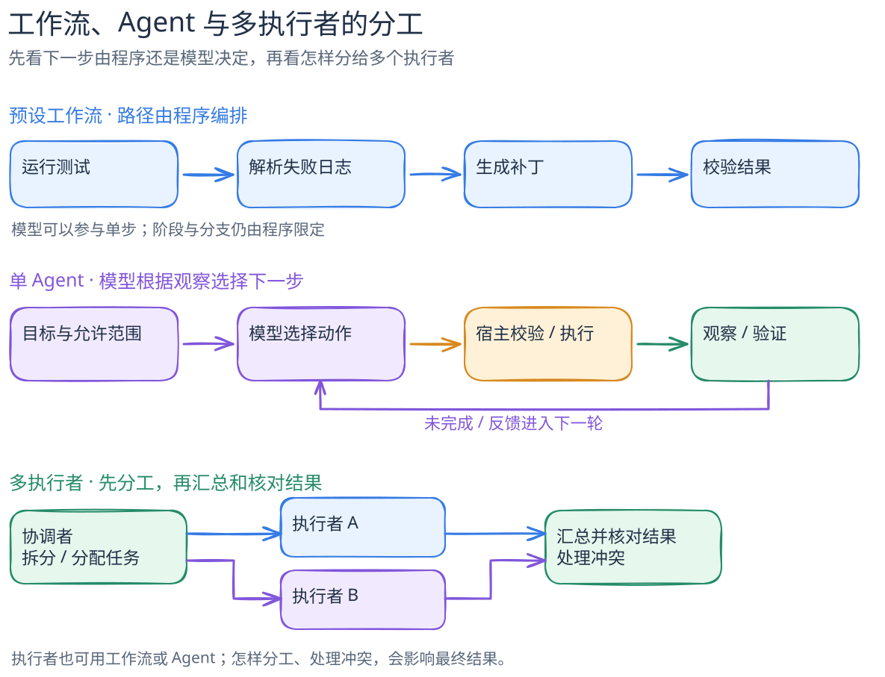

# Agent、工作流与多 Agent：安排任务的三种办法

[返回机制目录](README.md) · [图源](../../figures/agent-workflow-multiagent/scene.excalidraw) · [PNG](../../figures/agent-workflow-multiagent/preview.png)

准备一份读书会资料，可以有三种做法：照着固定步骤整理，让一个助手边查边决定，或者让几个助手分头收集后再合并。它们的主要区别，在于**步骤怎样安排，以及工作怎样分给执行者**。

图的上半部分看步骤，下半部分看分工。一个工作流也可以安排多个助手；一个 Agent 也可以独自做完任务。[图的文字版](../../figures/agent-workflow-multiagent/README.md)进一步说明各条箭头。

## 同一个任务，三种组织方式

假设要整理三个活动通知，写出时间、地点和报名方式。

**工作流像一张提前写好的清单。** 程序先读取三个文件，再提取字段，最后生成汇总。如果通知缺少地点，就进入“标注待确认”的分支。模型可以负责读懂通知和组织语言，执行顺序由程序安排。这适合步骤比较稳定、需要反复处理的任务。

**单个 Agent 像一位可以调整做法的助手。** 它读完第一个通知，发现里面提到了附件，就先去查附件；确认时间后，再决定是否需要找第二个来源。程序把工具结果交给模型，模型根据新信息选择下一步。这适合开始时还无法列清所有步骤的任务。

**多个执行者像一个分工小组。** 三个助手分别整理三个通知，另一个协调者统一格式、核对冲突并合并结果。各助手内部既可以照固定步骤做，也可以自己决定下一步。分工比较独立时，这种做法可能节省时间；材料之间牵连很多时，沟通和合并反而会增加工作。

| 做法 | 步骤怎样安排 | 需要特别安排的事情 |
| --- | --- | --- |
| 预设工作流 | 程序提前定义步骤和分支 | 遇到清单外的情况时转交处理 |
| 单 Agent | 模型根据上一轮结果选择下一步 | 可用工具、时间预算和完成条件 |
| 多个执行者 | 协调者拆分工作，再合并各自结果 | 各自负责的范围、共享信息和冲突处理 |

这里采用 [Anthropic 对 workflow 和 agent 的区分](https://www.anthropic.com/engineering/building-effective-agents)：工作流主要沿预定义的代码路径运行，Agent 由模型动态选择过程和工具。该文的 orchestrator-workers，也就是“协调者与工作者”模式，可以由中央模型动态拆分任务。因此本章把“步骤怎样决定”和“有几个执行者”分开讨论。这是帮助理解架构的分类，各项目的命名可能不同。

## 模型选择步骤，程序负责执行

回到读通知的例子。模型提出“读取附件”，运行 Agent 的程序收到文件路径，检查它是否在允许范围内，再调用读取工具。工具把内容返回后，模型才知道附件里写了什么。

这个运行程序常被称为**宿主**。它负责提供工具、检查参数、安排执行和保存结果。模型负责提出下一步；宿主负责把允许的动作真正做出来。

Pi 中可以找到这条路径：

1. [`Agent.prompt()`](https://github.com/earendil-works/pi/blob/898ab804050730e9dcefb4443875d5a932aa6a32/packages/agent/src/agent.ts#L367-L442) 接收任务，启动运行。
2. [`runLoop`](https://github.com/earendil-works/pi/blob/898ab804050730e9dcefb4443875d5a932aa6a32/packages/agent/src/agent-loop.ts#L162-L320) 在模型回答和工具执行之间调度。
3. [参数检查和执行前钩子](https://github.com/earendil-works/pi/blob/898ab804050730e9dcefb4443875d5a932aa6a32/packages/agent/src/agent-loop.ts#L703-L771) 先处理工具请求，再进入执行。

这些步骤说明了分工。命令能够访问哪些文件、是否需要用户批准，还要继续查看宿主的配置和运行环境。[Pi 代码导读](../systems/pi/code-walkthrough.md)展示了具体函数怎样连接。

## 分工时，把交接说明写清楚

给几个助手相同的问题，让它们各写一份答案，是一种并行调用。要让它们协作，还需要进一步安排：

- 每个助手负责哪一份材料，最后交回什么。
- 哪些文件可以读取，哪些动作需要询问用户。
- 两个来源说法不一致时，由谁回到原文核对。
- 需要写文件或发送消息时，由谁执行，避免重复操作。

比如让一个助手提取活动时间，另一个核对地点，协调者按来源合并。这样的交接说明比“大家一起研究一下”更容易执行。

## 从简单办法开始

先用一次调用试一试：材料已经齐全时，一次读取和整理可能就够。任务有固定阶段时，可以用工作流。任务中经常出现需要继续调查的新情况，再考虑 Agent 循环。确实有几块可以独立完成的工作，再考虑多执行者。

可以用同一组任务比较几种做法，记录答案是否正确、花了多久、用了多少费用，以及结果能否检查。本书没有对这三种方案做运行性能排名。

下一篇 [Agent loop](agent-loop.md)把一个助手的过程拆开；[审批与沙箱](approval-vs-sandbox.md)继续说明程序怎样安排一次动作的执行。
