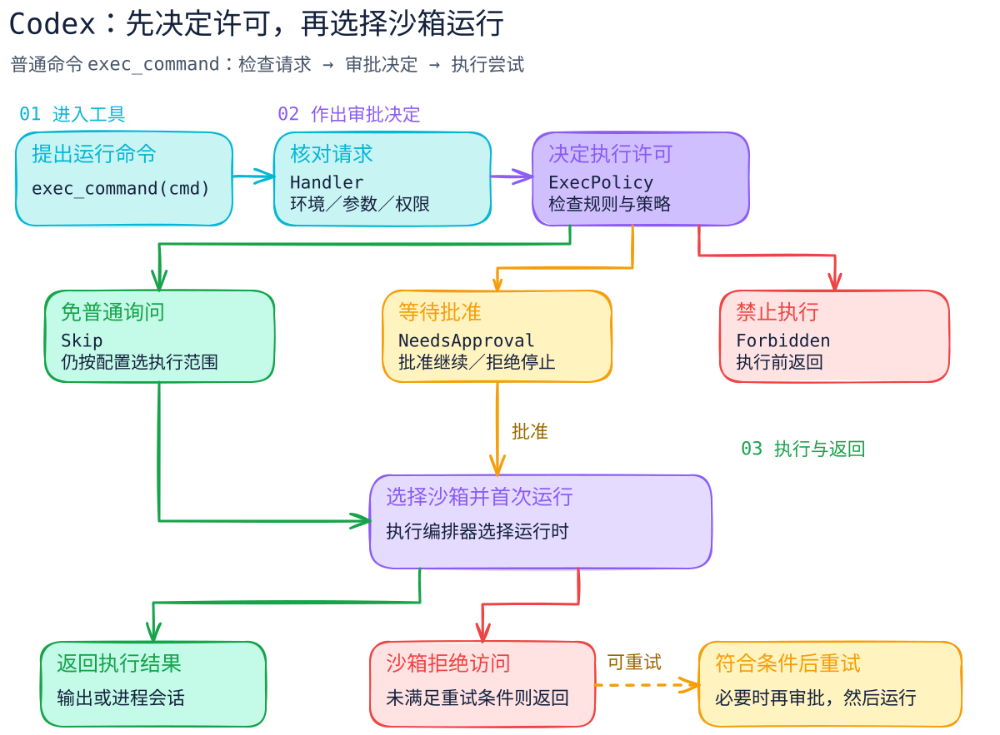

# 审批、沙箱、工作目录：让助手按要求执行

[返回机制目录](README.md) · [Codex 决策图](../systems/codex/README.md) · [OpenHands 事件图](../systems/openhands/README.md)

你让助手修改一个项目，并要求：“可以改这个文件夹，发送邮件前先问我。”这里涉及三件事：**谁允许动作执行、执行环境开放哪些资源、命令从哪里开始运行**。它们分别由审批、沙箱和工作目录来处理。

## 把三个词放进一个例子

假设助手准备运行测试，并把结果写入项目文件夹。

**审批**处理这次动作的许可。程序可能直接允许测试，也可能先显示命令，让用户选择继续或拒绝。发送邮件、删除重要文件等动作，可以设置为每次先确认。

**沙箱**是限制执行程序所能接触资源的环境。比如只开放项目文件夹，把其他目录设为不可读，或者限制网络访问。具体能限制什么，取决于所用沙箱和配置。

**工作目录**是命令运行的起点。如果工作目录是 `/project`，命令里的 `./results.txt` 就通常指向 `/project/results.txt`。程序是否还能访问其他目录，由权限和执行环境决定。

| 设置 | 在这个例子中的作用 |
| --- | --- |
| 审批 | 决定是否允许这次测试命令运行 |
| 沙箱 | 限定命令可以读写的文件和访问的网络 |
| 工作目录 | 确定相对路径从哪个文件夹开始计算 |

用户批准命令后，沙箱仍可以继续限制它；设置了工作目录后，也仍需要检查文件权限。三项设置配合起来，才构成一次动作的执行方式。

## Codex 怎样安排一次命令

本书核对的 Codex Rust core 版本，先判断命令是否需要普通审批，再安排沙箱和执行。决策结果有三个：

- `Skip`：这次无需普通审批，继续后面的执行安排。
- `NeedsApproval`：先请求批准。
- `Forbidden`：禁止执行。

因此看到 `Skip` 时，要接着看沙箱选择和权限设置。它表示跳过普通审批这一步，后面仍可能使用沙箱。

[执行策略源码](https://github.com/openai/codex/blob/c44deff7b1083e9660ac55d02122481f1cdf139b/codex-rs/core/src/exec_policy.rs#L337-L458) · [沙箱选择源码](https://github.com/openai/codex/blob/c44deff7b1083e9660ac55d02122481f1cdf139b/codex-rs/core/src/tools/sandboxing.rs#L239-L279)

## OpenHands 怎样等待确认

OpenHands SDK 的这条路径先记录动作，叫作 `ActionEvent`。需要确认时，会进入 `WAITING_FOR_CONFIRMATION`，也就是“等待用户确认”，暂停运行。

在本书核对的版本中，等待确认后再次调用 `run()`，宿主就会继续推进这个动作。因此使用它的应用，需要把“用户点击批准”与“再次调用 run”正确连接。界面还没有收到批准时，不应自行重启这段执行。

它的终端工具从工作空间（workspace）取得工作目录 `working_dir`。这告诉我们命令从哪里运行；环境隔离的具体能力，要继续看选用的工作空间和部署方式。

[等待确认的代码](https://github.com/OpenHands/software-agent-sdk/blob/6ebd820d10794f1b52bb06ef6c19512888a1401b/openhands-sdk/openhands/sdk/agent/response_dispatch.py#L163-L190) · [TerminalTool 的工作目录](https://github.com/OpenHands/software-agent-sdk/blob/6ebd820d10794f1b52bb06ef6c19512888a1401b/openhands-tools/openhands/tools/terminal/definition.py#L294-L330)

## 使用工具时，按这个顺序检查

先确认任务允许哪些动作，再确认重要动作怎样取得批准，然后检查执行环境能接触哪些文件、账号和网络。执行后，查看产物是否符合要求。

例如“测试运行成功”之后，仍应查看修改文件和测试结果；“邮件草稿写好了”之后，发送这一步仍按用户原先的要求处理。这个顺序适用于理解系统和使用工具，具体产品的开关名称可以不同。
