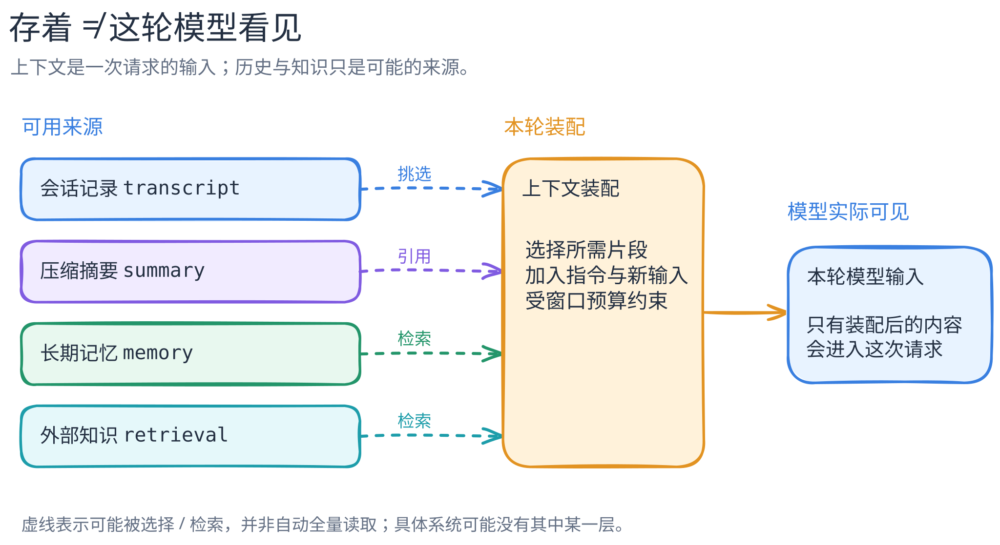

# 上下文、会话、摘要与记忆不是一回事

[返回机制目录](README.md) · [可编辑图](../../figures/context-vs-memory/scene.excalidraw) · [PNG](../../figures/context-vs-memory/preview.png)

最容易造成误解的一句话是“Agent 有记忆”。先问四件事：内容**存在哪里**，**保存多久**，**由谁决定读入**，**本轮模型真的看见了什么**。模型的当前上下文是一次请求的输入，并不等于系统能访问的全部历史或文件。

| 名称 | 它通常是什么 | 本轮一定可见吗？ |
| --- | --- | --- |
| 当前上下文 | 此次模型请求实际提交的指令、选中的消息、工具结果等 | 是；它本身就是输入 |
| 会话记录 | 应用保存的消息和事件历史 | 不一定；可能只投影当前分支或近几轮 |
| 压缩摘要 | 为预算或续接而概括出的历史信息 | 不一定；要看是否被选入本轮 |
| 长期记忆 | 跨轮次、甚至跨会话保存的事实、偏好或状态 | 不一定；通常还需检索、引用或注入 |
| 外部知识 | 文件、数据库、网页等可访问材料 | 不一定；可访问不等于已读取，更不等于已验证 |

图的虚线是“可被选择或检索”，不是自动、无损、可靠的传输。上下文装配会受到窗口预算、策略与权限约束；没被装进去的内容不会神奇地存在于本轮模型输入里。反过来，被装进去也不意味着模型必然正确使用它。

Pi 提供一个可核对的具体例子：其核心在请求前进行 [`transformContext → convertToLlm`](https://github.com/earendil-works/pi/blob/898ab804050730e9dcefb4443875d5a932aa6a32/packages/agent/src/agent-loop.ts#L380-L406)；coding-agent 的 [`SessionManager` 投影当前会话分支](https://github.com/earendil-works/pi/blob/898ab804050730e9dcefb4443875d5a932aa6a32/packages/coding-agent/src/core/session-manager.ts#L543-L582)。这证明 Pi 的“存储状态”和“本次模型消息”有转换边界，不证明所有系统采用同一种存储或摘要算法。[Pi 代码导读](../systems/pi/code-walkthrough.md)有更完整的固定版本路径。

下一步应分别研究：压缩在什么条件下触发，摘要保留/丢失了什么；长期记忆如何写入和检索；检索结果怎样做来源核验。这三件事不能靠本图推出答案。图是通用教学模型，不代表某个产品的完整实现。
