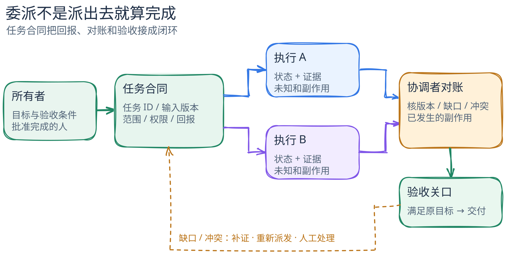

# 委派与交接：多执行者怎样对一项任务负责？

[返回机制目录](README.md) · [相关概念：Agent、工作流与多 Agent](agent-workflow-multiagent.md) · [可编辑图源](../../figures/delegation-and-handoff/scene.excalidraw) · [PNG](../../figures/delegation-and-handoff/preview.png)

打开三个聊天窗口，让它们分别回答同一个问题，很容易得到三份文字。但要把一项工作**委派**出去，还必须回答：每份工作要交付什么、执行者能看见和改变什么、结果怎样对账、失败由谁接手、最后谁有权宣布完成。读完本篇，你应能把“多次生成”与“可核验的多执行者协作”分开。

[图的文字版](../../figures/delegation-and-handoff/README.md)可独立阅读。这是**概念图**；下文用 LangGraph 固定版本的一条窄路径说明其中的“分发输入—汇合状态”，其余合同字段和验收关口是应用设计，不是该库自动提供的能力。

## 先把任务写成可检查的交付

例子：协调者要判断某仓库的一项测试失败是否由最近的配置改动造成。它把工作拆成两份：A 查失败日志与复现命令，B 查相关配置的变更与影响。两人可并行读材料，但协调者仍要把两份证据对齐到**同一仓库版本和同一次失败**，再决定下一步。

一个足够小的任务合同可写成：

| 字段 | A：失败日志 | B：配置变更 | 为什么需要 |
| --- | --- | --- | --- |
| 目标与范围 | 定位首次失败及可复现命令 | 列出相关变更及可能机制 | 避免两人都泛泛猜原因 |
| 输入与版本 | 日志 ID、测试命令、固定 commit | 同一 commit、变更范围 | 使结论可以对齐和重查 |
| 可用能力 | 只读日志与测试文件 | 只读配置与提交历史 | 分清“读到证据”与“已获写入许可” |
| 回报格式 | 证据位置、观察、复现状态、未知 | 变更位置、因果假说、反证、未知 | 让合并者检查材料，而非拼接两段结论 |
| 停止与升级 | 找不到日志或版本不符时报告阻塞 | 需要改配置或接触密钥时先升级 | 不让执行者用越权动作填补证据缺口 |

这个表是本篇的**教学任务合同**，不是 LangGraph 的内置 schema。真正委派时还应给每份子任务一个 ID、负责人、截止或预算，以及结果状态；涉及写入时加上允许的资源、审批人和幂等键。给执行者的上下文应足够完成其任务，但不意味着复制协调者的全部会话、凭据和权限。

## 交接发生在哪些边界？

1. **派发前，协调者定义可分离的工作。** 两份子任务若依赖同一个尚未确定的事实，先解决依赖；否则并行只会同时放大错误前提。协调者记录输入版本和预期回报，才能知道结果属于哪次尝试。
2. **派发时，传入被选择的上下文。** A 收到日志线索，B 收到变更范围。执行者有自己的工作状态；它们不因为都叫 Agent 就自动共享全部上下文。复制过多会泄露无关信息，复制过少会使任务无法执行。
3. **行动前，宿主检查能力边界。** “请分析”不等于“可以修改”；模型提议的工具调用还要经由实际执行环境和权限规则。若两个执行者可写同一文件或调用同一外部 API，就需要冲突控制、操作 ID 和重复执行策略。
4. **返回时，先对账再综合。** 回报应区分已观察事实、推断、未完成与失败，并附证据位置。协调者检查版本是否一致、子任务是否都结束、结论是否冲突。缺一份结果时，不能把另一份结果当作全局完成。
5. **完成由验收方决定。** 子执行者可以报告“我的部分完成”；协调者可以报告“已汇总”；但原任务是否满足要求，应按最初的验收条件由任务所有者或其明确授权的关口决定。图执行停止、模型说“完成”、有两份答案，都不是交付证明。

失败可能出现在每个接缝：某人超时、两个结果引用不同 commit、两人都改了同一资源，或外部动作成功而回报丢失。恢复时先查**动作是否已生效**，再决定重试、补偿或交给人处理；不能只重放提示词。若 A 找到的失败与 B 的变更不在同一版本，协调者应标为“不可合并”，请求补证或重新派发，而不是投票选一个看似自信的答案。

## 固定源码锚点：LangGraph 的 `Send`

以官方仓库 [`langchain-ai/langgraph@bdb85b5aa87a21de68371d2e534b81aeed398f57`](https://github.com/langchain-ai/langgraph/tree/bdb85b5aa87a21de68371d2e534b81aeed398f57) 的 Python `StateGraph` 为例。**静态源码事实**：`Send(node, arg)` 表示向指定节点发送一份自定义输入；它的文档示例在条件边上为每个 `subject` 生成一个 `Send("generate_joke", {"subject": s})`，目标节点各自产生一条结果。[`Send` 定义与示例](https://github.com/langchain-ai/langgraph/blob/bdb85b5aa87a21de68371d2e534b81aeed398f57/libs/langgraph/langgraph/types.py#L732-L804)

这条路径的三个要点可映射到委派：条件函数决定生成哪些 `Send`，`arg` 明确每次交给节点的输入，节点产出的状态更新回到图状态。本例的目标节点始终是 `generate_joke`，只是 `subject` 输入与发送数量不同。`StateGraph` 文档说明节点以 `State → Partial<State>` 交互；当多个节点更新同一键时，该键可以声明 reducer 聚合值。示例把 `jokes` 定义为按 `operator.add` 合并的列表。[状态与 reducer](https://github.com/langchain-ai/langgraph/blob/bdb85b5aa87a21de68371d2e534b81aeed398f57/libs/langgraph/langgraph/graph/state.py#L131-L145) · [示例状态和条件边](https://github.com/langchain-ai/langgraph/blob/bdb85b5aa87a21de68371d2e534b81aeed398f57/libs/langgraph/langgraph/types.py#L751-L775) · [条件边入口](https://github.com/langchain-ai/langgraph/blob/bdb85b5aa87a21de68371d2e534b81aeed398f57/libs/langgraph/langgraph/graph/state.py#L982-L1030)

**边界**：这个示例演示动态分发和状态归并，目标节点甚至只是普通函数；它没有展示两个自主 Agent、权限隔离、外部副作用、失败重试，或业务验收。`operator.add` 能把列表拼起来，不能证明两份证据互相一致。把它用于上面的调查任务，需要应用自己定义任务 ID、证据结构、冲突检查、权限和验收规则。这是从源码能力到应用设计的**工程推断**，不是 LangGraph 的保证。官方当前文档也把 `Send` 描述为按不同输入动态分发的机制，并把 `Command` 描述为可更新状态、路由及跨子图导航的另一原语；本篇没有把两者混成一个运行路径。[官方 Graph API 文档](https://docs.langchain.com/oss/python/langgraph/graph-api)

核对日期：2026-09-23。固定版本的 [`pyproject.toml`](https://github.com/langchain-ai/langgraph/blob/bdb85b5aa87a21de68371d2e534b81aeed398f57/libs/langgraph/pyproject.toml#L5-L13) 与 [`LICENSE`](https://github.com/langchain-ai/langgraph/blob/bdb85b5aa87a21de68371d2e534b81aeed398f57/libs/langgraph/LICENSE#L1-L20) 标明 Python 包为 MIT；本篇只链接并概述源码，没有复制上游图稿。本文核对了固定版本源码与官方文档，**没有运行**示例、测试、并发调度或故障注入。因此图中的并行、失败与对账是设计模型，不能读作该版本的实测轨迹。

## 常见反例：三个窗口，三句“已完成”

把完整任务粘给三个模型，要求它们各自给结论，最后按多数票提交：没有子任务边界，没有版本和证据对齐，也没有共同的失败状态。三者可能引用同一条错误资料；多数票只会把相关错误重复计算。若它们还能写同一文件，冲突与重复副作用更难追踪。这可以作为并行生成候选想法的办法，但不足以证明交接和验收已经成立。

自测：若 B 超时而 A 已报告“完成”，整项任务是什么状态？若 A 与 B 的结果来自不同 commit，协调者能否直接合并？若重试 B 可能再次调用外部 API，哪个 ID 和哪个观察能判定是否已经生效？能回答这些问题，才算把执行者数量转化为可管理的交接。
