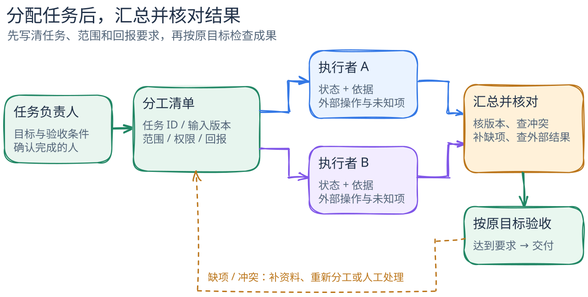

# 委派与交接：给几个助手分工，再把结果合起来

[返回机制目录](README.md) · [Agent、工作流与多 Agent](agent-workflow-multiagent.md) · [可编辑图源](../../figures/delegation-and-handoff/scene.excalidraw) · [PNG](../../figures/delegation-and-handoff/preview.png)

准备读书会时，可以让一个助手整理活动时间，另一个核对场地，第三个汇总报名要求。最后由协调者检查来源和内容，写成一份统一通知。

这就是委派的基本过程：**拆出几份工作，给出各自需要的材料，收回结果，再检查和合并。**

[图的文字版](../../figures/delegation-and-handoff/README.md)解释了各条箭头。图展示应用可以怎样设计协作；后面用 LangGraph 的一个例子说明“分发输入、收集合并”的代码机制。

## 分工时，把要求写到具体事情上

以时间和场地两份工作为例：

| 内容 | 助手 A：活动时间 | 助手 B：场地信息 |
| --- | --- | --- |
| 任务 | 找到日期、开始时间和结束时间 | 找到地点、楼层和待确认事项 |
| 材料 | 同一批活动通知及其版本 | 同一批活动通知及其版本 |
| 允许动作 | 读取指定材料 | 读取指定材料 |
| 返回内容 | 时间、原文位置、缺失信息 | 地点、原文位置、缺失信息 |
| 停止情况 | 来源互相矛盾时报告 | 需要联系场地方时先询问 |

表里的字段由应用或协调者安排。每份子任务还可以有一个标识、负责人和截止时间，方便查看它属于哪次任务。

交给助手的材料以完成其工作为准。A 需要时间线索，B 需要场地资料；与任务无关的私人聊天和凭据，留在原处。

## 正常协作怎样进行

**先拆分。** 时间和场地可以各自整理，就并行进行。如果场地取决于尚未确定的日期，先解决日期，再安排后面的工作。

**再派发。** 协调者把对应材料和要求交给每个助手，并记录任务标识。各助手可以分别保存自己的对话和进度；需要共用一份通知时，先说清楚谁能读取、采用哪个版本。

**收回结果。** A 返回时间和原文，B 返回地点和原文。缺少楼层时，B 标为待确认，协调者保留这一说明。

**检查合并。** 协调者确认两份结果引用同一批通知。若旧通知写周六、新通知写周日，就回到来源核对版本，再决定怎样写入最终通知。

**按原要求完成。** 协调者检查时间、地点和报名方式，再交付汇总。是否用于发布，由使用者或事先指定的检查规则决定。只完成其中一项时，可以报告进度，让使用者知道还差什么。

## 写入任务怎样避免互相覆盖

读资料的工作比较容易分开。几个助手需要修改文件时，可以分配互不重叠的文件，或者由一个执行者统一写入，其他人提交建议。

实际写入前，运行程序按用户允许的文件和动作范围检查；需要批准的动作，先由指定的人确认。

调用外部服务时，还要记录操作标识，安排确认和重复请求处理。如果一个助手超时，先检查它是否已经做完动作，再决定重试。[中断与恢复](interruption-recovery.md)继续说明这种情况。

## 可选深入：LangGraph 怎样分发输入

LangGraph 的 `Send(node, arg)` 表示向一个指定节点发送自定义输入。节点可以理解为图里的一步处理函数。

官方示例把不同 `subject` 交给 `generate_joke`，分别生成结果：

- 条件函数为每个主题产生一条 `Send`。
- `arg` 带上这次处理的主题。
- 目标节点返回一部分状态更新，图再合并这些结果。

[Send 定义和示例](https://github.com/langchain-ai/langgraph/blob/bdb85b5aa87a21de68371d2e534b81aeed398f57/libs/langgraph/langgraph/types.py#L732-L804)

`StateGraph` 的节点以 `State → Partial<State>` 交互，也就是“读当前状态，返回需要更新的那部分”。多个节点更新同一个字段时，可以为该字段安排 reducer，中文可理解为合并规则。示例中 `jokes` 是列表，用 `operator.add` 拼接每个节点返回的列表。

[状态与合并规则](https://github.com/langchain-ai/langgraph/blob/bdb85b5aa87a21de68371d2e534b81aeed398f57/libs/langgraph/langgraph/graph/state.py#L131-L145) · [示例状态与条件边](https://github.com/langchain-ai/langgraph/blob/bdb85b5aa87a21de68371d2e534b81aeed398f57/libs/langgraph/langgraph/types.py#L751-L775) · [条件边入口](https://github.com/langchain-ai/langgraph/blob/bdb85b5aa87a21de68371d2e534b81aeed398f57/libs/langgraph/langgraph/graph/state.py#L982-L1030)

这个例子中的工作者是普通函数，展示的是动态分发和列表合并。把它用到多个 Agent 的任务里，应用还要安排各自目标、权限、失败处理和结果检查。列表拼好之后，也仍需要核对时间、地点等内容是否一致。

LangGraph 的 `Command` 另外支持状态更新、路由和跨子图导航；本篇沿 `Send` 的这条示例讲解分发。[官方 Graph API](https://docs.langchain.com/oss/python/langgraph/graph-api)

## 从一份小分工开始

先选两项可以独立整理的内容，写清楚“做什么、看什么、交回什么”。合并时回到来源核对，并保留缺失信息。稳定以后，再增加执行者或安排更复杂的动作。

本章核对了固定版本源码与文档，没有运行并发调度或故障注入。LangGraph Python 包的[项目元数据](https://github.com/langchain-ai/langgraph/blob/bdb85b5aa87a21de68371d2e534b81aeed398f57/libs/langgraph/pyproject.toml#L5-L13)和[许可证](https://github.com/langchain-ai/langgraph/blob/bdb85b5aa87a21de68371d2e534b81aeed398f57/libs/langgraph/LICENSE#L1-L20)标明 MIT；本篇只概述并链接源码，图是本书的教学图。
