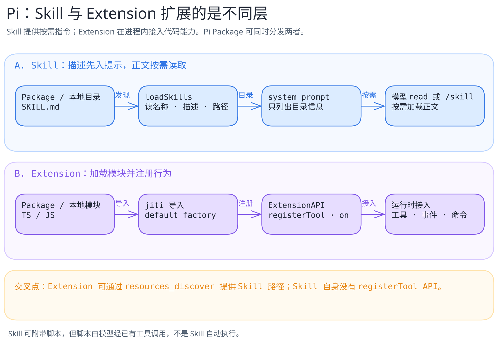

# Tool、Skill、Extension、Package、MCP：到底扩展了什么？

[返回机制目录](README.md) · [Pi 的固定源码示例](../systems/pi/extensions-and-skills.md)

这些词不在同一层，因此不宜统称“插件”。先问：它增加的是**模型可读的指导**、**宿主进程的代码行为**、**可调用的能力**、**分发容器**，还是**跨进程连接协议**？

| 机制 | 最直接改变什么 | 谁决定何时用 | 关键风险/边界 |
| --- | --- | --- | --- |
| Tool | 一个具名、带参数和结果的可执行操作 | 模型提出调用，宿主依权限与执行策略处理 | 调用副作用及结果是否可信 |
| Skill | 可发现、按需读取的任务指导及配套文件 | 宿主发现；模型或用户决定读取/调用 | 指令可影响模型行为，也可能引导运行脚本 |
| Extension | 宿主加载的扩展代码、事件钩子、工具或 UI | 宿主加载后按事件/调用运行 | 代码权限与生命周期依赖宿主实现 |
| Package | 分发和组合这些资源的容器 | 安装者及宿主加载器 | 不能因为打包在一起就认为权限相同 |
| MCP | 宿主与外部服务交换 Tools、Resources、Prompts 等能力的协议 | 宿主负责连接、权限与呈现；具体操作依协商的能力 | 远端返回值及授权边界；它不是 Skill 文件格式 |

Pi 的固定源码版本提供一个具体例子：[`loadSkills` 与 `formatSkillsForPrompt`](https://github.com/earendil-works/pi/blob/898ab804050730e9dcefb4443875d5a932aa6a32/packages/coding-agent/src/core/skills.ts#L277-L382)使 Skill 的描述先被发现、正文后按需读取；[`ExtensionAPI` 注册代码行为](https://github.com/earendil-works/pi/blob/898ab804050730e9dcefb4443875d5a932aa6a32/packages/coding-agent/src/core/extensions/loader.ts#L254-L294)；[Pi Package 文档](https://github.com/earendil-works/pi/blob/898ab804050730e9dcefb4443875d5a932aa6a32/packages/coding-agent/docs/packages.md)说明打包与分发。上图只画 Pi 的这三层，**不把 MCP 画成 Pi 核心内置组件**。

MCP 的[协议架构](https://modelcontextprotocol.io/specification/2025-11-25/architecture)定义 Host、Client、Server 及能力协商；Server 可公开 Tools、Resources、Prompts。协议支持这些原语，并不意味着每个 Agent 都会接入某个 Server，也不意味着某个远端 Tool 自动拥有宿主的全部权限。当前本书使用这份规范解释术语，具体产品接入还要另读各自固定源码。MCP 规范会演进，本页不会把一版协议的会话细节写成永久事实。

最小判断法：**Skill 告诉 Agent 如何做；Tool 提供一次可调用操作；Extension 改变宿主；Package 负责分发；MCP 规定跨边界交换能力的方式。**这是帮助阅读的抽象，不保证每个产品都沿用这些名称或完全相同的生命周期。
