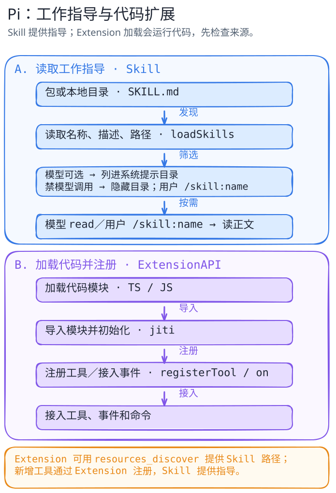

# Tool、Skill、Extension、Package 与 MCP：给助手增加能力

[返回机制目录](README.md) · [Pi 的代码示例](../systems/pi/extensions-and-skills.md)

你想让助手处理一类新任务，通常有几种办法：给它一份做事说明，增加一个工具，加载一段扩展代码，或连接一个外部服务。先看自己需要增加什么，再选择相应方式。

| 名称 | 可以怎样理解 | 主要作用 |
| --- | --- | --- |
| Tool（工具） | 一次能调用的操作 | 接收参数，执行读取、搜索或修改，再返回结果 |
| Skill（任务指导） | 一份按需阅读的方法说明 | 告诉助手这类任务怎么做，并可附参考文件和脚本 |
| Extension（代码扩展） | 加进宿主程序的代码 | 响应事件，增加工具、改变处理步骤或界面 |
| Package（资源包） | 用来安装和分发的包 | 把 Skill、扩展等资源装在一起 |
| MCP（连接协议） | 宿主和外部服务之间的约定 | 交换工具、资料、提示模板以及调用结果 |

## 用“整理一份资料”理解它们

Skill 可以写明“先读原文，列出要点，再核对出处”。读取工具负责真的打开文件。若要在工具执行前增加一项检查，可以由宿主支持的 Extension 实现。需要把这套方法交给别人安装时，就做成 Package；材料存在外部服务时，可以通过该产品支持的 MCP 连接读取。

它们可以合作。使用时也分别看权限：说明文件会影响助手怎么做，扩展代码则可能直接在宿主进程中运行。随包附带的脚本仍要由工具执行，运行之前看清来源和读写范围。

## Pi 的例子：先发现，再按需读取

在本书所读版本里，Pi 先发现 Skill 的描述，再按需读取正文；Extension 通过 API 注册代码行为；Package 负责组合与分发这些资源。上图画的就是这三部分。

- [Skill 发现与描述](https://github.com/earendil-works/pi/blob/898ab804050730e9dcefb4443875d5a932aa6a32/packages/coding-agent/src/core/skills.ts#L277-L382)
- [Extension API](https://github.com/earendil-works/pi/blob/898ab804050730e9dcefb4443875d5a932aa6a32/packages/coding-agent/src/core/extensions/loader.ts#L254-L294)
- [Package 文档](https://github.com/earendil-works/pi/blob/898ab804050730e9dcefb4443875d5a932aa6a32/packages/coding-agent/docs/packages.md)

这幅 Pi 图没有画 MCP 内置接入。想确认某产品怎样支持 MCP，应另看该产品的连接说明或源码。

## MCP 的例子：连接外部服务

按 [2025-11-25 版协议架构](https://modelcontextprotocol.io/specification/2025-11-25/architecture)，宿主管理连接，客户端与服务端交换能力；服务端可以提供工具、资源和提示模板。实际连接后，可用哪些操作，还取决于双方支持的能力、账户授权与宿主设置。

协议和产品都会更新，本书用这份规范解释分工。具体接入步骤应以所用产品和版本为准。下一篇[Skill、MCP 与工具权限](mcp-skill-tool-lifecycle.md)会把这些角色放进一次完整任务。
