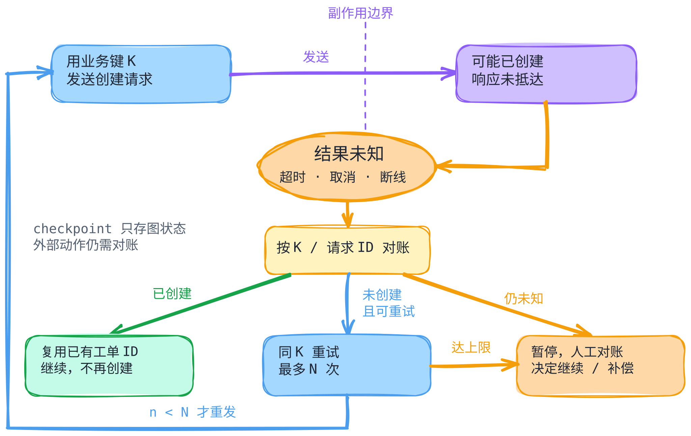

# 中断、重试与恢复：先确认哪一步已经生效

[返回机制目录](README.md) · [Pi 固定版本代码导读](../systems/pi/code-walkthrough.md) · [LangGraph checkpoint 导读](../systems/langgraph/code-walkthrough.md)

[单独打开 SVG](../../figures/interruption-recovery/diagram.svg) · [可编辑图源](../../figures/interruption-recovery/scene.excalidraw) · [PNG 预览](../../figures/interruption-recovery/preview.png) · [图的文字版](../../figures/interruption-recovery/README.md)

假设 Agent 请求工具向外部系统创建一张工单，工具已发出请求，但等待响应时连接断开。读者现在需要判断：**能否再次调用工具？** 关键事实是“Agent 没收到成功响应”只说明**结果不可见**，不说明外部动作没发生。恢复要先分清运行控制、保存的状态和真实世界的副作用。

## 五个动作分别解决什么

| 动作 | 改变什么 | 不能直接推出什么 |
| --- | --- | --- |
| 取消/中断 | 停止当前运行或发取消信号；停止后的确认程度取决于被调用方 | 已发出的外部请求被撤销，或此前的动作被回滚 |
| 重试 | 再做一次模型请求或工具动作，通常受错误类别、次数和退避约束 | 上一次没有生效，或再次执行一定安全 |
| 幂等 | 由外部系统识别同一个**业务动作标识**，重复提交时给出同一效果或既有结果；需核对接口合同 | 只凭 Agent 的调用 ID 就自动具备幂等性 |
| checkpoint/恢复 | 读取可定位的执行状态，从某处继续或分叉 | 外部系统也回到该快照的时间点 |
| 人介入 | 在证据不足、结果冲突或不可逆动作前决定继续、补偿或停止 | 人的点击天然能补齐未知的执行结果 |

“重试”还须问**重试哪一层**：重发模型请求可能只重新求一段推理；重放工具调用则可能再次写入外部系统。进程崩溃、用户主动取消、服务端超时和工具返回明确失败，产生的证据也不同。设计时为每个有副作用的动作记录业务键、请求参数摘要、调用/响应标识与最终确认结果；在再次发送前按该键查询外部状态。若外部接口支持幂等键，重试沿用**同一业务键**；更换键可能被视为新动作。这是推荐的应用设计，具体系统是否提供这些能力必须逐一核对。

## 一条可判断的失败路径

1. 执行前：把“要创建工单 X”的意图与业务键 K 记下来。若动作需要审批，在发送前完成审批；审批只决定能否启动，不替代结果确认。
2. 请求发出后收到成功响应：记录外部工单 ID 和状态，再推进 Agent 状态。若响应明确失败，按错误类别判断是否可以重试。
3. 请求发出后超时或取消：标记**结果未知**，先用 K 或外部请求 ID 查询。查到已创建，就记录既有结果并继续，避免第二次创建。
4. 确认未创建，且接口合同允许安全重试：在预设上限 `N` 和截止时间内，用原 K 重发；每次再出现未知结果仍先对账。达到上限、查询不可用、结果相互矛盾或动作不可逆时，暂停给人对账。
5. 恢复 checkpoint 时，再核对外部结果与新运行计划。checkpoint 可能让图重新调度某个节点，不能代替第 3 步的外部确认。

第 1–5 步是**工程建议**，并非下面两个框架共同提供的内置流程。反例是“创建请求超时 → 从旧 checkpoint 重跑 → 新建第二张工单”：保存的图状态可能合法，两张外部工单仍然是重复副作用。若接口既不支持按业务键查询，也不支持幂等提交，自动重试不能证明安全；应保留未知状态并交由人核对，必要时制定补偿动作。

## 固定版本中的实际边界

**Pi 的取消与重试。** 静态阅读 [`earendil-works/pi@898ab804050730e9dcefb4443875d5a932aa6a32`](https://github.com/earendil-works/pi/tree/898ab804050730e9dcefb4443875d5a932aa6a32)：核心 `Agent.abort()` 发当前运行的取消信号；coding-agent 的 `AgentSession.abort()` 还会取消重试等待等操作并等待空闲。[核心取消](https://github.com/earendil-works/pi/blob/898ab804050730e9dcefb4443875d5a932aa6a32/packages/agent/src/agent.ts#L332-L349) · [应用层取消](https://github.com/earendil-works/pi/blob/898ab804050730e9dcefb4443875d5a932aa6a32/packages/coding-agent/src/core/agent-session.ts#L2072-L2092) 对可重试的**模型错误**，`AgentSession` 在一次运行结束后检查开关和次数、做可取消退避，再调用 `Agent.continue()`；失败尝试留在原始记录，但下一次模型上下文投影可省略它。[后运行重试](https://github.com/earendil-works/pi/blob/898ab804050730e9dcefb4443875d5a932aa6a32/packages/coding-agent/src/core/agent-session.ts#L1468-L1529) · [退避](https://github.com/earendil-works/pi/blob/898ab804050730e9dcefb4443875d5a932aa6a32/packages/coding-agent/src/core/agent-session.ts#L3375-L3419) 这是模型请求层的路径，不证明已发出的第三方工具动作可撤销，也不意味着每个工具错误都会自动重试。

**LangGraph 的 checkpoint。** 静态阅读 [`langchain-ai/langgraph@bdb85b5aa87a21de68371d2e534b81aeed398f57`](https://github.com/langchain-ai/langgraph/tree/bdb85b5aa87a21de68371d2e534b81aeed398f57) 的 Python 同步 `Pregel` 与示例 `InMemorySaver`：循环可以按 `checkpoint_id` 加载旧状态；`update_state(old_config, values)` 从旧状态写出一个新版本（无法唯一判定写入节点时还须指定 `as_node`），再以返回 config 继续。[加载指定版本](https://github.com/langchain-ai/langgraph/blob/bdb85b5aa87a21de68371d2e534b81aeed398f57/libs/langgraph/langgraph/pregel/_loop.py#L1629-L1654) · [读取旧版](https://github.com/langchain-ai/langgraph/blob/bdb85b5aa87a21de68371d2e534b81aeed398f57/libs/langgraph/langgraph/pregel/main.py#L1640-L1675) · [歧义检查与保存新版](https://github.com/langchain-ai/langgraph/blob/bdb85b5aa87a21de68371d2e534b81aeed398f57/libs/langgraph/langgraph/pregel/main.py#L1905-L2047) · [分叉测试](https://github.com/langchain-ai/langgraph/blob/bdb85b5aa87a21de68371d2e534b81aeed398f57/libs/langgraph/tests/test_time_travel.py#L143-L218) 新状态与已持久化也有区别：该版本 `durability` 默认为 `async`，`sync` 在下一步前保存，`exit` 只在退出时保存。[源码中的参数说明](https://github.com/langchain-ai/langgraph/blob/bdb85b5aa87a21de68371d2e534b81aeed398f57/libs/langgraph/langgraph/pregel/main.py#L2705-L2711) 官方[持久化文档](https://docs.langchain.com/oss/python/langgraph/persistence)说明 checkpoint 用于图状态和恢复；它不构成外部工单已回滚的证据。`InMemorySaver` 本身被源码注释限定为调试/测试用途。[示例 saver 注释](https://github.com/langchain-ai/langgraph/blob/bdb85b5aa87a21de68371d2e534b81aeed398f57/libs/checkpoint/langgraph/checkpoint/memory/__init__.py#L33-L44)

两条固定版本路径各说明一个局部边界：Pi 展示运行/模型重试的层次，LangGraph 展示图状态版本的选择。图里的工单场景是**教学抽象**，不是声称这两个项目内置工单查询、幂等键或人工对账流程。

## 证据与待验证

- **源码事实与官方文档声明**：上面的 Pi、LangGraph 行为限定在链接的固定 commit 与官方文档所述范围；LangGraph 仓库里的测试是上游断言，不是本文的运行记录。
- **工程推断**：结果未知时先对账、重复请求沿用业务键、恢复后复核外部动作，是从“运行状态与外部副作用分离”推得的应用设计建议。
- **未验证**：本文未运行两个固定版本、未做故障注入，也未检验具体外部 API 的幂等合同、生产 saver 的跨进程恢复、取消信号在网络与工具中的实际传播。上线前应记录故障点、checkpoint ID、调用 ID、业务键和外部结果，分别做超时、取消、崩溃和重复投递试验。
