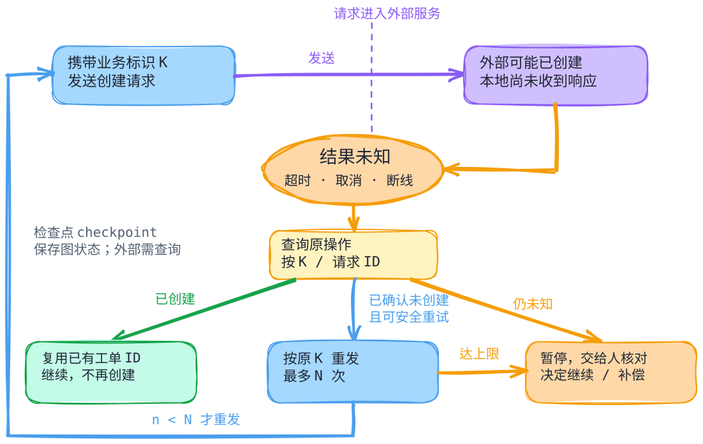

# 中断、重试与恢复：把没做完的任务接着做

[返回机制目录](README.md) · [Pi 代码导读](../systems/pi/code-walkthrough.md) · [LangGraph 检查点导读](../systems/langgraph/code-walkthrough.md)

助手正在创建一张工单，页面却一直没有返回结果。可能是请求没有到达，也可能是工单已经创建，只是返回消息丢了。接着做之前，先查询这次操作的状态，才能避免多建一张。

[单独打开 SVG](../../figures/interruption-recovery/diagram.svg) · [可编辑图源](../../figures/interruption-recovery/scene.excalidraw) · [PNG 预览](../../figures/interruption-recovery/preview.png) · [图的文字版](../../figures/interruption-recovery/README.md)

## 先分清几个常用动作

**取消**是请求当前运行或工具停止，程序再确认实际停止状态。已经发送到外部服务的操作，需要另行查询和处理。比如关闭浏览器以后，刚才提交的工单仍可能已经保存。

**重试**是再做一次请求。重新询问模型，通常是在重新生成回答；重新调用创建工单的工具，则可能再次写入外部系统。安排重试时，要明确重做的是哪一步。

**幂等**让外部服务识别“这是同一次业务操作”。如果接口支持幂等键，客户端给创建工单的请求带上一个固定标识，重复发送时，服务按约定返回原结果或保持同一效果。这个约定由具体接口提供，需要核对有效期、参数和使用规则。

**检查点，英文 checkpoint**，保存程序执行到某一步的状态。恢复时，程序可以找到上次保存的位置继续运行；外部服务里的工单仍按真实状态处理。

**人工处理**适合结果冲突、无法查询或操作风险较高的情况。程序保留请求信息和已有结果，交给人决定继续、修正还是停止。

## 把一次创建过程记录清楚

下面是应用可以采用的设计示例，不是 Pi 或 LangGraph 内置的工单流程。

1. **发送前记下操作。** 保存业务标识 K、请求参数、发送时间和任务要求。需要批准的动作，先完成确认。
2. **收到结果就登记。** 成功时记录外部工单 ID；明确失败时记录原因，再判断是否适合重试。
3. **超时后先查询。** 用 K 或外部请求 ID 查状态。已经创建，就使用原工单继续。
4. **按接口约定处理未查到的结果。** 一次查询没有记录时，旧请求可能还在执行，也可能查询数据尚未更新。可靠确认旧请求已结束且没有生效，并确认接口允许安全重试，才考虑重新发送。另一种情况是接口明确支持用原幂等键安全重放。条件不清楚时，保留“结果未知”，交给人核对。
5. **设定停止条件。** 每次重试仍使用约定有效期内的同一业务标识和同一组参数，并限制次数与截止时间。查询不可用、约定过期或结果矛盾时，暂停并交给人处理。

接口既不提供可靠查询，也没有幂等保证时，有副作用的操作不应自动重发。先保留“结果未知”的状态，避免为了得到一个成功提示而重复创建。

例如 Stripe 的幂等接口会核对参数，键清理后再次使用可能成为新请求。[Stripe 的幂等说明](https://docs.stripe.com/api/idempotent_requests)可以用来理解规则，但具体有效期和行为要以所用接口为准。[AWS 对迟到请求与幂等重试的说明](https://aws.amazon.com/builders-library/making-retries-safe-with-idempotent-APIs/)也讨论了这一情况。

## Pi：取消运行，或重试模型请求

Pi 的核心 `Agent.abort()` 向当前运行发出取消信号。coding-agent 的 `AgentSession.abort()` 还处理重试等待等操作，并等待运行回到空闲状态。

[核心取消](https://github.com/earendil-works/pi/blob/898ab804050730e9dcefb4443875d5a932aa6a32/packages/agent/src/agent.ts#L332-L349) · [应用层取消](https://github.com/earendil-works/pi/blob/898ab804050730e9dcefb4443875d5a932aa6a32/packages/coding-agent/src/core/agent-session.ts#L2072-L2092)

对于可重试的模型错误，`AgentSession` 会检查开关和次数，等待一段可取消的退避时间，再调用 `Agent.continue()` 继续。退避就是失败后先等一会儿，避免立刻重复请求。失败尝试仍保存在原始记录里，下一次交给模型的消息可以省略这次失败。

[运行后的重试判断](https://github.com/earendil-works/pi/blob/898ab804050730e9dcefb4443875d5a932aa6a32/packages/coding-agent/src/core/agent-session.ts#L1468-L1529) · [退避等待](https://github.com/earendil-works/pi/blob/898ab804050730e9dcefb4443875d5a932aa6a32/packages/coding-agent/src/core/agent-session.ts#L3375-L3419)

这条代码处理的是模型请求错误。第三方工具是否支持取消或重试，还要查看该工具的实现和外部接口。

## LangGraph：从保存的执行状态继续

LangGraph 可以按 `checkpoint_id` 找到一个旧状态。应用也可以用 `update_state(old_config, values)` 在旧状态基础上写出一个新版本，再用返回的配置继续。如果系统无法确定由哪个节点更新，还需要指定 `as_node`。

[加载指定版本](https://github.com/langchain-ai/langgraph/blob/bdb85b5aa87a21de68371d2e534b81aeed398f57/libs/langgraph/langgraph/pregel/_loop.py#L1629-L1654) · [读取旧状态](https://github.com/langchain-ai/langgraph/blob/bdb85b5aa87a21de68371d2e534b81aeed398f57/libs/langgraph/langgraph/pregel/main.py#L1640-L1675) · [检查与保存新版本](https://github.com/langchain-ai/langgraph/blob/bdb85b5aa87a21de68371d2e534b81aeed398f57/libs/langgraph/langgraph/pregel/main.py#L1905-L2047) · [上游分叉测试](https://github.com/langchain-ai/langgraph/blob/bdb85b5aa87a21de68371d2e534b81aeed398f57/libs/langgraph/tests/test_time_travel.py#L143-L218)

保存时机也需要选择。本书核对的版本，`durability` 默认为 `async`；`sync` 在下一步前完成保存，`exit` 在退出时保存。[参数说明](https://github.com/langchain-ai/langgraph/blob/bdb85b5aa87a21de68371d2e534b81aeed398f57/libs/langgraph/langgraph/pregel/main.py#L2705-L2711)

示例中的 `InMemorySaver` 在内存里保存状态，源码将它定位为调试和测试用途。实际需要跨进程恢复时，应用还要选择合适的持久化存储。[示例存储说明](https://github.com/langchain-ai/langgraph/blob/bdb85b5aa87a21de68371d2e534b81aeed398f57/libs/checkpoint/langgraph/checkpoint/memory/__init__.py#L33-L44) · [持久化文档](https://docs.langchain.com/oss/python/langgraph/persistence)

恢复检查点后，仍回到外部服务核对已经发送的操作。例如图状态回到了创建工单之前，服务端的第一张工单却可能已经存在。

## 下一步怎样检查

可以用假数据测试三种情况：发送前中断、服务已经处理但返回消息丢失、查询结果迟到。分别记录请求标识、保存位置和外部结果，再观察恢复过程。

本章核对了固定版本源码和官方文档，没有运行上述框架或做故障注入。工单记录、幂等重试和人工处理，是本书给应用设计的建议。
