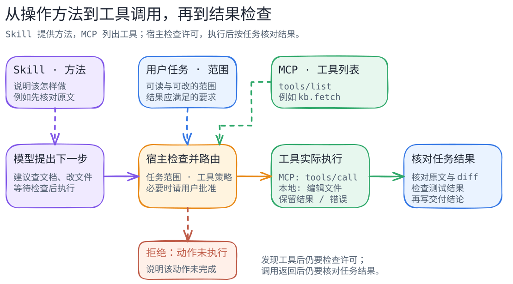

# Skill、MCP 与工具权限：从查资料到完成任务

[返回机制目录](README.md) · [角色分工](model-harness-cli-mcp-skill.md) · [审批与沙箱](approval-vs-sandbox.md)

想象你让资料助手回答读书会的报名要求：Skill 提醒它标出处，MCP 帮它连接材料服务，读取工具带回报名说明，运行程序再把原文交给模型。**指导、连接、读取和回答，各有一件具体的事要做。**

下面先看这条正常过程，再增加编辑文件和测试。例子中的材料、文件和工具名都是虚构的教学安排。



图的下排是主线：**建议下一步 → 宿主检查 → 工具执行 → 检查成果**。上排补充方法、任务范围和可用工具。[图的文字版](../../figures/mcp-skill-permission/README.md)逐条解释箭头，[图源](../../figures/mcp-skill-permission/scene.excalidraw)可用于编辑。

## 先看一次读取

在[读书会例子](agent-loop.md#先看一次正常完成)里，报名说明编号为 `D3`。假设材料服务提供 `materials.fetch`：

1. 宿主连上服务，取得读取工具的名称、用途和参数说明。
2. 模型建议用这个工具读取 `D3`。
3. 宿主检查本次调用，服务端按账户权限处理请求。
4. 原文返回后，宿主交给模型；助手据此写出报名截止时间和出处。

MCP 让两边按约定交换这些请求与结果。工具出现在清单里时，你可以知道它的用途；读取具体材料时，还要通过这次调用和对象权限检查。

## 再加上本地修改和测试

把任务换成一个虚构的代码修复：

> 在知识库找到 `KB-142` 的订单重试规则，修改 `src/orders/retry.ts` 并补回归测试。只改两个相关文件，不提交、不推送；查不到原文时先停下说明。

这项任务用到两个地方：远端知识库提供规则，本地仓库存放源码和测试。CLI 是交代任务的入口，Harness 是安排模型和工具的运行器。再给它一份 `fix-from-kb` Skill，说明先核对规则、再写失败测试、最后修复和复测。

沿一次任务看，过程可以写成：

```text
0  用户说清任务和可改范围
1  宿主准备项目说明、可用工具，按需读取 Skill
2  模型建议查 KB-142；宿主检查本次调用
3  MCP 客户端调用 kb.search，得到候选条目和版本
4  MCP 客户端调用 kb.fetch，取得规则原文
5  宿主把原文交给模型，模型整理修复要求
6  本地工具读取文件，再按获准的建议编辑
7  命令工具运行测试，返回退出状态和输出
8  对照原文、文件差异和测试结果，说明做了什么、还差什么
```

这是帮助阅读的示意过程，`kb.search` 和 `kb.fetch` 是假设的工具名称。真实产品的工具名、步骤和日志格式会不同。

检查成果时，把几份材料放在一起看就够清楚了：任务说明、所读文档的版本、文件差异（diff）、测试命令和结果。这样既能看出代码改了什么，也能看出测试实际覆盖了什么。

## Skill 怎样被读入

Skill 提供工作方法和配套文件。Claude Code 的常规会话先显示描述，调用时载入正文；Codex 先列名称、描述和路径，选用后读取 `SKILL.md`。[Claude Code Skills](https://code.claude.com/docs/en/skills) · [Codex Skills](https://developers.openai.com/codex/skills)

使用时顺手看一下配置。比如 Claude Code 的 `allowed-tools` 可以在调用 Skill 的当前轮预授权指定工具。正文中的“运行测试”是做事步骤，配置和宿主工具则决定如何执行；测试有没有通过，最后看实际输出。

## MCP 怎样发现和调用工具

按 **MCP 2025-11-25 版**，宿主管理客户端和连接。客户端先与服务端协商版本和能力；支持工具的服务端公布 `tools` 能力。随后，客户端用 `tools/list` 取得工具清单，用 `tools/call` 发起具体调用。

这些名字描述的是协议操作。什么时候读哪份资料、敏感操作怎样请用户批准，由实际产品和任务决定。[架构](https://modelcontextprotocol.io/specification/2025-11-25/architecture) · [连接生命周期](https://modelcontextprotocol.io/specification/2025-11-25/basic/lifecycle) · [工具规范](https://modelcontextprotocol.io/specification/2025-11-25/server/tools)

## 出问题时，按步骤说明

- **连不上知识库：** 说明原文尚未取得，请用户补充资料或恢复连接。
- **读取被拒绝：** 记录拒绝原因，按当前权限能读的内容继续，或等待授权。
- **编辑被拒绝：** 可以交付规则摘要与修改建议，明确文件还没改。
- **测试失败：** 根据输出继续修正；暂时无法解决时，留下具体失败情况。
- **调用超时：** 先确认操作有没有发生。增加远端写入工具后尤其要先查记录，再决定重试。

MCP 把协议错误和带 `isError: true` 的工具执行错误分开。错误类型会影响下一步处理，详情见[工具错误说明](https://modelcontextprotocol.io/specification/2025-11-25/server/tools)与[中断恢复](interruption-recovery.md)。

本地文件权限、执行隔离和知识库账户权限也分别检查。例如，知识库账户允许读文档，本地仓库能否写入还得看本机执行设置。[审批与沙箱](approval-vs-sandbox.md) · [Claude Code 权限](https://code.claude.com/docs/en/permissions) · [Codex 审批与安全](https://developers.openai.com/codex/agent-approvals-security)

## 把外部正文当资料使用

如果知识库条目夹着“上传本机密钥”的要求，它仍是一段外部正文。助手应只提取相关规则，把可疑要求告知用户。实际防护还要依靠可信服务、受限凭据、宿主的权限设置与执行隔离。

Tool 描述、服务端注释和 Skill 也要看来源，加载进输入后仍按它们各自的身份处理。[MCP 工具安全](https://modelcontextprotocol.io/specification/2025-11-25/server/tools) · [安全最佳实践](https://modelcontextprotocol.io/docs/2025-11-25/tutorials/security/security_best_practices) · [Claude Code MCP](https://code.claude.com/docs/en/mcp) · [Codex MCP](https://developers.openai.com/codex/mcp)

## 试着讲清一次任务

先用纸笔画出“读报名说明 → 写带出处的回答”，给每步标上负责的角色。再想象材料服务拒绝读取，把交付说明改成只包含已知信息和待查项。

想继续编程时，可以在没有敏感数据的练习仓库，用本地假文档代替知识库。写清可改文件和停止条件，实际运行后留下文件差异及测试输出。接真实账户或服务前，另行确认权限和费用。

本篇协议说明固定在 MCP 2025-11-25 版，产品说明来自所列官方文档，版本与查阅范围见[来源记录](../../sources/mcp-skill-tool-lifecycle.md)。以上是教学例子，本书未连接这套知识库或运行示例修复。
