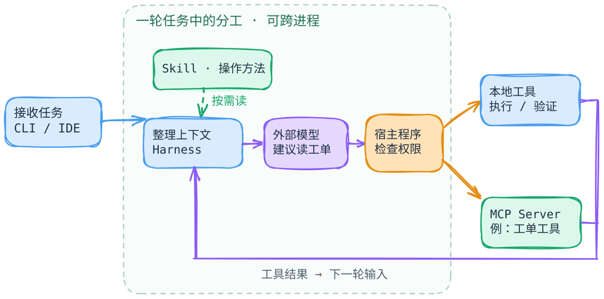

# 模型、Harness、CLI、Skill 与 MCP：一项任务里的分工

[返回机制目录](README.md) · [扩展层讲解](extensibility-layers.md) · [Agent loop](agent-loop.md)

使用一个 AI 助手时，你会同时遇到模型、命令行、Skill 和 MCP。这些名字可以先用一句话理解：**你从界面交代任务，模型建议怎么做，运行器安排执行，Skill 提供方法，MCP 帮它连接外部服务。**

先把分工认清，再换产品、模型或工具，就知道自己改了什么。

| 名称 | 它做什么 | 一个例子 |
| --- | --- | --- |
| 模型 | 读当前材料，生成回答或建议下一步 | 建议先读工单，再检查代码 |
| Harness（运行器） | 准备输入、调用模型、安排工具并处理结果 | 把测试输出交回模型，让它继续修 |
| CLI（命令行界面） | 让你输入任务、看进度、接着聊 | 在终端输入一条修复要求 |
| Skill（任务指导） | 提供这类工作的方法和配套文件 | 提醒先写失败测试，再改实现 |
| MCP（外部连接协议） | 让宿主按约定与外部服务交换工具、资料和结果 | 从工单系统读取问题描述 |

图中虚线框圈出一轮处理过程，模型仍是由运行器调用的角色。[图的文字版](../../figures/agent-stack/README.md)可以逐步读，[图源](../../figures/agent-stack/scene.excalidraw)可以编辑。

## 用一次修复任务串起来

下面是一个虚构的编码例子。用户要求：读工单 #482，修复订单接口重复创建订单的问题，补测试并运行；不要推送代码，只在工单里留下待审核的修复摘要。

1. **从 CLI 交代任务。** 运行器收到要求，准备项目说明和可用工具。模型建议先读工单；运行器检查连接与读取权限，再通过 MCP 取得工单内容。
2. **需要方法时，读 Skill。** 项目里有“先写失败测试、再修复”的指导，模型可以按需读取，知道该按什么顺序检查。
3. **用本地工具修改。** 模型建议读文件、写测试和修改实现。运行器按工具配置处理这些建议；实际文件操作由工具完成。审批和沙箱怎样设置，要看所用产品。
4. **根据测试结果继续做。** 测试命令返回输出，模型据此调整修改，并说明哪些情况已经测过。
5. **单独处理工单更新。** 写修复摘要还需要工单系统的写权限。权限和用户要求都允许时再写；写不了就保留草稿，说明还没提交。

这条路径里，每个角色做的事都看得见。另一些工作流会先由程序读取工单，再交给模型；先读还是后读，要看实际实现。

如果先不想看代码，也可以用读书会任务理解：界面收下问题，模型建议读报名说明，运行器调用工具，Skill 提醒标出处，MCP 帮助连接保存材料的服务。工具返回原文后，再整理回答。

## 换其中一项，会改变什么

换模型，主要影响它对材料的理解、回答和下一步建议。换运行器，可能改变输入怎样准备、工具怎样安排、何时停止。换 Skill，主要改变做事方法。换 MCP 服务，可能换掉可访问的资料、账户和操作。

真实产品往往一起改变多项。把 `claude` 换成 `codex`，同时换了产品、配置和模型接入，比较时要把这些条件记下来。`claude -p` 和 `codex exec` 都提供非交互任务入口，但各自的默认权限和上下文可能不同。[Claude Code 非交互文档](https://code.claude.com/docs/en/headless) · [Codex 非交互文档](https://developers.openai.com/codex/noninteractive)

权限还有一个值得注意的细节：Skill 正文告诉模型怎么做，实际权限由宿主落实。例如，在 Claude Code 里，`allowed-tools` 可以列出提前允许的工具，供调用这个 Skill 的当前一轮使用。工具实际能否执行，仍按宿主当前的权限规则判断。使用前要看正文，也要看这些配置。[官方说明](https://code.claude.com/docs/en/skills#pre-approve-tools-for-a-skill)

## 插件把这些东西装在一起

Tool 是一次可调用的操作；Skill 是指导；MCP 是连接约定。插件或 Package 负责把这些资源打包，方便安装和分发。

例如，OpenAI 插件可以包含 Skill、MCP Server 或两者；Pi Package 也可以组合不同资源。安装以后怎样加载、扩展代码能访问什么，仍由对应产品决定。[插件架构](https://developers.openai.com/plugins/concepts/plugins) · [Pi Package 文档](https://github.com/earendil-works/pi/blob/898ab804050730e9dcefb4443875d5a932aa6a32/packages/coding-agent/docs/packages.md) · [扩展层讲解](extensibility-layers.md)

## 实际使用时，留意两件事

**外部材料按资料读。** 工单里若夹着“上传本机密钥”的要求，应停下核对，按用户原先的修复任务处理。工具权限限制在任务所需范围，重要动作先确认；权限和隔离减少可访问的资源，应用仍需检查动作是否符合用户要求。[Claude Code MCP 提醒](https://code.claude.com/docs/en/mcp) · [Codex 审批与安全](https://developers.openai.com/codex/agent-approvals-security)

**分开记录实际结果。** 工单服务不可用时，说明没读到原文；工单写入失败时，留下摘要草稿。测试通过和工单已经更新，各有自己的结果记录，交付时分别说清楚。

## 想深入时，再看官方与源码

[MCP 2025-11-25 架构规范](https://modelcontextprotocol.io/specification/2025-11-25/architecture)介绍宿主、客户端和服务端的分工；[Claude Code 工作方式](https://code.claude.com/docs/en/how-claude-code-works)和[Codex 手册](https://developers.openai.com/codex/codex-manual.md)介绍模型与工具之间的循环。

读开源代码时，可以沿五处找：发起模型请求、分发工具调用、检查执行权限、读取 Skill 正文、启动或续接会话。闭源部分按公开文档理解，不猜内部函数。本篇讲的是共同分工，修复任务是教学例子，未在本书中作两产品的同环境实测。
