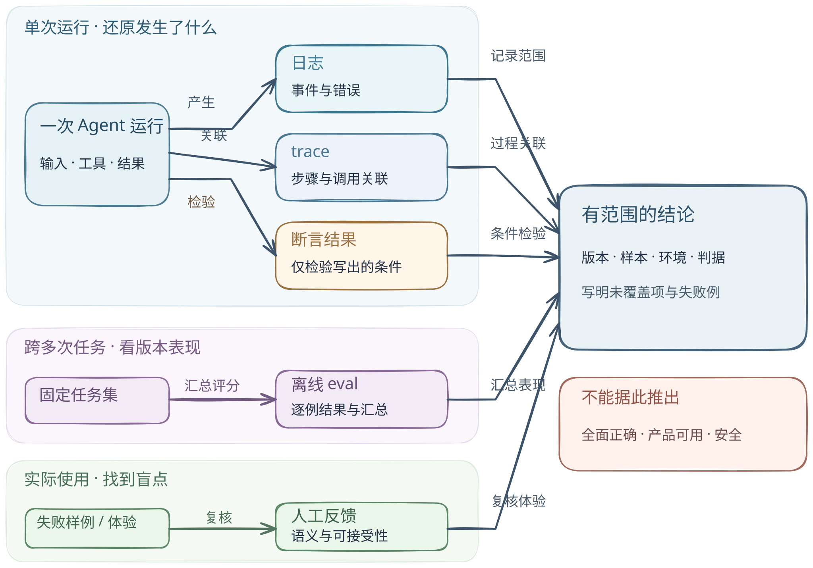

# 观察、测试与评测：一次通过能说明什么

[返回机制目录](README.md) · [Agent loop](agent-loop.md) · [mini-swe-agent 固定版本剖面](../systems/mini-swe-agent/README.md)

一个 Agent 显示“任务完成”，团队仍要回答两个不同的问题：**这一轮实际发生了什么？**以及**这些行为和结果是否满足用户目标及安全边界？**前者需要可追溯的观察；后者需要明示的判据、样本和人的判断。某条记录存在，不表示记录完整；某个测试通过，也只表示它检查的条件在被测环境和输入上成立。

[图的文字版与可编辑图源](../../figures/observation-evaluation/README.md) · [单独打开 SVG 放大阅读](../../figures/observation-evaluation/diagram.svg)。图把单次运行、跨任务评测和实际使用分成不同尺度：每类证据回答不同问题，再汇合成**有范围的结论**。箭头表示产生、关联、检验、汇总或复核，不表示五项检查是必经的线性流水线，也不表示某个产品内置全部环节。

## 最小场景：让 Agent 改一个配置

用户要求 Agent 把服务超时时间改为 5 秒，并保持现有重试规则。Agent 修改文件、运行单元测试、报告完成。要判断交付是否可信，可以依次问：它实际改了哪一行、调用了哪些工具？测试检查了什么？对不同配置和失败注入是否仍成立？用户是否认可等待体验？更关键的是，改动是否越过权限或泄露了不该写入日志的数据？这几个问题需要不同证据。

| 手段 | 主要回答 | 可核对的产物 | 典型盲点 |
| --- | --- | --- | --- |
| 日志 | 某时点记录了什么事件、错误或值？ | 带时间、级别与上下文的事件记录 | 未记录的动作看不见；一条“成功”日志不能证明副作用正确。 |
| trace（执行轨迹） | 同一次任务中，步骤、调用、耗时及因果关系如何串联？ | 同一请求下的 span 或模型/工具调用序列 | 缺采样、缺上下文或跨进程关联会留下空白；轨迹描述过程，不自动判定质量。 |
| 断言/自动测试 | 一个明确的不变量在给定输入和环境中成立吗？ | 用例、预期、实际结果、通过/失败 | 只覆盖写出的判据；mock、固定样例和测试环境可能遮住真实副作用。 |
| 离线 eval | 在选定任务集和评分规则上，版本表现怎样？ | 数据集版本、参考答案/评分器、逐例结果与汇总 | 样本分布、标签和评分器偏差；平均分会掩盖严重的少数失败。 |
| 人工反馈 | 结果对具体用户或审核者是否有用、可接受？ | 反馈、复核理由、纠错样例 | 主观且有选择偏差；单次点赞无法替代系统性覆盖。 |

OpenTelemetry 将日志定义为事件记录、trace 定义为请求路径；日志可通过 trace/span ID 与执行上下文关联，但两者仍是不同信号。[信号概念](https://opentelemetry.io/docs/concepts/signals/) · [日志关联规范](https://opentelemetry.io/docs/specs/otel/logs/#log-correlation) LangSmith 的官方文档把离线评测用于事前的精选数据集，把在线评测用于生产轨迹监测，并将规则式代码评估器、模型评分器及汇总评估器区分开。[评测类型](https://docs.langchain.com/langsmith/evaluation-types) 这些是工具文档对能力的说明；本文没有在这些服务上运行评测。

## 怎样汇合不同尺度的证据

- **定义任务和边界。** 写下允许改的文件、预期的 5 秒值、不许改的重试规则，以及用户真正关心的等待体验。没有完成标准，“通过”没有解释力。
- **观察单次运行。** 保存输入、模型/工具动作、工具返回与最终改动的关联 ID；日志适合定位事件，trace 适合沿同一任务还原调用关系。敏感输入应按数据策略脱敏，不能为排错而无限制记录。
- **检验明确条件。** 例如配置解析后超时为 5 秒、重试次数保持原值、工具命令退出码符合预期。断言失败应能回到具体运行和改动；断言通过只能确认这些条件。
- **评测跨任务表现。** 固定任务集、系统版本、模型配置和评分规则，保留逐例结果，并单列“超时已改却误删重试”等关键失败。需要比较新旧版本时，在相同数据集和规则上比较，而不是只看一次总分。
- **复核真实使用。** 人检查配置语义、交互体验和异常场景的可接受程度。将有代表性的失败经脱敏与授权后加入回归集；人工复核也要记录判断标准和分歧。

以上是**工程推断的检查清单**，不是任一 Agent 项目在源码中已经实现的五段流水线。日志、trace 与断言可以围绕同一次运行并行产生；离线 eval 需要跨多次任务的样本；人工反馈可从失败样例或真实使用直接进入。它们的覆盖范围分别写入交付判断。LangSmith 文档描述了生产问题进入离线数据集的反馈循环，但没有替本章的样例作出质量结论。[生产反馈循环](https://docs.langchain.com/langsmith/evaluation-types#production-feedback-loop)

## 固定版本映射：mini-swe-agent 的轨迹能回答哪一步

以下只看 [`SWE-agent/mini-swe-agent@04d809ceab9df28f9adaed044884180159172930`](https://github.com/SWE-agent/mini-swe-agent/tree/04d809ceab9df28f9adaed044884180159172930) 的 `DefaultAgent` 基类，核对日期为 2026-09-23。**源码事实**：`run()` 初始化消息列表并逐轮调用 `step()`；`query()` 把模型回复加入 `self.messages`；`execute_actions()` 执行动作，再把格式化观察加入消息列表。[循环与消息](https://github.com/SWE-agent/mini-swe-agent/blob/04d809ceab9df28f9adaed044884180159172930/src/minisweagent/agents/default.py#L88-L157) `serialize()` 将消息、模型调用数、成本、退出状态和 submission 放进轨迹结构；`save()` 只在配置了 `output_path` 时写 JSON 文件。[序列化与保存](https://github.com/SWE-agent/mini-swe-agent/blob/04d809ceab9df28f9adaed044884180159172930/src/minisweagent/agents/default.py#L159-L190)

**源码事实**：基类在末条消息 `role == "exit"` 时停止并返回它的 `extra`；但超限、连续格式错误和 `Submitted` 都可能写入 `exit`，普通异常记录后还会重新抛出。[停止与错误分支](https://github.com/SWE-agent/mini-swe-agent/blob/04d809ceab9df28f9adaed044884180159172930/src/minisweagent/agents/default.py#L96-L124) · [LocalEnvironment 的 Submitted 路径](https://github.com/SWE-agent/mini-swe-agent/blob/04d809ceab9df28f9adaed044884180159172930/src/minisweagent/environments/local.py#L24-L56) 因而 `exit` 代表控制流停止，不能当作“用户目标已达成”的断言。基类消息账本是**一次运行的局部轨迹**，不能等同于具备跨服务 span 关联的分布式 trace；这里只借它说明怎样核对一次行动。[本仓库的系统剖面](../systems/mini-swe-agent/README.md)还说明默认 CLI 使用覆盖部分方法的 `InteractiveAgent`，不能把基类行为外推到 CLI 全部模式。

**未验证**：本章没有运行模型、环境命令、测试集或人工试读，也没有审计该固定版本是否在其他模块另有评测功能；不作“mini-swe-agent 没有评测”的全项目断言。

## 失败反例：五种证据仍可能指向不同结论

假设 Agent 写入 `timeout=5`，测试只断言这一项，结果为绿；轨迹显示命令执行且退出码为 0。但 Agent 同时把 `retries=3` 改成 `retries=0`。单条“配置已写入”日志、成功的工具退出码和狭窄断言都与**错误交付**相容。离线任务集若没有“保留重试规则”的样例，也可能全部通过；没有用户或领域审核，等待体验的损失仍会被漏掉。这是说明判据缺口的**构造反例**，不是 mini-swe-agent 的实测故障。

反向也成立：人工评价“看起来很好”不能证明没有越权读取或敏感数据泄漏。要得到安全结论，须另有针对权限、隔离、数据流、攻击输入和真实部署边界的审查与测试；本章的普通功能测试不涵盖这些条件。**测试通过也不能证明离线 eval 有效**：样本是否代表真实任务、标注是否一致、评分器是否可靠，都要单独复核。测试通过只能写成“在**指定版本、样本、环境和断言**下未发现相应失败”，不能推出产品可用性、所有任务正确率、生产稳定性或安全性已经得到证明。

## 实际交付时记录什么

最低限度保留：被测源码与配置版本、输入及数据集来源、执行环境、是否使用 mock、日志/轨迹的采集范围、断言全文、逐例失败、汇总指标与评分器版本、人工评审标准及未覆盖风险。对失败给出可复现输入；对成功写明结论范围。若涉及真实用户数据，应先确定采集、脱敏、访问和保留规则。完成这些记录仍不是自动发布许可；它只是让后续复核能指出哪一层证据支持哪一句话。
