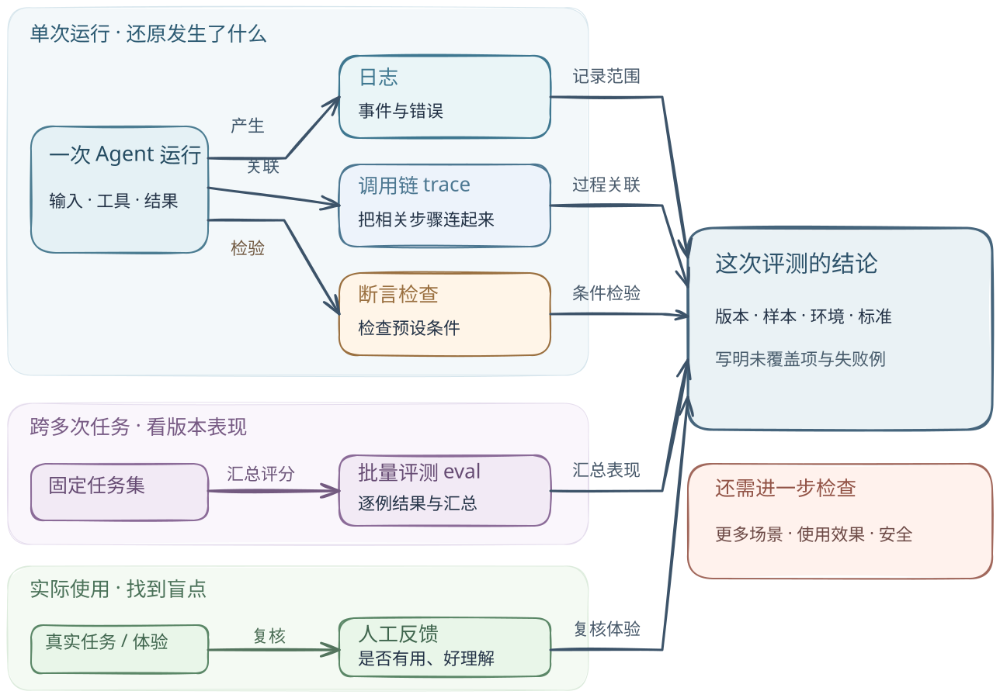

# 观察、测试与评测：检查助手做得怎么样

[返回机制目录](README.md) · [Agent loop](agent-loop.md) · [mini-swe-agent 项目导读](../systems/mini-swe-agent/README.md)

你让助手把超时时间改成 5 秒，同时保留原来的重试次数。检查结果时，可以先打开修改后的文件：超时是否为 5 秒，重试次数是否还是原值。再运行测试，看看程序能否按这个配置工作。

这就是评估的起点：**先写清楚想得到什么，再用合适的方法检查。**

[图的文字说明](../../figures/observation-evaluation/README.md) · [单独打开 SVG](../../figures/observation-evaluation/diagram.svg)

图里有几种检查办法，可以根据任务选择和组合。一次任务的执行记录帮助排错，一组任务帮助比较版本，使用者的反馈帮助改善实际体验。

## 五种方法各有用途

**日志**记录某个时刻发生的事情，例如“读取了配置文件”或“命令报错”。排查失败时，可以从错误附近的记录开始看。

**执行轨迹，英文 trace**，把同一次任务中的步骤串起来：模型何时请求工具，工具花了多久，结果怎样送回。分布式系统常用 span 表示其中一个步骤，并用标识将它们关联。

**自动测试**检查提前写好的条件。这个例子可以检查两项：超时时间为 5 秒，重试次数保持为 3。测试失败时，输出实际值，方便定位修改。

**评测，常写作 eval**，用一组任务和相同评分规则检查表现。比如准备不同格式的配置、缺少字段的配置和较长文件，比较新旧版本处理这些任务的结果。

**人工反馈**关心实际使用。使用者可以指出答案不清楚、操作太慢，或某个结果虽然满足字段要求，却不适合真实工作。

| 方法 | 可以保存的内容 | 适合做的事情 |
| --- | --- | --- |
| 日志 | 时间、事件、错误和相关标识 | 定位某次故障 |
| 执行轨迹 | 同一次任务的步骤、调用和耗时 | 看清流程怎样连接 |
| 自动测试 | 输入、预期、实际值和通过结果 | 检查明确条件 |
| 评测 | 任务集、评分规则、逐例结果和汇总 | 比较多个任务或版本 |
| 人工反馈 | 使用意见、修改理由和例子 | 改善用途和阅读体验 |

OpenTelemetry 的[信号概念](https://opentelemetry.io/docs/concepts/signals/)和[日志关联规范](https://opentelemetry.io/docs/specs/otel/logs/#log-correlation)解释了日志、trace 及其关联。LangSmith 的[评测类型文档](https://docs.langchain.com/langsmith/evaluation-types)区分离线数据集评测、在线运行监测，以及代码和模型评分器。

## 把检查条件写完整

回到改配置的任务。测试只写“超时为 5 秒”时，助手即使误改了重试次数，这条测试也会通过。增加“重试次数仍为 3”的条件，就能检查用户的另一项要求。

还可以检查修改范围：只有允许的配置文件发生变化。需要判断等待体验时，再用相应的运行场景和用户反馈补充。

因此每次报告测试结果，都写清楚检查了什么。一个容易读懂的表述是：

> 在这组配置样例中，超时时间已改为 5 秒，原重试次数保持不变；暂未检查高并发下的等待体验。

这比单独说“全部通过”更方便下一位维护者继续检查。

## 从一个例子扩展到一组任务

先准备具有代表性的样例，列出正确结果。运行后保留每一个任务的结果，再汇总成功比例、耗时和费用。严重失败单独列出，例如修改了不允许改的文件，避免它被平均值掩盖。

比较新旧版本时，尽量保持任务集、模型设置、执行环境和评分规则一致。模型评分器也需要抽样人工复核，确认它能识别本任务的重要错误。

如果在实际使用中发现有代表性的失败，可以在获得许可、去掉敏感信息后，把它加入回归测试。回归测试用于防止修复的问题再次出现。[LangSmith 的生产反馈循环](https://docs.langchain.com/langsmith/evaluation-types#production-feedback-loop)介绍了这种做法。

## 从 mini-swe-agent 的记录开始读源码

不必一上来搭完整监测系统。mini-swe-agent 的 `DefaultAgent` 基类提供了一个较短的例子。

`run()` 初始化消息，循环调用 `step()`。`query()` 把模型回答加入消息列表。`execute_actions()` 执行工具，再把格式化的工具结果加入消息。因此沿着这个列表，可以查看一次运行里模型请求了什么、工具返回了什么。

[循环与消息源码](https://github.com/SWE-agent/mini-swe-agent/blob/04d809ceab9df28f9adaed044884180159172930/src/minisweagent/agents/default.py#L88-L157)

`serialize()` 整理消息、模型调用次数、成本、退出状态和 submission；配置了 `output_path` 时，`save()` 才把它写成 JSON 文件。

[整理与保存源码](https://github.com/SWE-agent/mini-swe-agent/blob/04d809ceab9df28f9adaed044884180159172930/src/minisweagent/agents/default.py#L159-L190)

这份记录描述一次运行。它与跨服务关联的分布式 trace 有不同用途。查看停止原因时，还要读 `exit` 消息的内容：提交结果、达到上限和连续格式错误，都可能让循环退出；普通异常记录后会重新抛出。

[停止和错误分支](https://github.com/SWE-agent/mini-swe-agent/blob/04d809ceab9df28f9adaed044884180159172930/src/minisweagent/agents/default.py#L96-L124) · [提交结果的路径](https://github.com/SWE-agent/mini-swe-agent/blob/04d809ceab9df28f9adaed044884180159172930/src/minisweagent/environments/local.py#L24-L56)

默认 CLI 使用的 `InteractiveAgent` 还覆盖了部分方法。想了解 CLI 的具体行为，可以接着读[项目导读](../systems/mini-swe-agent/README.md)。

## 为后续改进留下什么

至少保留任务样例、正确结果、程序和模型版本、测试环境，以及逐例失败。记录是否使用模拟数据或 mock，也就是用替身代替真实服务。人工审读时，保留具体句子和修改理由，比只有“好”或“不好”的评分更有帮助。

涉及私人资料时，先确定哪些信息可以记录、谁能查看、保存多久。安全权限、数据泄漏等问题需要专门的测试，普通功能样例主要检查任务结果。

本章核对了文档和固定版本源码，没有在这些监测服务上运行评测，也没有据此给产品打分。
