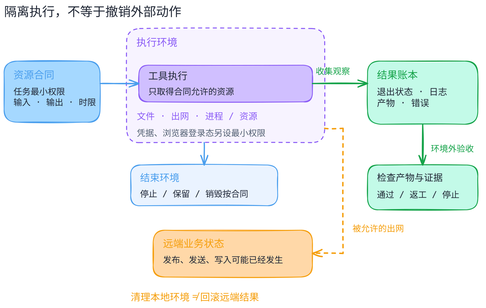

# 沙箱执行环境：把不确定的代码放到什么边界里？

[返回机制目录](README.md) · [先区分审批与隔离](approval-vs-sandbox.md) · [外部动作与恢复](../comparisons/permission-and-recovery.md)

读完这一篇，你应能为一个任务写出执行环境的资源合同，而不是只说“放进 Docker 就安全了”。本篇依据 2026-09-27 核对的官方文档解释机制；没有安装这些运行时，没有测试隔离逃逸，也不作安全强度或速度排名。

## 从一个小任务开始

假设你让 Agent 修复一个 CSV 转换脚本。它需要读样例、写输出、运行测试；样例可能来自陌生人，依赖的安装脚本也可能执行代码。这个任务**需要计算能力，不需要你的全部电脑**：私人目录、生产密钥、已登录的浏览器和自由出网都不是必需资源。

“批准修复脚本”只说明任务可以开始。[上一章](approval-vs-sandbox.md)回答谁批准；这一章继续问：代码在哪里运行，获得什么资源，结束后哪些状态还在？先列最小合同：输入目录只读，输出目录可写，测试有时限，不注入真实密钥，默认不连外网。这里的合同是工程设计示例，不是某平台默认配置。

[可编辑图源](../../figures/sandbox-execution/scene.excalidraw) · [PNG 预览](../../figures/sandbox-execution/preview.png) · [图的文字版](../../figures/sandbox-execution/README.md)。这是教学机制图：实线表示本例的流程，虚线外圈表示执行环境边界，橙色虚线表示获准出网时的条件路径；具体资源限制仍须由选定运行时落实。

## 不同工具不是同一层的替代品

| 选择 | 它主要提供什么 | 还要检查什么 |
| --- | --- | --- |
| 本地进程策略 | 用操作系统机制限制文件、进程或网络访问 | 限制是否真正施加在执行进程及子进程上 |
| Linux 容器 | 以 namespaces 划分资源视图，以 cgroups 管资源使用 | 挂载、权限、宿主内核、daemon 控制权 |
| gVisor | 用 Sentry 应用内核处理工作负载的系统调用 | 所需功能兼容性、暴露的文件与网络 |
| Firecracker microVM | 用 KVM 和虚拟设备运行独立客体环境 | 宿主配置、VMM 降权、出网过滤 |
| E2B、Daytona 等远端平台 | 将创建、连接、停止等环境操作包装成服务 API | 底层隔离、账户权限、数据驻留、生命周期 |

容器的 namespaces 与 cgroups 各有职责：前者划分资源视图，后者做资源计量和限制。它们不能代替对挂载、capabilities 和 daemon 接口的检查；Docker 官方明确把配置漏洞与内核漏洞列为隔离风险。[Docker 安全文档](https://docs.docker.com/engine/security/) · [系统调用过滤](https://docs.docker.com/engine/security/seccomp/)

gVisor 不是“更严格的 syscall 黑名单”，也不是 microVM：它在用户态实现应用内核 Sentry，处理工作负载的系统调用，再通过受限接口与宿主交互。这增加了隔离层，也引入兼容性取舍；所需程序是否可用仍应实际测试。[架构说明](https://gvisor.dev/docs/architecture_guide/intro/) · [兼容性说明](https://gvisor.dev/docs/user_guide/compatibility/)

Firecracker 是 microVM 的 VMM，使用 KVM 执行客体；官方设计仍要求约束 VMM 进程，建议生产环境使用 `jailer` 降权。尤其要注意：**它本身不做网络流量过滤**，出网策略是宿主集成的一部分。因此“换成 microVM”不是“不再需要网络权限设计”。[固定版本设计文档](https://github.com/firecracker-microvm/firecracker/blob/edb60617c31ebd610c530f67706ec5c79d4c2725/docs/design.md)

这些层还可以组合。NVIDIA OpenShell 的官方资料把文件、进程、出网和推理路由分别施加控制：文件与进程策略在创建时锁定，网络与推理配置可运行时更新。它值得作为**策略治理与执行环境组合**的案例，不宜直接排在“容器、gVisor、microVM”同一行比较内核隔离强弱。[官方项目](https://github.com/NVIDIA/OpenShell) · [控制与放宽风险](https://docs.nvidia.com/openshell/security/best-practices.md)

## 一份资源合同要写五件事

第一是**文件**：输入、输出、临时文件分别在哪，允许读写哪些挂载？只改当前工作目录不是访问控制。第二是**网络**：谁可以连接谁，是否能访问内网与元数据服务，下载依赖是否也打开了上传通道？E2B 官方文档说明其沙箱默认允许出网；Daytona 的默认网络策略还受组织层配置影响。不能靠服务名字推断它离线。[E2B 出网配置](https://docs.e2b.dev/network/internet-access) · [Daytona 网络限制](https://www.daytona.io/docs/en/network-limits/)

第三是**进程和资源**：用哪个用户执行，能否提权、生成子进程、耗尽内存，超时后怎样终止？第四是**秘密**：究竟哪些进程能取得凭据，作用域和有效期如何限制，日志是否会保存它？代理代填凭据与直接把密钥交给代码，是不同设计。[OpenShell 凭据与推理控制](https://docs.nvidia.com/openshell/security/best-practices.md)

第五是**浏览器身份**：独立 BrowserContext 不等于无账户权限。导入登录态后，页面动作就可能以该账户身份发生。Playwright 官方提醒，保存的认证状态可能包含能冒用账户的 cookies 与 headers，不应提交进仓库。不要把个人浏览器目录当普通样例挂进去。[认证状态说明](https://playwright.dev/docs/auth)

## 把生命周期接回 Agent 的循环

回到 CSV 任务，宿主先选择模板和资源合同，创建环境并记下 ID；只送入必要输入，在环境内运行脚本；收集退出状态、输出、日志与资源事件；由环境外的验收逻辑检查结果；最后按合同保留产物或销毁环境。**输出待验收，不是因为来自沙箱就可信。** 验收本身也按最小权限处理不可信产物，不在宿主直接执行返回的脚本。这是工程编排建议，不是任一 SDK 的完整接口定义。

暂停、停止和删除也不能混用。Daytona 的 `stop` 保留文件系统、清除内存；其 Linux VM 与 Windows 环境另支持保留内存的暂停，容器环境不支持该暂停。E2B 的暂停可保留文件与内存，也提供仅保留文件、恢复时重启的方式；`kill` 则不能恢复。应按环境类型和具体操作记录保留了什么，不能把“持久化”统称为完整恢复。恢复现场也不等于模型重新获得上下文。[Daytona 停止与暂停](https://www.daytona.io/docs/en/sandboxes/#stop-sandboxes) · [E2B 持久化](https://docs.e2b.dev/sandbox/persistence)

在现有书稿里，Codex 的执行策略与沙箱选择是这一编排的局部映射；OpenHands 的动作事件说明“提出、记录、执行、观察”也有不同阶段。不能反过来用某个终端工具的工作目录证明实际部署已经隔离。[Codex 剖面](../systems/codex/README.md) · [OpenHands 剖面](../systems/openhands/README.md)

## 两个容易漏掉的反例

**反例一：为了方便，挂入整个家目录和 Docker 控制接口。** 容器仍然存在，却得到过多资源；Docker 官方说明，daemon 的控制者能创建强大挂载，影响宿主文件系统。隔离原语没有替你选对权限。[Docker daemon 攻击面](https://docs.docker.com/engine/security/#docker-daemon-attack-surface)

**反例二：环境里已登录后台，Agent 点了发布，然后宿主销毁环境。** 文件和进程清理了，远端发布不会因此自动撤销。沙箱没有证明业务授权，也没有证明发布正确；需要审批、操作 ID、外部状态查询及对账。已有[回执丢失练习](../labs/remote-effect.md)可用于理解这条恢复边界，但不是浏览器或真实沙箱的实测。

## 自测与下一步实验

1. 只读挂载源文件，能保证数据不外传吗？不能；还要检查出网与其他可读资源。
2. Daytona 停止后再启动，能直接恢复原进程内存吗？其文档说内存状态清除，不能如此推断。
3. 限制到一个可信域名，就能保证每个请求符合任务吗？不能；可达目的地与业务允许动作是两层判断。

下一步在专门 Linux 测试环境准备假数据与“秘密”哨兵，比较仅设工作目录和真正限制资源的结果，检查越界读、子进程、超时与产物。清理要核对进程确已终止，不只看停止请求已接受。不要用个人目录、登录态或生产密钥；标准库模拟器不能证明内核隔离。
