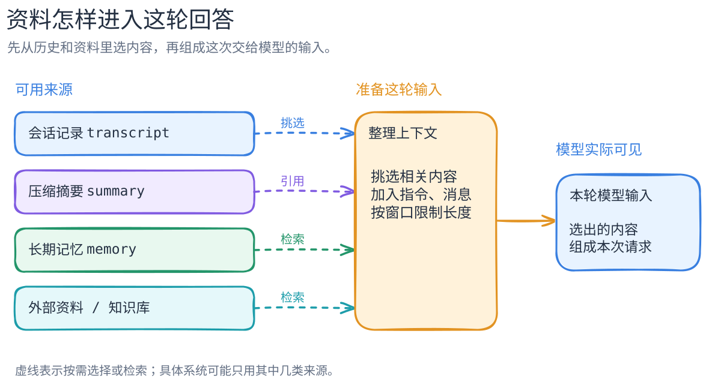

# 动手：把需要的历史选进本轮输入

[返回学习路线](../learning-path.md) · [上下文与记忆的机制解释](../concepts/context-vs-memory.md) · [第一条本地练习](first-agent-loop.md)

这一课给你 5 条聊天记录，把它们装进一份有长度限制的输入。预算充足时，5 条都能带入；预算缩小时，要选择更有用的记录。你会尝试扩大预算和优先检索两种方法，最后得到一张“保存了什么、这轮选了什么”的对照表。

记录采用虚构的草稿讨论：最早一条说“本轮只允许生成预览稿；没有用户批准，不得对外发布”，后来又讨论目录、来源、排版和学习路线。程序读取这些材料后，判断当前是否有发布许可。

这是可选的机制小实验。运行前请确认 Python 3.10+；只用标准库，无需 API Key、不联网、不发布内容。`judge_visible()` 是识别固定短语的规则程序，作用是让你直接看见输入选择的效果。

## 先预测，再跑三轮

从仓库根目录执行，使用 Python 3.10 或更新版本，无需安装第三方包：

```bash
python3 examples/context-budget/demo.py --mode full
python3 examples/context-budget/demo.py --mode recent
python3 examples/context-budget/demo.py --mode retrieve
python3 -m unittest discover -s examples/context-budget -p 'test_*.py'
```

运行前先写下你预计各模式会选中的记录 ID；运行后对照 `stored_records` 和 `visible_ids`。前者是保存的材料，后者是本轮装入的材料。

本例按字符数设置预算，把规则、问题、记录 ID、正文、分隔符和换行一起计入。它用来演示长度限制，实际模型的 token 计数另有规则；计数细节见末节。

装配器先保留必要规则和问题，再逐条尝试完整记录；默认从最新的 `r5` 开始。某条装不下就跳过，继续尝试下一条，不把一条约束截成半句。检索模式把命中的旧约束 `r1` 提到候选顺序最前面，再用**同一个预算**重新装配。

| 模式 | 总预算／实际占用 | 本轮 `visible_ids` | 规则判读器结果 |
| --- | --- | --- | --- |
| `full` | 1200／248 字符 | `r5, r4, r3, r2, r1` | `do_not_publish`：看见明确的不得发布约束。 |
| `recent` | 220／212 字符 | `r5, r4, r3, r2` | `insufficient_evidence`：没有看见发布许可依据。 |
| `retrieve` | 220／217 字符 | `r1, r5, r4, r3` | `do_not_publish`：旧约束重新变得可见，`r2` 被挤出。 |

先看 `full`：预算足够，5 条记录都装入，程序读到最早的约束。`recent` 保留较新的 4 条，发布依据不足，因而返回 `insufficient_evidence`。`retrieve` 在相同的 220 字符预算内优先装入旧约束，恢复了对它的读取；代价是挤出 `r2`。这就是输入选择的取舍。

## 看清四份信息各归谁



概念图左边是保存或可查询的材料，中间负责选择，右边是一次请求的实际输入。本实验走其中的**固定历史 → 选择／字面检索 → 本轮上下文**路径。图的[完整文字说明](../../figures/context-vs-memory/README.md)可单独阅读。

输出按四个位置组织：

- **保存来源 `stored_records`**：本次进程中保存的完整原记录，供读者对照。
- **本轮输入 `context` 与 `visible_ids`**：实际交给判读器的字符串和入选记录 ID。
- **判读结果 `answer`**：规则程序依据这份输入形成的判断。
- **事后检查 `audit`**：回答之后再对照完整历史，检查旧约束的保存和装入情况。

完整 JSON 是给读者的对照材料。判读器只收到 `context`；`stored_records` 和 `audit` 属于其他位置。顺着这三个字段查看，就能追踪一条信息从保存到使用的过程。

例如 `recent` 的最后一个选择事件为：

```json
{
  "event": "select_record",
  "id": "r1",
  "characters": 36,
  "remaining_before": 8,
  "selected": false,
  "reason": "whole_record_does_not_fit"
}
```

这条记录表示一次选择：剩余 8 字符，完整的 `r1` 要 36 字符，所以本轮跳过它。它仍保存在 `stored_records`。`audit` 也分别写出 `critical_record_stored=true` 和 `critical_record_visible=false`，清楚显示保存与装入的位置。

## 沿代码找到四个函数（可选）

打开 [`demo.py`](../../examples/context-budget/demo.py)，按四个函数阅读即可：

1. `retrieve()` 在保存来源里查找字面字符串“用户批准”，返回命中 ID。查询词在 `run()` 中固定；单独改 `QUESTION` 时查询词保持原样。这是字面检索，改词或改来源措辞会影响命中。
2. `assemble()` 先检查必要输入能否放下，再按候选顺序装完整记录。每次写下候选成本、剩余额度和取舍；预算紧张时，重新检索会改变谁被选中，而不会扩大窗口。
3. `judge_visible(context)` 只收到装配后的字符串，没有历史、检索 ID 或 `audit`。它只识别固定的禁止发布短语；空输入也不会暗中去全局历史找答案。
4. `run()` 得到回答后，再用完整记录生成 `audit`。检查端使用相同固定短语，并与判读器的输入分开；它用于对照记录的保存和装入情况。

来源仍在时，宿主可以重新查询、调整顺序，再生成下一份输入。这条思路也能帮助你阅读 [Pi 的上下文装配](../concepts/context-vs-memory.md)、[Mem0 的检索接入](../systems/mem0/README.md)和 [Letta 的可编辑记忆](../systems/letta/README.md)；具体实现见各项目章节。

## 改一个参数，用轨迹验收

先预测把新近选择的预算从 220 调为 248 会发生什么，再只改命令参数：

```bash
python3 examples/context-budget/demo.py --mode recent --budget 248
```

在输出里标出四项：5 条记录仍保存、`r1` 已装入、总占用为 248、回答为 `do_not_publish`。这四项连起来，就说明本模拟器怎样通过扩大预算恢复约束。

再保持检索开启，把预算缩为 91：

```bash
python3 examples/context-budget/demo.py --mode retrieve --budget 91
```

这次查中了 `r1`，但必要输入先占 56 字符，剩余 35 字符放不下 36 字符的记录。装配器继续尝试，最后选中恰好 35 字符的 `r3`。因此 `visible_ids=["r3"]`、总占用 91，`critical_record_visible=false`。检索找到候选后，装配器仍要决定它能否进入输入。

最后试一个连必要规则与问题也装不下的预算：

```bash
python3 examples/context-budget/demo.py --mode recent --budget 10
```

输出 `budget_too_small`，`required_characters=56`，`context=null`、`answer=null`；CLI 退出码为 **2**，表示预期的输入拒绝。程序不会静默截断问题，也不调用判读器。已有测试同时覆盖正常选择、必要输入不足、旧约束遗漏、同预算重新检索、检索命中仍放不下、整条记录的边界，以及判读器不能偷读历史。

最后把三次修改整理成一张表：预算、命中记录、装入记录、判读结果。能从表中说明 `r1` 在哪一步被跳过、怎样重新装入，就完成了本课。

## 计数与模拟范围

字符数使用 Python `len(str)` 的 **Unicode 码点数**：例如 `e` 加组合重音可能显示成一个字形，却占两个码点。它区别于 token 数和 UTF-8 字节数，也没有计入真实模型的输出、图像或工具 schema。中文和英文的 tokenizer 成本不同，本例数字只能用于本实验。

`full` 只因默认预算够大而装入全部记录，缩小预算仍会遗漏。`recent` 在依据不足时保持保守，这是规则程序的选定行为。本例的来源保存在进程内，检索是字面匹配，没有压缩摘要、长期记忆产品或磁盘持久化。

接真实模型时，可继续检查这轮请求输入、模型回答与任务结果。输入包含一条材料以后，是否理解并正确使用仍需单独检查。tokenizer、真实推理、记忆过期、冲突、权限、持久恢复和生产检索质量均不在本实验的已测范围内。
