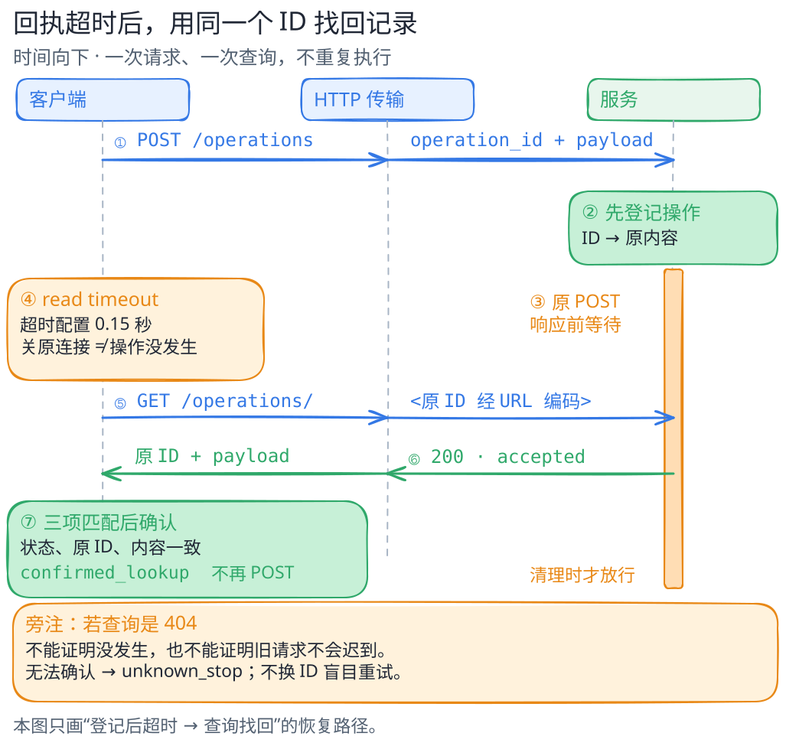

# 动手：用本地 HTTP 观察回执与查询

[返回学习路线](../learning-path.md) · [先读内存版回执练习](remote-effect.md) · [权限与恢复对照](../comparisons/permission-and-recovery.md)

这个进阶小实验把上一课的内存调用换成本机 HTTP。客户端向服务登记 `publish-v1`，收到回执后确认；回执迟迟不来时，再开一条连接按原操作 ID 查询。你会先看见一次正常登记，再观察超时后怎样找回结果。

服务只把版本标签登记在内存账本里。TCP/HTTP 请求、并发和读超时是真实发生的，业务和故障时机由教学程序安排。初读本书可以跳过代码，只沿图看发送、登记和查询三条泳道；想运行时，先读[内存版练习](remote-effect.md)中的操作 ID 与对账说明。

运行前请确认 Python 3.10+，并允许本机 loopback（只连本机的网络接口）监听。本实验只用标准库，无账号、API Key 或真实发布操作。

## 先看一次正常登记

从仓库或解压后的阅读包根目录运行：

程序只在本机 `127.0.0.1` 临时启动服务，结束后自动关闭。无需账号，也不会写磁盘或发布内容。请保留本机地址，不要改成对外监听的 `0.0.0.0`；[`http.server` 不适合生产服务](https://docs.python.org/3/library/http.server.html)。清理服务的实现放在后面的可选代码导读中。

```bash
python3 examples/http-receipt/demo.py --mode normal
python3 -m unittest discover -s examples/http-receipt -p 'test_*.py'
```

`normal` 应收到 POST 201，ID 和内容匹配，`host.status=confirmed_receipt`。这说明宿主拿到了登记回执；清理后的账本有 1 条记录。省略 `--mode` 也会运行这个正常路径。

接着让原请求的回执超时：

```bash
python3 examples/http-receipt/demo.py --mode timeout_then_lookup
```

第一次 `submit` 返回 `transport=timeout`、`http_status=null`。宿主用原 ID 查询，收到 GET 200，核对 ID 与 `payload=publish-v1` 后返回 `confirmed_lookup`；事后账本仍为 1 条。字段分工如下：

| 输出位置 | 谁取得的信息 | 能说明什么 |
| --- | --- | --- |
| `host.events` | 客户端收到的 HTTP 回执或超时 | 决定继续、确认或保持未知的依据 |
| `host.status` | 宿主根据这些结果作出的判断 | 本实验的登记结果 |
| `observer_after_cleanup` | 清理后直接读取服务内部账本 | 给读者对照服务状态与宿主当时掌握的信息 |



[图源](../../figures/http-receipt-timeline/scene.excalidraw) · [PNG 预览](../../figures/http-receipt-timeline/preview.png) · [不看图的说明](../../figures/http-receipt-timeline/README.md)

图画的是 `timeout_then_lookup`：POST 携带 ID 和内容，服务登记后等待；客户端读超时并关闭原连接，再用新连接 GET 查询原 ID。确认来自查询回执，主路径没有第二次写入。迟到的原响应可能在连接关闭后才尝试发送。

## 再比较七种情况

先选 `normal`、已跑过的 `timeout_then_lookup`、`same_id_retry`，回答每次会登记几条；再看 `lookup_lag` 和 `late_commit` 的两种 404。最后两条是反例和冲突，不是推荐恢复策略。

```bash
python3 examples/http-receipt/demo.py --mode normal
python3 examples/http-receipt/demo.py --mode same_id_retry
python3 examples/http-receipt/demo.py --mode lookup_lag
python3 examples/http-receipt/demo.py --mode late_commit
python3 examples/http-receipt/demo.py --mode unsafe_new_id
python3 examples/http-receipt/demo.py --mode payload_conflict
```

| 模式 | 客户端在决策时看见 | 宿主结论 | 清理后的登记数 |
| --- | --- | --- | --- |
| `normal` | POST 201，ID 与内容匹配 | `confirmed_receipt` | 1 |
| `timeout_then_lookup` | 读超时；原 ID 的 GET 200 | `confirmed_lookup` | 1 |
| `same_id_retry` | 读超时；同 ID、同内容再次 POST 得 200、`replayed=true` | `confirmed_replay` | 1 |
| `lookup_lag` | 读超时；第一次 GET 404 | `unknown_stop` | 1；其实已登记，只是故意隐藏一次读回 |
| `late_commit` | 读超时；GET 404 | `unknown_stop` | 1；原请求在宿主停止判断之后才获准登记 |
| `unsafe_new_id` | 读超时；查询已确认，却仍用新 ID POST | `duplicate_effect` | 2 |
| `payload_conflict` | 读超时；同 ID 换内容 POST 得 409 | `conflict_stop` | 1；原内容没有被替换 |

前三种确认路径退出码为 **0**；后四种为 **2**，表示未确认、冲突或刻意的错误恢复。状态细节在 JSON 中，账本登记数则在事后观察字段里。测试命令应通过 **16 个测试**。同 ID 重放若再次超时，继续保持未知；收到匹配原 ID 的 409 回执后，才标为 `conflict_stop`。

两种 404 看上去相同，发生时机不同。`lookup_lag` 已经登记，第一次查询暂时隐藏它；`late_commit` 查询时尚未登记，旧请求仍在处理，清理释放闸门后才登记。宿主当时都返回 `unknown_stop`。事后观察让读者看见差别，也说明查询应结合旧请求是否还在处理来理解。

## 同 ID 重放由服务实现

操作 ID 是本服务 JSON 请求中的应用字段，不是标准 HTTP 自带的幂等承诺。这里只保证在**同一个服务进程、同一账本**内：同 ID 和同 payload 重放返回原登记；同 ID 不同 payload 返回 409；核对与新增在同一把锁下完成，避免两个线程同时查无记录后各写一次。

所以 `same_id_retry` 返回原登记，`unsafe_new_id` 会新增一条。关键在服务端：它识别原 ID，并在锁内完成检查与新增；日志或提示词中的 ID 只是标记。HTTP 的[幂等与重试说明](https://www.rfc-editor.org/rfc/rfc9110.html#section-9.2.2)可帮助理解协议，本例的 POST 重放规则则由应用明确实现。

接真实 API 前，先核对同键内容规则、键保留时间、结果查询、取消能力和重试策略，再检查实际业务成果。下面的代码只实现同进程内存账本规则。

## 沿五个位置读代码（可选）

打开 [`demo.py`](../../examples/http-receipt/demo.py)，按下面五处阅读：

1. `running_service()` 启动 loopback 服务，并在 `finally` 中先释放闸门，再 `shutdown()`、`server_close()` 和等待线程。清理是收尾，不是撤销业务；`late_commit` 正是先让原请求完成收尾，再给观察者读账本。
2. `Handler.do_POST()` 收到并验证请求。`late_commit` 在登记前等闸门；其余故障在 `Ledger.register()` 之后、响应之前等。故障点放在哪，决定超时后账本已经发生了什么。
3. `Ledger.register()` 在锁内核对 ID 与内容。重复返回原登记，冲突不写，不让两条并发请求分别绕过去重。
4. `request()` 使用 [`HTTPConnection` 的超时与响应读取](https://docs.python.org/3/library/http.client.html)，遇到 `socket.timeout` 就记录传输超时。为稳定重现故障，初次请求在发送后、阻塞读响应前调用本地 `fixture_before_read`：等待“已登记”或“已收到但暂不登记”的事件，再开始实际 socket 读超时。这是教学程序安排时序的回调，真实远端客户端无法读取这些内部事件。
5. `run()` 按 HTTP 回执决定 `host.status`，确认时核对状态码、ID 和内容。内部同步负责安排故障，未达到预期时序就抛异常；账本只在独立的事后观察中读取。慢登记测试延迟 0.25 秒，检查登记早于读超时。

## 选一个变化，写出预测

任选一个变化，先写你预计的状态和登记数，再用代码或测试对照。想改文件时，在临时练习副本操作：

- 第二次 POST 保持原 ID，但把内容改成 `publish-v2`。
- 多个并发 POST 使用同 ID、同内容。
- 第一次查询收到 404 后，用新 ID 再发一次。

最后写一份四行说明：**发出的请求、收到的结果、服务的重放规则、下一步处理**。能用它解释一个新场景，就比记住七个模式名更有用。

## 参考结果

同 ID 换内容时，`payload_conflict` 返回 409、`conflict_stop`，原 `publish-v1` 保留。并发去重测试 `test_atomic_parallel_deduplication` 发四个真实请求，断言一个 201、三个 200 和一条登记。404 后换 ID 会绕过去重：原记录可能已有，旧请求也可能随后登记。

## 本实验的范围

账本只在同一个服务进程内保存，进程退出就丢失；这里没有键有效期、租户隔离、业务事务、跨机器协调或灾难恢复。因此它演示的是一次本地 HTTP 与应用去重过程，并非分布式“恰好一次”、真实发布、互联网丢包或 OS 沙箱测试。

下一步可以使用专用临时持久存储，测试重启、冲突和读回；那是新的实验。本课只确认内存登记，不检查真实版本质量，也没有真实模型参与。
