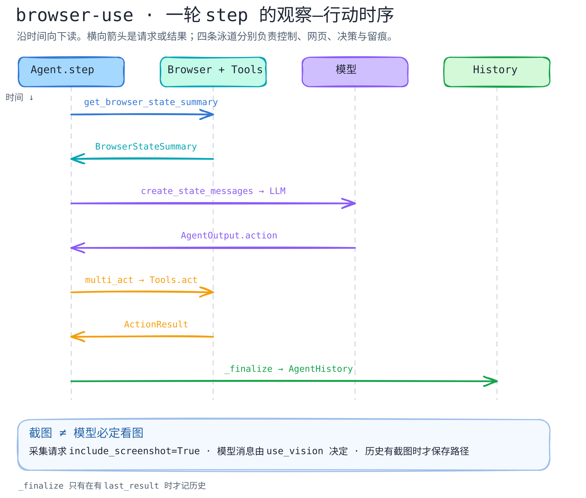

# browser-use：一轮 step 怎样把网页变成行动与历史？

> 固定官方源码 [`browser-use/browser-use@d8110c5ff87ccba887aaa726cdb780f2f84bef8d`](https://github.com/browser-use/browser-use/tree/d8110c5ff87ccba887aaa726cdb780f2f84bef8d)。本篇只追踪 `Agent.step()` 的观察、模型决策、动作执行和留痕路径；是**静态源码剖面**，不是浏览器运行录像。

[文字版](../../../figures/browser-use-step/README.md) · [可编辑图源](../../../figures/browser-use-step/scene.excalidraw) · [关键代码导读](code-walkthrough.md)

## 为什么这条路径值得看

浏览器 Agent 的“上下文”并非只有聊天记录。`Agent.step()` 先从 `BrowserSession` 请求当前网页摘要，再由消息管理器编成模型输入；模型给出动作列表，`multi_act()` 逐个交给工具与浏览器，最后 `_finalize()` 将这一步的模型输出、执行结果与浏览器状态保存为历史项。[step](https://github.com/browser-use/browser-use/blob/d8110c5ff87ccba887aaa726cdb780f2f84bef8d/browser_use/agent/service.py#L1033-L1085) · [历史项](https://github.com/browser-use/browser-use/blob/d8110c5ff87ccba887aaa726cdb780f2f84bef8d/browser_use/agent/service.py#L1356-L1415)

这里最容易误读的是截图：`_prepare_context()` 在每步请求状态时传入 `include_screenshot=True`，但 `create_state_messages()` 仍按 `use_vision` 决定是否把截图放进模型消息；`_make_history_item()` 则会在摘要里确有截图时单独存储截图。因此“捕获了截图”“模型收到了截图”“历史存了截图”是三个不同断言。[捕获](https://github.com/browser-use/browser-use/blob/d8110c5ff87ccba887aaa726cdb780f2f84bef8d/browser_use/agent/service.py#L1091-L1099) · [模型消息条件](https://github.com/browser-use/browser-use/blob/d8110c5ff87ccba887aaa726cdb780f2f84bef8d/browser_use/agent/message_manager/service.py#L449-L502) · [历史截图](https://github.com/browser-use/browser-use/blob/d8110c5ff87ccba887aaa726cdb780f2f84bef8d/browser_use/agent/service.py#L1748-L1779)

## 两个保护条件

- 浏览器状态请求超时时，`BrowserSession` 清空选择器查找路径，返回空 DOM 选择器映射和带错误信息的非可操作状态，而不是让模型继续用上一页的元素索引。[超时分支](https://github.com/browser-use/browser-use/blob/d8110c5ff87ccba887aaa726cdb780f2f84bef8d/browser_use/browser/session.py#L1616-L1679)
- 一次模型输出可含多动作，但 `multi_act()` 不盲目执行整列。动作完成、出错、注册动作声明终止序列，或动作前后 URL/焦点目标变化，都可能停止余下动作。[序列守卫](https://github.com/browser-use/browser-use/blob/d8110c5ff87ccba887aaa726cdb780f2f84bef8d/browser_use/agent/service.py#L2730-L2828)

## 边界与下一步

时序图把源码中的异步调用整理成一条正常阅读路径；它**没有**断言每步一定进入历史：`_finalize()` 在没有 `last_result` 时直接返回，步骤异常、暂停、重连和超时分支会改变结果。[条件](https://github.com/browser-use/browser-use/blob/d8110c5ff87ccba887aaa726cdb780f2f84bef8d/browser_use/agent/service.py#L1356-L1360) · [异常处理](https://github.com/browser-use/browser-use/blob/d8110c5ff87ccba887aaa726cdb780f2f84bef8d/browser_use/agent/service.py#L1258-L1314)

尚未启动浏览器、实测模型是否看到截图，也未验证截图存储、事件总线消费或页面变化检测的时延。Skills 在 `run()` 初始化阶段可注册为动作，但并非本图覆盖的执行链；后续应单独研究注册与权限边界。[Skills 注册入口](https://github.com/browser-use/browser-use/blob/d8110c5ff87ccba887aaa726cdb780f2f84bef8d/browser_use/agent/service.py#L2562-L2574)
