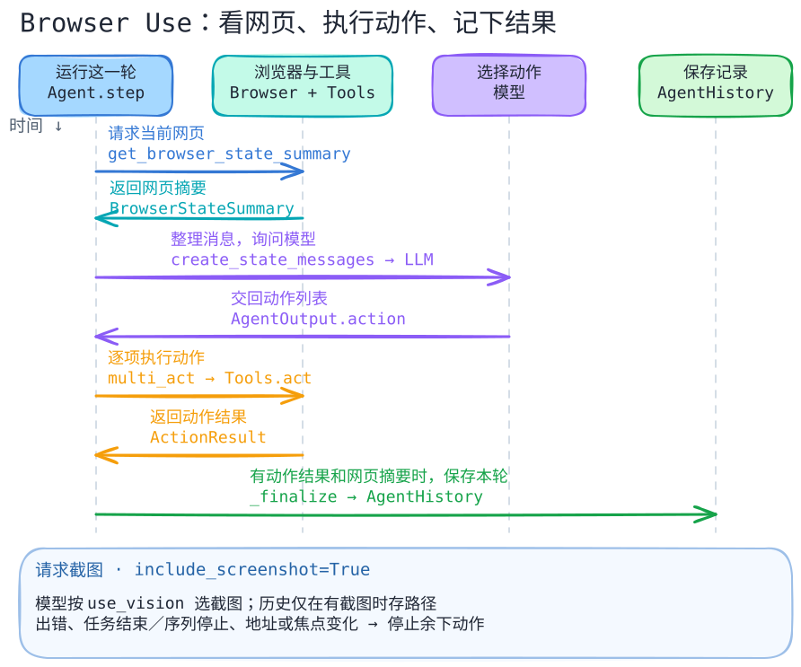

# browser-use：看网页、选动作、保存这一轮结果

假设你让浏览器助手在网页里找一段资料。它需要先知道当前页面上有什么，再决定点击、输入或滚动，然后看执行结果。browser-use 的 `Agent.step()` 就把这样一轮工作串起来：获取网页状态，询问模型，执行动作，保存这一轮的记录。

[文字版](../../../figures/browser-use-step/README.md) · [可编辑图源](../../../figures/browser-use-step/scene.excalidraw) · [关键代码导读](code-walkthrough.md)

## 网页怎么交给模型

`BrowserSession` 负责取得当前网页摘要。消息管理器把摘要和前一步结果整理成模型输入。模型返回动作列表后，`multi_act()` 按顺序把动作交给工具与浏览器。最后，`_finalize()` 整理这一轮的模型输出、执行结果和网页状态，满足保存条件时加入历史。[一轮工作](https://github.com/browser-use/browser-use/blob/d8110c5ff87ccba887aaa726cdb780f2f84bef8d/browser_use/agent/service.py#L1033-L1085) · [保存这一轮](https://github.com/browser-use/browser-use/blob/d8110c5ff87ccba887aaa726cdb780f2f84bef8d/browser_use/agent/service.py#L1356-L1415)

截图有三步：浏览器先获取截图，再决定是否把它交给模型，保存历史时也可以存下它。`_prepare_context()` 请求网页状态时会要求截图；能否取得截图，还要看这次返回的摘要。

摘要里有截图时，`use_vision=True` 会把它放进模型消息，`False` 会省略它，`"auto"` 则只在动作结果明确要求截图时放入。`_make_history_item()` 保存可用截图的方式单独处理。因此，看见历史里有截图时，还需要检查 `use_vision`，才能知道模型当时是否也看到了它。[请求截图](https://github.com/browser-use/browser-use/blob/d8110c5ff87ccba887aaa726cdb780f2f84bef8d/browser_use/agent/service.py#L1091-L1099) · [选择模型图片输入](https://github.com/browser-use/browser-use/blob/d8110c5ff87ccba887aaa726cdb780f2f84bef8d/browser_use/agent/message_manager/service.py#L449-L502) · [保存截图](https://github.com/browser-use/browser-use/blob/d8110c5ff87ccba887aaa726cdb780f2f84bef8d/browser_use/agent/service.py#L1748-L1779)

## 出现跳转或错误时，怎样停止后续动作

网页元素会变化，旧页面上的按钮编号到了新页面可能就失效了。请求网页状态超时时，`BrowserSession` 会清空网页元素的查找映射，返回带错误信息的状态，避免继续使用旧的元素索引。这里的 DOM 是浏览器里的网页结构。[状态超时处理](https://github.com/browser-use/browser-use/blob/d8110c5ff87ccba887aaa726cdb780f2f84bef8d/browser_use/browser/session.py#L1616-L1679)

模型一次可以提出多个动作。`multi_act()` 逐个执行：遇到错误、任务结束标记 `is_done`、动作要求停止序列，或页面地址/焦点目标变化时，会停下余下动作。一次点击正常结束后，仍可以继续执行下一项；`is_done` 说的是整个任务已被标记结束。[执行与停止条件](https://github.com/browser-use/browser-use/blob/d8110c5ff87ccba887aaa726cdb780f2f84bef8d/browser_use/agent/service.py#L2730-L2828)

## 历史保存了什么

图里的历史保存有条件：要有动作结果 `last_result`，还要有本轮网页摘要，才能创建 `AgentHistory`。保存的是本轮开始取得的网页状态，加上随后执行的结果；下一轮才会重新观察页面。出错、暂停和超时可能影响这个流程。[保存条件](https://github.com/browser-use/browser-use/blob/d8110c5ff87ccba887aaa726cdb780f2f84bef8d/browser_use/agent/service.py#L1356-L1385) · [异常处理](https://github.com/browser-use/browser-use/blob/d8110c5ff87ccba887aaa726cdb780f2f84bef8d/browser_use/agent/service.py#L1258-L1314)

下一篇[代码导读](code-walkthrough.md)会把这些步骤对应到函数。本文尚未实测截图传递、历史存储和页面变化检测；Skills 在 `run()` 初始化时注册为动作的方式，留到扩展主题再讲。[Skills 注册入口](https://github.com/browser-use/browser-use/blob/d8110c5ff87ccba887aaa726cdb780f2f84bef8d/browser_use/agent/service.py#L2562-L2574)

## 来源与阅读范围

本文依据官方源码 [`browser-use/browser-use@d8110c5ff87ccba887aaa726cdb780f2f84bef8d`](https://github.com/browser-use/browser-use/tree/d8110c5ff87ccba887aaa726cdb780f2f84bef8d)，介绍 `Agent.step()` 的网页观察、模型决策、动作执行和历史保存，尚未运行浏览器验证。
