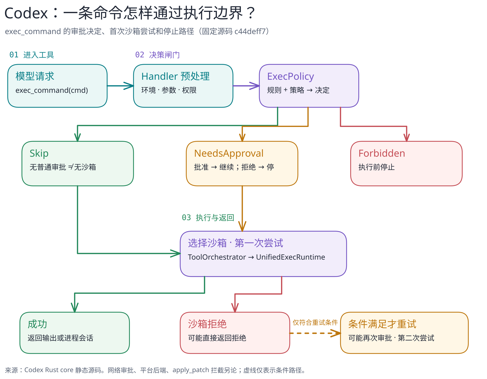

# Codex：一条命令为何会执行、询问或停下？

[返回系统目录](../README.md) · [关键代码路径](code-walkthrough.md) · [图的文字版](../../../figures/codex-exec-approval/README.md)

> 固定研究版本：官方仓库 [`openai/codex@c44deff7b1083e9660ac55d02122481f1cdf139b`](https://github.com/openai/codex/tree/c44deff7b1083e9660ac55d02122481f1cdf139b)，核对日期 2026-09-23。本篇只讨论 Rust core 中 `exec_command` 的局部路径；证据是**源码静态阅读**，不是运行实测，也不代表所有 Codex 宿主、工具或配置都走同一路径。

## 30 秒读懂

模型提出 `exec_command` 并不等于命令立即在宿主机运行。Handler 先解析参数、解析当前执行环境和权限请求；Unified Exec 随后让 exec policy 对命令给出 `Skip`、`NeedsApproval` 或 `Forbidden`。只有未被禁止且必要审批通过的请求，才进入沙箱选择与第一次执行。第一次被沙箱拒绝也**不等于自动无沙箱重试**：策略、拒绝类型、文件系统 deny-read 限制和审批状态会继续决定能否重试。[Handler](https://github.com/openai/codex/blob/c44deff7b1083e9660ac55d02122481f1cdf139b/codex-rs/core/src/tools/handlers/unified_exec/exec_command.rs#L186-L245) · [策略映射](https://github.com/openai/codex/blob/c44deff7b1083e9660ac55d02122481f1cdf139b/codex-rs/core/src/exec_policy.rs#L337-L458) · [执行编排](https://github.com/openai/codex/blob/c44deff7b1083e9660ac55d02122481f1cdf139b/codex-rs/core/src/tools/orchestrator.rs#L116-L220)

[可编辑图源](../../../figures/codex-exec-approval/scene.excalidraw) · [PNG 预览](../../../figures/codex-exec-approval/preview.png) · [不看图的说明](../../../figures/codex-exec-approval/README.md)

## 这篇刻意缩窄了什么

本图不是“Codex 整体架构图”，也没有把“审批”和“沙箱”画成同一个开关。审批决定是否允许某次行动；沙箱决定一次执行可触及的资源边界。`Skip` 表示该次执行无须普通审批，**并不必然表示无沙箱**；只在源码规定的例外条件下才可能绕过第一次沙箱。[第一次沙箱覆盖条件](https://github.com/openai/codex/blob/c44deff7b1083e9660ac55d02122481f1cdf139b/codex-rs/core/src/tools/sandboxing.rs#L239-L279)

它还不是“危险命令检测器”的完整说明：未匹配规则时的回退判定受审批策略、沙箱配置、命令分类和平台条件影响；本篇只展示决策结果如何影响这条工具路径。[未匹配命令回退](https://github.com/openai/codex/blob/c44deff7b1083e9660ac55d02122481f1cdf139b/codex-rs/core/src/exec_policy.rs#L770-L858)

## 下一步

跟读[关键代码路径](code-walkthrough.md)，再对照 Pi 的“小核心”理解两种系统的权限边界。后续章节应单独研究 Codex 的 turn 状态、上下文压缩、Skill 发现与加载，而不是在本图里塞进全部概念。
