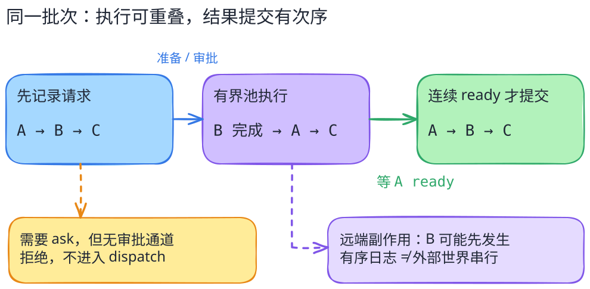

# DSH：把运行能力接成插件，不把插件当作安全边界

[返回系统目录](../README.md) · [关键代码导读](code-walkthrough.md)

这里的 DSH 指 DeepSeek 开源的 **DeepSeek Harness**，不是模型、桌面助手或通用 shell。研究它的理由，是看一个运行器怎样将会话、模型、工具和执行环境拆成可组合的服务，同时保持工具调用与结果之间的对应关系。

> 固定研究版本：[`deepseek-ai/deepseek-harness@477b4f420553e8a52c2fbccc464d7561b239c443`](https://github.com/deepseek-ai/deepseek-harness/tree/477b4f420553e8a52c2fbccc464d7561b239c443)，核对日期 2026-09-27。根许可证 MIT，另有第三方说明。此版本为开发者预览；下文是局部静态源码阅读，未安装或运行该 Harness。

## 先用一个问题读架构

假设工具批次依次请求 A、B、C，其中 A 很慢，B 很快。运行器允许部分工具并行时，模型下一轮看到的结果是否就按“谁先完成”排列？如果某个工具还需要审批，审批通道不存在，是否可以照常执行？

这两个问题共同揭示 Harness 的责任：**协调能力，不只是透传模型输出。** 插件能提供模型、会话或执行器；调用次序、许可判定、结果关联和失败处理仍要有明确合同。

[图源](../../../figures/dsh-tool-batch/scene.excalidraw) · [PNG 预览](../../../figures/dsh-tool-batch/preview.png) · [不看图的说明](../../../figures/dsh-tool-batch/README.md)

## 三个不同的接缝

| 接缝 | 固定版本中能核对的事实 | 不应推导出的保证 |
| --- | --- | --- |
| 应用组合 | Cordis 插件及 profile/bundle 组装服务；`sdk-minimal` 还可以显式独立接入 | 所有插件都安全、兼容，或可随意替换任意实现 |
| 工具生命周期 | 预处理、审批/guard、实际执行、后处理、事件结果提交有分开的调用点 | 模型提案已经得到宿主授权 |
| 执行环境 | filesystem/subprocess 提供共享执行世界的服务合同；bash sandbox 执行器将策略交给 confine | 更换 provider 就自动获得经过审计的隔离 |

组合与服务接缝依据固定版[架构说明](https://github.com/deepseek-ai/deepseek-harness/blob/477b4f420553e8a52c2fbccc464d7561b239c443/docs/architecture.md#L11-L35)及[能力服务合同](https://github.com/deepseek-ai/deepseek-harness/blob/477b4f420553e8a52c2fbccc464d7561b239c443/docs/architecture.md#L119-L137)。工具和执行器的具体分支见[代码导读](code-walkthrough.md)。这里的“接缝”是依据源码作的教学归纳，不是上游提供的安全认证。

## 并行执行，不等于打乱证据

批次调度器用有界池让已准备好的工具重叠执行；准备阶段与实际 dispatch 不是一回事。完成较快的 B 可以先得到结果，但 `commitReady()` 只把当前序号起连续准备好的结果写入会话事件。A 尚未结束时，B 的完成不让它抢到 A 的结果位置。

这保留了请求—结果的关联顺序，却也付出了代价：前面的慢工具会阻塞后面结果的提交。并发上限、工具当前执行模式和取消路径共同决定实际重叠程度；不能从存在一个池就说“所有工具都并行”。事件日志到模型消息的派生路径也不能被夸大成所有后端的持久化保证。

## 两个失败边界

需要询问时，缺审批通道不是默许；在该实现里它会走拒绝。bash sandbox 也存在明确的 `danger-full-access` 无约束分支，不能只因包名包含 sandbox 就认为每一次命令已被隔离。

上游 [SAFETY.md](https://github.com/deepseek-ai/deepseek-harness/blob/477b4f420553e8a52c2fbccc464d7561b239c443/SAFETY.md)直接说明此开发者预览未经过安全审计，sandbox/approval/permission 不能保证完整隔离，也不应成为运行不可信工作负载的唯一控制。读者应先读这份声明，再考虑实验；本书未在宿主执行任何 DSH 返回的命令。

## 与 Pi 比什么

[Pi](../pi/README.md)将小循环核心与 coding-agent 会话外壳分开；DSH 的这个切面更强调服务定义、provider、consumer 与插件组合。两者都提供可追踪的扩展入口，但比较的是**能力从哪里接入、谁拥有生命周期**，不是代码量、易用性或性能高低。扩展越灵活，替换服务时越需要核对合同、共享执行世界和许可行为。

读完应能回答：一个工具“已准备”“已开始”“已完成”“结果已提交”为什么是四个位置？如果说不清，先回到 [Agent loop](../../concepts/agent-loop.md)，不要直接尝试复杂插件组合。
