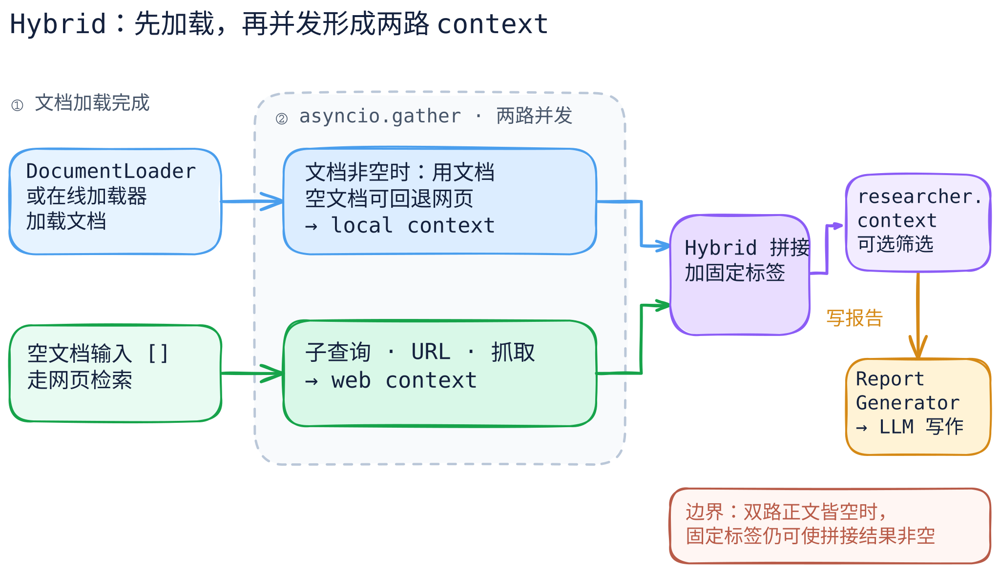

# GPT Researcher：多来源怎样变成报告上下文

[可编辑图源](../../../figures/gpt-researcher-evidence/scene.excalidraw) · [PNG 预览](../../../figures/gpt-researcher-evidence/preview.png) · [图的文字版](../../../figures/gpt-researcher-evidence/README.md)

> 固定官方仓库 [`assafelovic/gpt-researcher@6f998577d547b1e54ec662dac63583aa11e3b84b`](https://github.com/assafelovic/gpt-researcher/tree/6f998577d547b1e54ec662dac63583aa11e3b84b)。范围是非 `DeepResearch`、未指定 `source_urls`、未传入 `write_report(ext_context=...)` 的 `ReportSource.Hybrid`：本地文档和网页来源汇合后生成普通研究报告。本文只做**源码静态核对**；没有运行检索器、模型或检查真实报告引用。

## 核心问题

“会联网研究”并不说明报告依据怎样形成。这里要分清三层：原始来源（本地文件和网页）、按子问题筛选的研究上下文、最终 LLM 写出的报告。GPT Researcher 的 Hybrid 分支把本地文档路径和网页搜索路径并发执行，结果拼接进 `researcher.context`；写作器收到的是这个整理后的上下文，**不是原始网页集合的独立证据验证结果**。

## 关键代码路径

1. `GPTResearcher.conduct_research()` 把普通研究交给 `ResearchConductor.conduct_research()`，返回的内容保存到 `self.context`；`DeepResearch` 则走另一条分支。[主入口](https://github.com/assafelovic/gpt-researcher/blob/6f998577d547b1e54ec662dac63583aa11e3b84b/gpt_researcher/agent.py#L331-L390)
2. Hybrid 分支先用 `OnlineDocumentLoader` 或 `DocumentLoader` 读取本地/指定文档，再以 `asyncio.gather` 并发执行“给定文档的上下文提取”和“空文档输入的网页检索”，最后用 `prompt_family.join_local_web_documents` 拼接。[来源分支](https://github.com/assafelovic/gpt-researcher/blob/6f998577d547b1e54ec662dac63583aa11e3b84b/gpt_researcher/skills/researcher.py#L164-L196) · [拼接格式](https://github.com/assafelovic/gpt-researcher/blob/6f998577d547b1e54ec662dac63583aa11e3b84b/gpt_researcher/prompts.py#L564-L566)
3. `_get_context_by_web_search()` 规划子查询并行执行；`_process_sub_query()` 对网页路径调用检索器、获取 URL、抓取或复用预取正文，然后让 `ContextManager` 生成与子查询相关的压缩上下文。MCP retriever 可按策略参与，但不是 Hybrid 的必然组成。[子查询规划与并行](https://github.com/assafelovic/gpt-researcher/blob/6f998577d547b1e54ec662dac63583aa11e3b84b/gpt_researcher/skills/researcher.py#L286-L407) · [单个子查询处理](https://github.com/assafelovic/gpt-researcher/blob/6f998577d547b1e54ec662dac63583aa11e3b84b/gpt_researcher/skills/researcher.py#L510-L625) · [抓取和预取正文汇合](https://github.com/assafelovic/gpt-researcher/blob/6f998577d547b1e54ec662dac63583aa11e3b84b/gpt_researcher/skills/researcher.py#L900-L942)
4. `ContextManager` 使用 `ContextCompressor`；小文档集可直接格式化，较大的文档集会走拆分和 embedding 相关性过滤。格式化内容带标题与来源字段，形成报告提示可用的上下文。[上下文管理器](https://github.com/assafelovic/gpt-researcher/blob/6f998577d547b1e54ec662dac63583aa11e3b84b/gpt_researcher/skills/context_manager.py#L37-L63) · [压缩快慢路径](https://github.com/assafelovic/gpt-researcher/blob/6f998577d547b1e54ec662dac63583aa11e3b84b/gpt_researcher/context/compression.py#L117-L183) · [来源格式](https://github.com/assafelovic/gpt-researcher/blob/6f998577d547b1e54ec662dac63583aa11e3b84b/gpt_researcher/prompts.py#L556-L566)
5. `GPTResearcher.write_report()` 将内部 `self.context` 或外部传入的 `ext_context` 交给 `ReportGenerator`；后者遇到真正的空字符串会拒绝生成“有来源”的报告，否则把上下文交给 `generate_report` 调用 LLM。提示文本要求引用，但**提示要求不是引用正确性校验**。[写作入口](https://github.com/assafelovic/gpt-researcher/blob/6f998577d547b1e54ec662dac63583aa11e3b84b/gpt_researcher/agent.py#L451-L491) · [空上下文保护](https://github.com/assafelovic/gpt-researcher/blob/6f998577d547b1e54ec662dac63583aa11e3b84b/gpt_researcher/skills/writer.py#L56-L95) · [LLM 报告生成](https://github.com/assafelovic/gpt-researcher/blob/6f998577d547b1e54ec662dac63583aa11e3b84b/gpt_researcher/actions/report_generation.py#L230-L310) · [引用要求](https://github.com/assafelovic/gpt-researcher/blob/6f998577d547b1e54ec662dac63583aa11e3b84b/gpt_researcher/prompts.py#L300-L313)

## 一个需要单独核验的边界

Hybrid 的 `join_local_web_documents` 无条件写出 `Context from local documents:` 和 `Context from web sources:` 两段标签。即使两路没有有效正文，拼接结果在字符串意义上仍可能非空；而写作器当前只用 `_ctx.strip()` 判断“是否有材料”。因此，从静态路径看，这道保护**不能独立证明 Hybrid 报告确有来源材料**。这只是代码可推导的风险，尚未实际触发或证明会生成虚假引用。[拼接实现](https://github.com/assafelovic/gpt-researcher/blob/6f998577d547b1e54ec662dac63583aa11e3b84b/gpt_researcher/prompts.py#L564-L566) · [写作器判断](https://github.com/assafelovic/gpt-researcher/blob/6f998577d547b1e54ec662dac63583aa11e3b84b/gpt_researcher/skills/writer.py#L62-L75)

## 不要混淆

- `visited_urls` 是 URL 去重状态，不是事实核验或可信度分数。[URL 去重](https://github.com/assafelovic/gpt-researcher/blob/6f998577d547b1e54ec662dac63583aa11e3b84b/gpt_researcher/skills/researcher.py#L805-L823)
- `curate_sources` 是配置控制的可选步骤，不应在图中画成所有请求必经。[可选筛选](https://github.com/assafelovic/gpt-researcher/blob/6f998577d547b1e54ec662dac63583aa11e3b84b/gpt_researcher/skills/researcher.py#L210-L231)
- Hybrid、多源、MCP、DeepResearch 是不同维度；这张图只覆盖 Hybrid 普通研究中的本地与网页并发汇合。

下一步应在隔离环境用两份标有互相冲突事实的文档及可控网页源，记录抓取内容、压缩后的来源字段、`researcher.context` 和最终引用；再单测“双源均空”的保护边界。静态图不能代替这样的证据质量验证。
