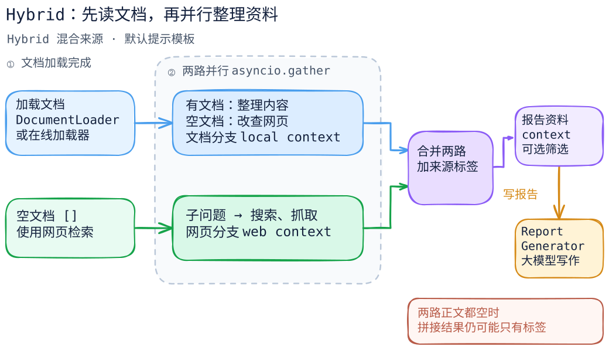

# GPT Researcher：多来源怎样变成报告上下文

## 一份调研报告怎样开始

假设你要了解一项新技术，手里有两份资料，还想补充网上的说明。GPT Researcher 会先规划子问题，收集资料，选出与问题相关的内容，再把整理好的材料交给大模型写报告。

本文介绍 Hybrid（混合来源）的这条路径：文档与网页两路同时收集，随后汇合。可以把它理解为一次“资料准备—写作”的接力：来源提供原文，研究器整理材料，写作器组织成报告。

[可编辑图源](../../../figures/gpt-researcher-evidence/scene.excalidraw) · [PNG 预览](../../../figures/gpt-researcher-evidence/preview.png) · [图的文字版](../../../figures/gpt-researcher-evidence/README.md) · [九步代码导读](code-walkthrough.md)

## 从收集资料到写成报告

1. `GPTResearcher.conduct_research()` 把普通研究交给 `ResearchConductor.conduct_research()`，返回的内容保存到 `self.context`；`DeepResearch` 则走另一条分支。[主入口](https://github.com/assafelovic/gpt-researcher/blob/6f998577d547b1e54ec662dac63583aa11e3b84b/gpt_researcher/agent.py#L331-L390)
2. Hybrid 分支先用 `OnlineDocumentLoader` 或 `DocumentLoader` 读取本地/指定文档，再以 `asyncio.gather` 并发执行“给定文档的上下文提取”和“空文档输入的网页检索”，最后用 `prompt_family.join_local_web_documents` 拼接。文档一路拿到非空材料时，围绕这些材料提取内容；加载结果为空时，`_process_sub_query()` 可以转去取网页。这也是为什么实际检查来源时，还要看内容和 URL，而不只看分支名字。[来源分支](https://github.com/assafelovic/gpt-researcher/blob/6f998577d547b1e54ec662dac63583aa11e3b84b/gpt_researcher/skills/researcher.py#L164-L196) · [空文档回退](https://github.com/assafelovic/gpt-researcher/blob/6f998577d547b1e54ec662dac63583aa11e3b84b/gpt_researcher/skills/researcher.py#L510-L625) · [拼接格式](https://github.com/assafelovic/gpt-researcher/blob/6f998577d547b1e54ec662dac63583aa11e3b84b/gpt_researcher/prompts.py#L564-L566)
3. `_get_context_by_web_search()` 规划子查询并行执行；`_process_sub_query()` 对网页路径调用检索器、获取 URL、抓取或复用预取正文，然后让 `ContextManager` 生成与子查询相关的压缩上下文。配置需要时，MCP retriever（通过 MCP 接入的检索工具）也可以参与，具体由所选策略决定。[子查询规划与并行](https://github.com/assafelovic/gpt-researcher/blob/6f998577d547b1e54ec662dac63583aa11e3b84b/gpt_researcher/skills/researcher.py#L286-L407) · [单个子查询处理](https://github.com/assafelovic/gpt-researcher/blob/6f998577d547b1e54ec662dac63583aa11e3b84b/gpt_researcher/skills/researcher.py#L510-L625) · [抓取和预取正文汇合](https://github.com/assafelovic/gpt-researcher/blob/6f998577d547b1e54ec662dac63583aa11e3b84b/gpt_researcher/skills/researcher.py#L900-L942)
4. `ContextManager` 使用 `ContextCompressor`；小文档集可直接整理格式，较大的文档集会拆成片段，再用 embedding（文本的数值表示）筛选相关内容。格式化内容带标题与来源字段，形成报告提示可用的上下文。[上下文管理器](https://github.com/assafelovic/gpt-researcher/blob/6f998577d547b1e54ec662dac63583aa11e3b84b/gpt_researcher/skills/context_manager.py#L37-L63) · [压缩快慢路径](https://github.com/assafelovic/gpt-researcher/blob/6f998577d547b1e54ec662dac63583aa11e3b84b/gpt_researcher/context/compression.py#L117-L183) · [来源格式](https://github.com/assafelovic/gpt-researcher/blob/6f998577d547b1e54ec662dac63583aa11e3b84b/gpt_researcher/prompts.py#L556-L566)
5. `GPTResearcher.write_report()` 将内部 `self.context` 或外部传入的 `ext_context` 交给 `ReportGenerator`；后者遇到真正的空字符串会拒绝生成“有来源”的报告，否则把上下文交给 `generate_report` 调用 LLM。提示要求在报告中引用来源；最终引用是否准确，需将报告中的说法逐项对回原文。[写作入口](https://github.com/assafelovic/gpt-researcher/blob/6f998577d547b1e54ec662dac63583aa11e3b84b/gpt_researcher/agent.py#L451-L491) · [空上下文保护](https://github.com/assafelovic/gpt-researcher/blob/6f998577d547b1e54ec662dac63583aa11e3b84b/gpt_researcher/skills/writer.py#L56-L95) · [LLM 报告生成](https://github.com/assafelovic/gpt-researcher/blob/6f998577d547b1e54ec662dac63583aa11e3b84b/gpt_researcher/actions/report_generation.py#L230-L310) · [引用要求](https://github.com/assafelovic/gpt-researcher/blob/6f998577d547b1e54ec662dac63583aa11e3b84b/gpt_researcher/prompts.py#L300-L313)

## 交稿前，检查正文和出处

在本文限定的**非 Granite PromptFamily** 路径，`join_local_web_documents` 无条件写出 `Context from local documents:` 和 `Context from web sources:` 两段标签。即使两路没有有效正文，拼接结果在字符串意义上仍可能非空；而写作器当前只用 `_ctx.strip()` 判断“是否有材料”。所以，交稿检查应确认至少有一份来源带着有效正文，再核对引用。Granite 提示模板另有拼接格式，需单独看它的实现。本段从代码指出一个检查位置，尚未实际触发，也未测得虚假引用。[拼接实现](https://github.com/assafelovic/gpt-researcher/blob/6f998577d547b1e54ec662dac63583aa11e3b84b/gpt_researcher/prompts.py#L564-L566) · [Granite 覆写](https://github.com/assafelovic/gpt-researcher/blob/6f998577d547b1e54ec662dac63583aa11e3b84b/gpt_researcher/prompts.py#L756-L834) · [写作器判断](https://github.com/assafelovic/gpt-researcher/blob/6f998577d547b1e54ec662dac63583aa11e3b84b/gpt_researcher/skills/writer.py#L77-L88)

## 记住各部分的工作

- `visited_urls` 用来避免重复抓取同一个 URL。来源可信度与事实核验，要另做检查。[URL 去重](https://github.com/assafelovic/gpt-researcher/blob/6f998577d547b1e54ec662dac63583aa11e3b84b/gpt_researcher/skills/researcher.py#L805-L823)
- `curate_sources` 是可选的来源筛选，启用后再处理这一步。[可选筛选](https://github.com/assafelovic/gpt-researcher/blob/6f998577d547b1e54ec662dac63583aa11e3b84b/gpt_researcher/skills/researcher.py#L210-L231)
- Hybrid 指混合来源，MCP 指工具接入方式，DeepResearch 是另一种研究流程；本文跟的是 Hybrid 的普通报告路径。

下一步应在隔离环境用两份标有互相冲突事实的文档及可控网页源，记录抓取内容、压缩后的来源字段、`researcher.context` 和最终引用；再单测“双源均空”的保护边界。这组实验可以检查收集、压缩和写作三个位置各留下了什么；本文尚未运行它们。

## 版本与检查范围

> 固定官方仓库 [`assafelovic/gpt-researcher@6f998577d547b1e54ec662dac63583aa11e3b84b`](https://github.com/assafelovic/gpt-researcher/tree/6f998577d547b1e54ec662dac63583aa11e3b84b)。范围是非 `DeepResearch`、未指定 `source_urls`、未传入 `write_report(ext_context=...)` 的 `ReportSource.Hybrid`：文档路径和网页路径汇合后生成普通研究报告；文档路径不保证实际加载到本地文档。本文只做**源码静态核对**；没有运行检索器、模型或检查真实报告引用。
