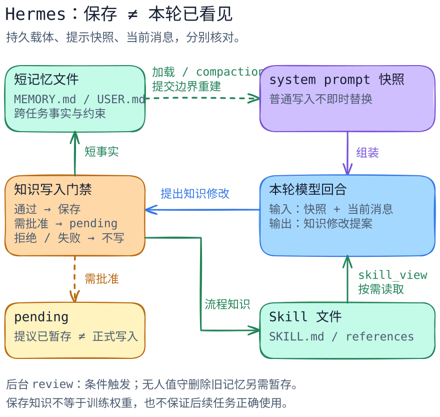

# Hermes：怎样把一次经验变成下次可用的知识

[返回系统目录](../README.md) · [关键代码导读](code-walkthrough.md) · [上下文与记忆](../../concepts/context-vs-memory.md)

假设你和助手一起排查过测试失败。以后遇到同类问题，你希望它记住项目要求，也能沿用那套排查方法。Hermes 把这些经验分开处理：短事实写进记忆，较长的方法写成 Skill，需要时再读；任务结束后，还可以安排一次后台复查，挑出值得保存的经验。更新发生在宿主管理的文件与模型输入中，模型权重训练属于另一件事。

## 先把两种知识分开

以一个虚构任务说明：你让助手分析测试失败，同时明确“本项目只在隔离的测试环境验证，不操作生产数据”。

- 项目要求适合短记忆，像桌上的便签。`MEMORY.md` 保存环境事实，`USER.md` 保存用户资料，加载后放进系统提示。默认容量分别是 2,200 和 1,375 个字符，按字符而非 token 计算；外部手工写入超限内容时，加载会提醒。[内置存储与加载](https://github.com/NousResearch/hermes-agent/blob/a9109b07f42685f88397008d0d5a6c3d481b3b28/tools/memory_tool_store.py#L88-L164)
- 排查步骤适合 **Skill（可复用的工作方法）**，像一本参考手册。启动提示通常先列名称和描述；需要时，`skill_view` 读取 `SKILL.md` 或相关文件。这样，长流程可以按需取用。[索引生成](https://github.com/NousResearch/hermes-agent/blob/a9109b07f42685f88397008d0d5a6c3d481b3b28/agent/prompt_builder.py#L1359-L1415)、[按需读取](https://github.com/NousResearch/hermes-agent/blob/a9109b07f42685f88397008d0d5a6c3d481b3b28/tools/skills_tool.py#L573-L693)

两种知识都能保存，取用方式各有安排：便签随提示带上，手册在需要时翻开。真正执行其中的命令，仍要通过宿主工具和权限检查；加载 Skill 也可能涉及预处理和依赖激活，使用前应审查内容与配置。

## 正常路径：读、做、筛选，再保存

1. 开始工作时，启用内置记忆的宿主建立 `MemoryStore`，从磁盘读入短记忆，并为提示准备一份副本，代码称它为 snapshot（快照）。
2. 系统提示组合该快照与 Skill 索引；模型先知道有哪些流程，而不是已经读过所有流程正文。
3. 遇到测试失败时，模型可以调用 `skill_view` 读取排查流程；宿主找到 Skill、检查状态并返回内容，相关参考文件再按需读取。
4. 排查中发现新的稳定事实，或需要改进流程时，模型提出 `memory` 或 `skill_manage` 调用，宿主检查操作与审批后处理写入。
5. 一轮结束后，条件满足时，宿主启动 **review fork（独立的后台复查任务）**。它拿着会话材料和受限工具，检查哪些经验值得整理。启动还要求已有最终答复、任务未中断且未禁用后台复查。
6. 提议可以正式保存，也可以先进入待批准列表。随后重建提示或读取 Skill 时，再查看新知识怎样进入输入。

这条路径的具体入口、状态和分支见[代码导读](code-walkthrough.md)。下面只画“已保存、待批准、当前可见”的关系，不是完整系统架构。

[图源](../../../figures/hermes-session-memory/scene.excalidraw) · [PNG 预览](../../../figures/hermes-session-memory/preview.png) · [不看图的说明与箭头证据](../../../figures/hermes-session-memory/README.md)

## 新笔记在什么时候用上

可以把系统提示中的记忆块想成开工前拍下的一张便签照片。`MemoryStore` 维护的 live entries（当前条目）会随写入更新并保存到磁盘，而 `format_for_system_prompt()` 仍读取准备提示时留下的那份快照。

中途更新便签后，要在允许的重建位置重新拍照，系统提示中的记忆块才换成新内容。当前任务也能从用户消息和工具结果得到新信息，所以要分别观察提示快照和本轮新增消息。[写入与快照的分离](https://github.com/NousResearch/hermes-agent/blob/a9109b07f42685f88397008d0d5a6c3d481b3b28/tools/memory_tool_store.py#L245-L295)、[快照读取](https://github.com/NousResearch/hermes-agent/blob/a9109b07f42685f88397008d0d5a6c3d481b3b28/tools/memory_tool_store.py#L463-L481)

固定版本的正常会话在上下文压缩提交时，会清除旧提示缓存、重读存储并重建提示。另有一条 detached（分离回合）路径，可以携带预先准备的 seeded prompt（预置提示），沿用这份内容。读代码时按所走路径判断刷新时机。[压缩边界](https://github.com/NousResearch/hermes-agent/blob/a9109b07f42685f88397008d0d5a6c3d481b3b28/agent/conversation_compression.py#L3144-L3188)、[失效时重载](https://github.com/NousResearch/hermes-agent/blob/a9109b07f42685f88397008d0d5a6c3d481b3b28/agent/system_prompt.py#L790-L820)

## 保存经验时，留意几种结果

**短记忆容量用完。** `add` / `replace` 超过字符容量会返回失败，要求缩短、合并或移除，而不是悄悄丢弃旧条目。替换是整条 entry 替换，`old_text` 只用于定位；它不是在条目中局部替换一个短语。多条匹配也会拒绝猜测。重复整合失败后有终止提示，避免保存辅助知识拖住用户的答复。[容量与整条替换](https://github.com/NousResearch/hermes-agent/blob/a9109b07f42685f88397008d0d5a6c3d481b3b28/tools/memory_tool_store.py#L276-L362)、[连续失败限制](https://github.com/NousResearch/hermes-agent/blob/a9109b07f42685f88397008d0d5a6c3d481b3b28/tools/memory_tool_store.py#L93-L131)

**提议进入待批准列表。** 开启 `write_approval` 时，Skill 写入会先暂存；记忆写入则按前台交互、后台等来源决定询问或暂存。暂存结果可以包含 `success: true` 与 `staged: true`，表示提议处理成功，而非正式存储已更新。审批还可能被拒绝。应检查 `staged`、待办记录和实际读回，不只检查一个布尔值。[审批决策](https://github.com/NousResearch/hermes-agent/blob/a9109b07f42685f88397008d0d5a6c3d481b3b28/tools/write_approval.py#L169-L193)、[Skill 暂存结果](https://github.com/NousResearch/hermes-agent/blob/a9109b07f42685f88397008d0d5a6c3d481b3b28/tools/skill_manager_tool.py#L618-L648)

**写入报错后，先读回核对。** 记忆存储先更新当前条目，再写文件；文件写入采用临时文件加原子替换，避免读到半截内容。它处理的是单次文件替换，当前条目、正式文件和工具回包仍可能落在不同进度。Skill 的一条路径则先写文件，再扫描，扫描拒绝时尝试恢复原文；恢复也可能报错。所以，审批前拒绝可停止提交，写入过程报错则需核对文件和状态后再决定重试。[记忆修改顺序](https://github.com/NousResearch/hermes-agent/blob/a9109b07f42685f88397008d0d5a6c3d481b3b28/tools/memory_tool_store.py#L245-L274) · [原子文件写入](https://github.com/NousResearch/hermes-agent/blob/a9109b07f42685f88397008d0d5a6c3d481b3b28/utils.py#L264-L326) · [Skill 写后扫描与恢复](https://github.com/NousResearch/hermes-agent/blob/a9109b07f42685f88397008d0d5a6c3d481b3b28/tools/skill_manager_tool.py#L350-L369)

**后台复查使用更小的操作范围。** 当前源码对无人值守 review 的记忆 `replace` / `remove` 有额外暂存门禁，即使通用审批开关关闭也不能直接执行这类删除旧知识的操作。默认 review 工具白名单也不允许普通 terminal / 写文件工具；但配置的 `extra_tools` 能扩充它，不能宣称它永远只有固定几个工具。[无人值守删除门禁](https://github.com/NousResearch/hermes-agent/blob/a9109b07f42685f88397008d0d5a6c3d481b3b28/tools/memory_tool.py#L167-L204)、[review 白名单](https://github.com/NousResearch/hermes-agent/blob/a9109b07f42685f88397008d0d5a6c3d481b3b28/agent/background_review.py#L1083-L1124)

**加载 Skill 可能顺带做准备工作。** `skill_view` 默认路径可预处理正文、尝试激活依赖。因此使用陌生 Skill 前，要一起审查内容、依赖和允许执行的操作。本文只看代码，没有执行激活。[预处理与依赖分支](https://github.com/NousResearch/hermes-agent/blob/a9109b07f42685f88397008d0d5a6c3d481b3b28/tools/skills_tool.py#L573-L664)

## 与 Pi 对照时，比较什么

[Pi 的既有剖面](../pi/README.md)区分核心循环与 coding 会话外壳，[Skill 篇](../pi/extensions-and-skills.md)解释按需指令与可执行 Extension。Hermes 这一篇多讲一步：宿主如何把短事实和长流程作为可写的跨任务资产，并为任务后的审视建立独立触发与工具门禁。

这不是“有记忆 / 没记忆”的全产品排名。Pi 可以通过扩展实现额外工作流；本篇也没有审计 Hermes 的所有插件。可学习的取舍是：更多知识维护逻辑放进宿主，能让复用路径显式，但也要承担缓存刷新、错误知识持久化、审批、并发写入与维护成本。这是基于本文路径的工程判断，不是效果或性能证明。

## 把保存和使用接起来

选一条短事实和一份排查流程，沿四个位置观察：工具处理结果、正式文件、后续输入、任务结果。`staged: true` 表示提议正在等批准；正式文件改变后，还要看刷新或读取是否发生；最后用一个同类任务检查这份知识是否真的帮到了助手。

这个小路线能把“助手说记住了”变成可观察的保存和取用过程。测试时使用虚构材料和隔离配置，避免触及个人记忆与生产数据。

## 本篇未覆盖

> 固定研究版本：[`NousResearch/hermes-agent@a9109b07f42685f88397008d0d5a6c3d481b3b28`](https://github.com/NousResearch/hermes-agent/tree/a9109b07f42685f88397008d0d5a6c3d481b3b28)，核对日期 2026-09-27；上游提交时间为 2026-09-27 03:21:39 UTC。[仓库 LICENSE 为 MIT](https://github.com/NousResearch/hermes-agent/blob/a9109b07f42685f88397008d0d5a6c3d481b3b28/LICENSE)。本稿是静态源码剖面，不是运行评测。

未运行 Hermes、未调用模型、未验证写入审批界面、未做多进程竞争实验；未评估记忆有效性或 Skill 生成质量。外部记忆 provider、压缩算法本体、Skill Hub 安全扫描、完整插件框架、terminal 后端及 Computer Use 留给单独专题。官方滚动文档用于发现线索，遇到与固定源码不一致时，以本文链接的版本限定结论。
