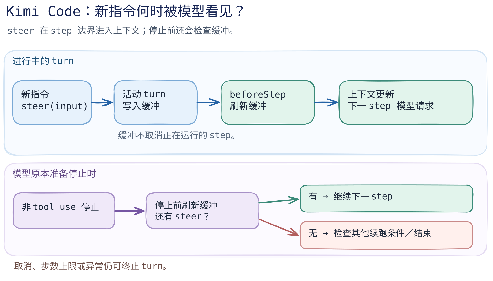

# Kimi Code：进行中的回合怎样接住新指令？

> **固定版本的静态源码切面。** 本篇核对 [`MoonshotAI/kimi-code@75a894e9ad5e8d49509664b3daaa1bbc9bb39432`](https://github.com/MoonshotAI/kimi-code/tree/75a894e9ad5e8d49509664b3daaa1bbc9bb39432)，核对日期 2026-09-23。对象是新版 Kimi Code CLI 的 `packages/agent-core`，不是旧 [`kimi-cli`](https://github.com/MoonshotAI/kimi-cli)，也不是 Kimi 模型。上游此提交的 [LICENSE](https://github.com/MoonshotAI/kimi-code/blob/75a894e9ad5e8d49509664b3daaa1bbc9bb39432/LICENSE) 为 MIT。本篇没有运行 CLI，也没有证明该提交对应当前安装包。

读完这一篇，应能判断：用户在 Agent 正忙时发来一句“先检查测试，再改文件”，这句话是立刻打断当前工具、排成下一个独立 turn，还是在当前 turn 的**下一次模型请求前**进入上下文？Kimi Code 的这个实现选择第三种，但存在停止、取消和上限的具体边界。

[图的文字版](../../../figures/kimi-code/README.md) · [可编辑图源](../../../figures/kimi-code/scene.excalidraw) · [PNG 预览](../../../figures/kimi-code/preview.png) · [逐段代码导读](code-walkthrough.md) · [来源台账](../../../sources/kimi-code.md)

## 正在运行时：先缓冲，后注入

`TurnFlow.steer()` 总会记录 `turn.steer`。若已有 `activeTurn`，它将输入和 origin 放入 `steerBuffer` 并返回 `null`，没有在此处创建新 turn，也没有在此处中止正在执行的工具；若没有活动 turn，则走 `launch()` 启动一个 turn。[源码：`steer()`](https://github.com/MoonshotAI/kimi-code/blob/75a894e9ad5e8d49509664b3daaa1bbc9bb39432/packages/agent-core/src/agent/turn/index.ts#L120-L143)

`runStepLoop()` 将 `flushSteerBuffer()` 安在 `beforeStep`：缓冲的输入按顺序作为 user message 追加到上下文，随后才执行压缩与注入，再由 loop 构造下一步的模型消息。因此“接住新指令”在这里是**step 边界的上下文更新**，不是对正在流式生成的模型响应或已发起工具调用的即时重写。[源码：缓冲与追加](https://github.com/MoonshotAI/kimi-code/blob/75a894e9ad5e8d49509664b3daaa1bbc9bb39432/packages/agent-core/src/agent/turn/index.ts#L265-L273) · [源码：`beforeStep`](https://github.com/MoonshotAI/kimi-code/blob/75a894e9ad5e8d49509664b3daaa1bbc9bb39432/packages/agent-core/src/agent/turn/index.ts#L578-L604)

一个容易漏掉的出口是模型本来准备结束且没有 `tool_use`。通用 `runTurn()` 此时调用 `shouldContinueAfterStop`；Kimi Code 的回调先刷新 steer 缓冲，有新输入就返回 `{ continue: true }`，从而再运行一个 step。没有 steer 时才继续检查 goal outcome、`Stop` hook，最终停止。[源码：loop 的停止检查](https://github.com/MoonshotAI/kimi-code/blob/75a894e9ad5e8d49509664b3daaa1bbc9bb39432/packages/agent-core/src/loop/run-turn.ts#L99-L128) · [源码：继续优先序](https://github.com/MoonshotAI/kimi-code/blob/75a894e9ad5e8d49509664b3daaa1bbc9bb39432/packages/agent-core/src/agent/turn/index.ts#L611-L657)

## 设计取舍：互动性放在 step 边界

这个位置给进行中的 turn 一个接收新意图的机会，又保留了当前 step 的执行完整性。它也意味着 steer 到达后何时被模型看到，取决于当前模型请求或工具何时结束、能否进入下一 step；这里没有“立即生效”的时延保证。这是从上述源码得出的**工程推断**，不是交互延迟实测。

边界也不等于无条件续跑。`runTurn()` 在每个 step 前检查 abort 与 `maxSteps`；取消会 abort 活动 turn，非当前 ID 的定向取消则被忽略。`runOneTurn()` 把正常、取消、异常分别映射为 `completed`、`cancelled`、`failed` 的 `turn.ended`。[源码：步数与中断](https://github.com/MoonshotAI/kimi-code/blob/75a894e9ad5e8d49509664b3daaa1bbc9bb39432/packages/agent-core/src/loop/run-turn.ts#L74-L128) · [源码：取消](https://github.com/MoonshotAI/kimi-code/blob/75a894e9ad5e8d49509664b3daaa1bbc9bb39432/packages/agent-core/src/agent/turn/index.ts#L205-L216) · [源码：结束映射](https://github.com/MoonshotAI/kimi-code/blob/75a894e9ad5e8d49509664b3daaa1bbc9bb39432/packages/agent-core/src/agent/turn/index.ts#L441-L510)

工具执行有另一道控制边界：`runStepLoop()` 把 `authorizeToolExecution` 接到 `agent.permission.beforeToolCall(ctx)`。这能说明权限决策位于工具执行之前，但本篇没有展开不同工具的审批策略、终端 UI 提示或拒绝后的完整消息路径。[源码：授权回调](https://github.com/MoonshotAI/kimi-code/blob/75a894e9ad5e8d49509664b3daaa1bbc9bb39432/packages/agent-core/src/agent/turn/index.ts#L658-L692)

## 与 Pi、Codex 对同一问题的取舍

| 问题 | Kimi Code 此切面 | Pi 固定版 | Codex 固定版 |
| --- | --- | --- | --- |
| 忙时的新输入在哪里等 | `TurnFlow.steerBuffer`，在 step 边界刷新。 | `Agent` 的 steering/follow-up 队列；steering 在轮间检查，follow-up 在将结束时检查。 | 本书现有 Codex 篇只研究 `exec_command` 审批，**未核对**忙时新输入路径。 |
| 先学到的取舍 | 当前 turn 可以因 steer 继续一个 step；等待时间受当前 step 影响。 | 小核心显式区分插队和后续输入；coding-agent 再负责会话外壳。 | 先区分命令审批与执行沙箱，不能由该篇推断 turn 交互模型。 |

Pi 的对照依据是本书[固定版的 `Agent.prompt()`、队列及 `runLoop` 导读](../pi/code-walkthrough.md)；Codex 依据是[固定版 `exec_command` 切面](../codex/README.md)。表格不是功能优劣排名，也不把两个项目在不同范围内的“取消”视作等价操作。

## 学习路径与未覆盖项

先沿[代码导读](code-walkthrough.md)逐步重建 `steer → flush → runTurn → continue/stop`，再自己画出“新输入在模型停止之前和之后到达”两种时间线。接着读 Pi 的[队列与会话](../pi/README.md)，最后读 Codex 的[命令审批](../codex/README.md)，区分**交互调度**与**执行授权**。自测：若 `steer()` 返回 `null`，能否推断输入已被模型看到？若当前 step 一直不结束，图中哪条箭头仍未发生？

本篇仅静态阅读固定提交的 `TurnFlow` 与通用 loop。未追踪 CLI/TUI 到 `steer()` 的入口、SDK/RPC 所有调用者、`wire.jsonl` 持久化与恢复、子 Agent 上下文隔离，也未测试并发抵达、取消竞争或最大步数附近的实际事件顺序。官方[会话文档](https://moonshotai.github.io/kimi-code/en/guides/sessions)和[子 Agent 文档](https://moonshotai.github.io/kimi-code/en/customization/agents)可作后续入口，不能替代这些尚未完成的源码与运行核验。
