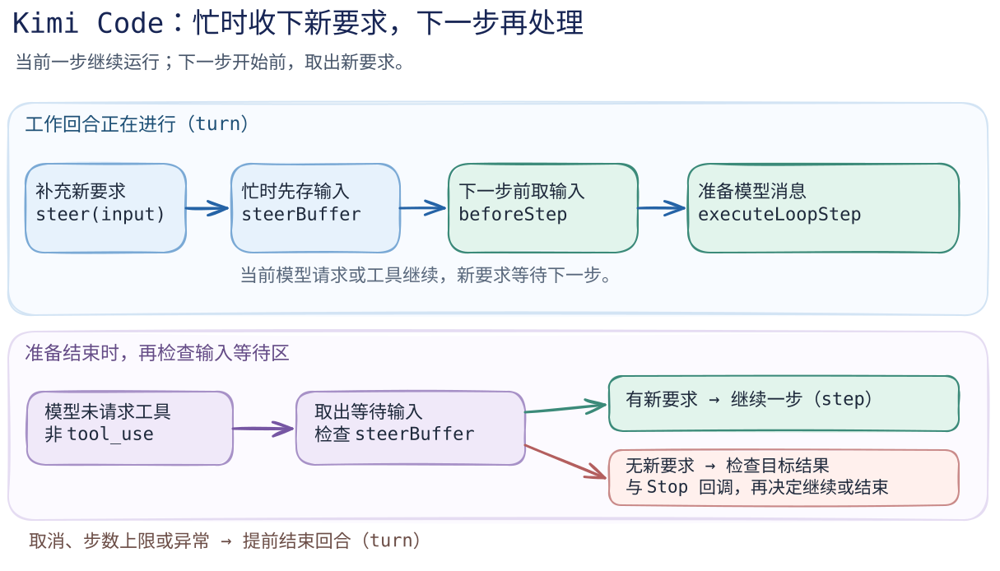

# Kimi Code：忙的时候，怎样接住你的新指令

你让 Agent 修复一个问题。它正在跑测试，你又补充一句：“先别改文件，把失败原因解释给我。”Kimi Code 会先收下这句话，等当前一步结束，再交给下一次模型请求，继续调整任务方向。

这里把一条输入展开的工作叫作回合（turn），一个回合可以有多个步骤（step）。`steer` 表示在工作途中补充或纠正指令。这篇跟着一条补充消息，看看宿主如何把它交给模型。

[图的文字版](../../../figures/kimi-code/README.md) · [可编辑图源](../../../figures/kimi-code/scene.excalidraw) · [PNG 预览](../../../figures/kimi-code/preview.png) · [逐段代码导读](code-walkthrough.md) · [来源台账](../../../sources/kimi-code.md)

## 正在运行时：先缓冲，后注入

**先收下消息。** `TurnFlow.steer()` 记录输入，然后查看是否正在工作。正在忙时，将消息及来源放进 `steerBuffer`，也就是等待区；空闲时，通过 `launch()` 启动一个新回合。忙时返回 `null`，表示这次没有新回合 ID。[源码：`steer()`](https://github.com/MoonshotAI/kimi-code/blob/75a894e9ad5e8d49509664b3daaa1bbc9bb39432/packages/agent-core/src/agent/turn/index.ts#L120-L143)

**下一步开始前，再交给模型。** `runStepLoop()` 在 `beforeStep` 中调用 `flushSteerBuffer()`，按收到的顺序把等待消息追加为用户输入，随后检查上下文压缩、补充材料，再构造下一次模型请求。回到修复例子：正在跑的测试先结束，模型在下一步看到“先解释原因”这条新要求。[源码：缓冲与追加](https://github.com/MoonshotAI/kimi-code/blob/75a894e9ad5e8d49509664b3daaa1bbc9bb39432/packages/agent-core/src/agent/turn/index.ts#L265-L273) · [源码：`beforeStep`](https://github.com/MoonshotAI/kimi-code/blob/75a894e9ad5e8d49509664b3daaa1bbc9bb39432/packages/agent-core/src/agent/turn/index.ts#L578-L604)

**准备收尾时，也再看一眼等待区。** 当模型没有要求调用工具、准备结束时，`runTurn()` 会调用 `shouldContinueAfterStop`。Kimi Code 先取出新消息；有消息就继续一步。没有消息，再检查目标状态以及 `Stop` hook（结束前回调），最后决定结束。[源码：loop 的停止检查](https://github.com/MoonshotAI/kimi-code/blob/75a894e9ad5e8d49509664b3daaa1bbc9bb39432/packages/agent-core/src/loop/run-turn.ts#L99-L128) · [源码：继续优先序](https://github.com/MoonshotAI/kimi-code/blob/75a894e9ad5e8d49509664b3daaa1bbc9bb39432/packages/agent-core/src/agent/turn/index.ts#L611-L657)

## 设计取舍：互动性放在 step 边界

把调整方向的位置放在步骤之间，有一个清楚的取舍：当前步骤保留执行过程，新指令等下一步处理。所以，测试很快结束时，调整也能很快接上；工具迟迟没有返回时，新消息也要继续等待。这个解释来自代码位置，实际等待多久还需要运行测量。

**调整方向与停止任务分别处理。** `steer` 用来补充输入，`cancel()` 用来发送取消信号。`runTurn()` 每一步前都检查取消和步数上限 `maxSteps`；定向取消只有匹配当前回合 ID 才起作用。回合结束后，`runOneTurn()` 记录 `completed`（正常结束）、`cancelled`（已取消）或 `failed`（失败）。[源码：步数与中断](https://github.com/MoonshotAI/kimi-code/blob/75a894e9ad5e8d49509664b3daaa1bbc9bb39432/packages/agent-core/src/loop/run-turn.ts#L74-L128) · [源码：取消](https://github.com/MoonshotAI/kimi-code/blob/75a894e9ad5e8d49509664b3daaa1bbc9bb39432/packages/agent-core/src/agent/turn/index.ts#L205-L216) · [源码：结束映射](https://github.com/MoonshotAI/kimi-code/blob/75a894e9ad5e8d49509664b3daaa1bbc9bb39432/packages/agent-core/src/agent/turn/index.ts#L441-L510)

**执行工具前，宿主还要检查权限。** `runStepLoop()` 把 `authorizeToolExecution` 接到 `agent.permission.beforeToolCall(ctx)`。因此，模型收到“改文件”这条新要求后，接下来仍须按宿主规则取得执行许可。具体审批界面与各工具策略留给后续专题。[源码：授权回调](https://github.com/MoonshotAI/kimi-code/blob/75a894e9ad5e8d49509664b3daaa1bbc9bb39432/packages/agent-core/src/agent/turn/index.ts#L658-L692)

## 与 Pi、Codex 对同一问题的取舍

| 问题 | Kimi Code 此切面 | Pi 固定版 | Codex 固定版 |
| --- | --- | --- | --- |
| 忙时的新输入在哪里等 | `TurnFlow.steerBuffer`，在 step 边界刷新。 | `Agent` 的 steering/follow-up 队列；steering 在轮间检查，follow-up 在将结束时检查。 | 本书现有 Codex 篇只研究 `exec_command` 审批，**未核对**忙时新输入路径。 |
| 先学到的取舍 | 当前 turn 可以因 steer 继续一个 step；等待时间受当前 step 影响。 | 小核心显式区分插队和后续输入；coding-agent 再负责会话外壳。 | 先区分命令审批与执行沙箱，不能由该篇推断 turn 交互模型。 |

Pi 的对照依据是本书[固定版的 `Agent.prompt()`、队列及 `runLoop` 导读](../pi/code-walkthrough.md)；Codex 依据是[固定版 `exec_command` 切面](../codex/README.md)。表格不是功能优劣排名，也不把两个项目在不同范围内的“取消”视作等价操作。

## 学习路径与未覆盖项

先用图解释新消息在哪里等待、什么时候交给模型。想深入时，再选读[代码导读](code-walkthrough.md)，对照 Pi 的[输入队列](../pi/README.md)和 Codex 的[执行审批](../codex/README.md)，看清“接收新指令”和“获准执行动作”各由哪部分处理。

> **固定版本的静态源码切面。** 本篇核对 [`MoonshotAI/kimi-code@75a894e9ad5e8d49509664b3daaa1bbc9bb39432`](https://github.com/MoonshotAI/kimi-code/tree/75a894e9ad5e8d49509664b3daaa1bbc9bb39432)，核对日期 2026-09-23。对象是新版 Kimi Code CLI 的 `packages/agent-core`，不是旧 [`kimi-cli`](https://github.com/MoonshotAI/kimi-cli)，也不是 Kimi 模型。上游此提交的 [LICENSE](https://github.com/MoonshotAI/kimi-code/blob/75a894e9ad5e8d49509664b3daaa1bbc9bb39432/LICENSE) 为 MIT。本篇没有运行 CLI，也没有证明该提交对应当前安装包。

本篇主要是固定提交的 `TurnFlow` 与通用 loop 静态阅读。2026-09-24 又复跑该提交 `agent-core` 的 3 组 mock 测试，共 68 例通过；其中一个用例确实模拟了**等待 Bash 审批时收到 steer，批准后同一 turn 的下一步看到它**。[测试与环境记录](../../../sources/kimi-code.md)说明了具体命令和局限。我们仍未追踪 CLI/TUI 到 `steer()` 的全部入口、SDK/RPC 所有调用者、`wire.jsonl` 持久化与恢复、子 Agent 上下文隔离，也未测真实模型、并发抵达、取消竞争或最大步数附近的实际事件顺序。官方[会话文档](https://moonshotai.github.io/kimi-code/en/guides/sessions)和[子 Agent 文档](https://moonshotai.github.io/kimi-code/en/customization/agents)可作后续入口，不能替代这些尚未完成的源码与运行核验。
