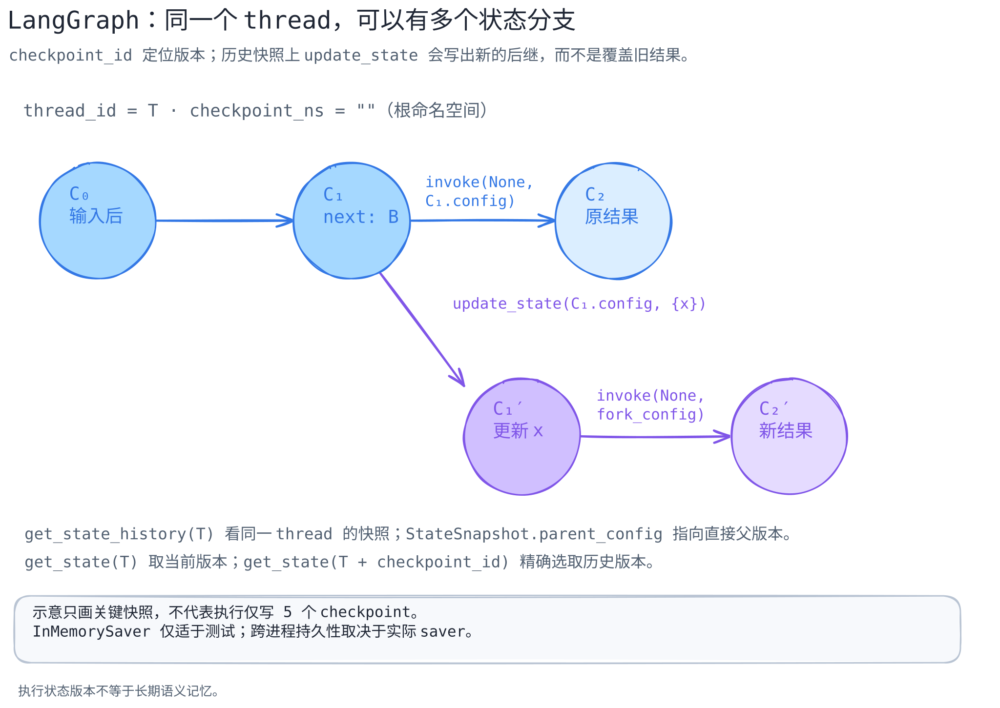

# LangGraph：thread 不是一条只能覆盖的状态线

[可编辑图源](../../../figures/langgraph-checkpoints/scene.excalidraw) · [PNG 预览](../../../figures/langgraph-checkpoints/preview.png) · [图的文字版](../../../figures/langgraph-checkpoints/README.md)

> 核对官方仓库 [`langchain-ai/langgraph@bdb85b5aa87a21de68371d2e534b81aeed398f57`](https://github.com/langchain-ai/langgraph/tree/bdb85b5aa87a21de68371d2e534b81aeed398f57) 的 Python `Pregel`/checkpointer 路径。证据包括源码和仓库内已有测试用例；本文**未运行测试或数据库后端**。图只抽取几个关键快照，不表示真实执行只有这些 checkpoint。

## 一句话区分

LangGraph checkpointer 保存的是**图执行状态的版本**：每个快照有当前 `values`、下一步 `next`、可重新取用的 `config` 和父版本 `parent_config`。它不是类似 Letta 核心块那样默认进入模型提示的知识，也不是 Mem0 那样按语义检索用户事实的存储。[`StateSnapshot` 字段](https://github.com/langchain-ai/langgraph/blob/bdb85b5aa87a21de68371d2e534b81aeed398f57/libs/langgraph/langgraph/types.py#L711-L733)

## 从一个旧快照分叉

1. 图需要编译时提供 checkpointer；没有 checkpointer，`get_state` 和 `bulk_update_state` 会报错。[`get_state` 要求](https://github.com/langchain-ai/langgraph/blob/bdb85b5aa87a21de68371d2e534b81aeed398f57/libs/langgraph/langgraph/pregel/main.py#L1392-L1414) · [`bulk_update_state` 要求](https://github.com/langchain-ai/langgraph/blob/bdb85b5aa87a21de68371d2e534b81aeed398f57/libs/langgraph/langgraph/pregel/main.py#L1590-L1623)
2. `get_state_history({"configurable": {"thread_id": "T"}})` 委托 saver 的 `list` 并把每个 `CheckpointTuple` 准备成 `StateSnapshot`；其中 `config` 可再定位此版本。[历史读取](https://github.com/langchain-ai/langgraph/blob/bdb85b5aa87a21de68371d2e534b81aeed398f57/libs/langgraph/langgraph/pregel/main.py#L1480-L1537)
3. `get_state(config)` 委托 saver 的 `get_tuple`。在 `InMemorySaver` 示例实现中，config 有 `checkpoint_id` 就精确取该版本；没有就取同一 `thread_id` 和 namespace 的最新 ID。[图接口](https://github.com/langchain-ai/langgraph/blob/bdb85b5aa87a21de68371d2e534b81aeed398f57/libs/langgraph/langgraph/pregel/main.py#L1392-L1450) · [示例 saver 选择逻辑](https://github.com/langchain-ai/langgraph/blob/bdb85b5aa87a21de68371d2e534b81aeed398f57/libs/checkpoint/langgraph/checkpoint/memory/__init__.py#L230-L309)
4. `update_state(old_snapshot.config, values)` 进入 `bulk_update_state`，先按传入 config 读旧 checkpoint，复制状态并应用节点写入，再 `put` 新 checkpoint；示例 saver 将传入的旧 `checkpoint_id` 记录为新版本的 parent。旧分支并未被同 ID 覆盖。[更新入口](https://github.com/langchain-ai/langgraph/blob/bdb85b5aa87a21de68371d2e534b81aeed398f57/libs/langgraph/langgraph/pregel/main.py#L2515-L2530) · [读取及复制旧状态](https://github.com/langchain-ai/langgraph/blob/bdb85b5aa87a21de68371d2e534b81aeed398f57/libs/langgraph/langgraph/pregel/main.py#L1640-L1676) · [写新快照](https://github.com/langchain-ai/langgraph/blob/bdb85b5aa87a21de68371d2e534b81aeed398f57/libs/langgraph/langgraph/pregel/main.py#L1990-L2045) · [父版本记录](https://github.com/langchain-ai/langgraph/blob/bdb85b5aa87a21de68371d2e534b81aeed398f57/libs/checkpoint/langgraph/checkpoint/memory/__init__.py#L421-L463)
5. 仓库测试构造 `node_a → node_b`，找出 `next == ("node_b",)` 的旧快照，调用 `update_state` 再 `invoke(None, fork_config)`；另一个测试从同一旧快照做两次 fork，检查两条结果互不混入。这是**测试代码的断言**，不是本文已实测的运行结果。[单次分叉用例](https://github.com/langchain-ai/langgraph/blob/bdb85b5aa87a21de68371d2e534b81aeed398f57/libs/langgraph/tests/test_time_travel.py#L143-L179) · [多分叉用例](https://github.com/langchain-ai/langgraph/blob/bdb85b5aa87a21de68371d2e534b81aeed398f57/libs/langgraph/tests/test_time_travel.py#L182-L218)

## 为什么这比“有会话历史”具体

`thread_id` 定作用域，`checkpoint_ns` 进一步划分命名空间，`checkpoint_id` 选版本；`parent_config` 使新旧结果的祖先关系可见。它能支持回看和从旧状态继续执行，但后续节点会不会重新执行、写出怎样的状态，仍受图结构、reducers、pending writes 和中断状态影响。不能把“拿到旧 checkpoint”直接说成“所有副作用都回滚”。

## 持久性的边界

为了看清键结构，本篇引用 `InMemorySaver`：它按 thread → namespace → checkpoint ID 存储，并有父版本指针。官方类注释明确它用于调试或测试，不适合生产持久化；进程结束后数据不保留。生产 saver 的事务性、恢复语义和跨机器能力不由这张图证明。[存储结构与官方限定](https://github.com/langchain-ai/langgraph/blob/bdb85b5aa87a21de68371d2e534b81aeed398f57/libs/checkpoint/langgraph/checkpoint/memory/__init__.py#L33-L86)

下一步应以一个可控两节点图分别使用 InMemorySaver 和生产 saver，记录每次 `config`、`parent_config`、`values`、`next` 以及副作用是否重放；本文尚未做该实验。
