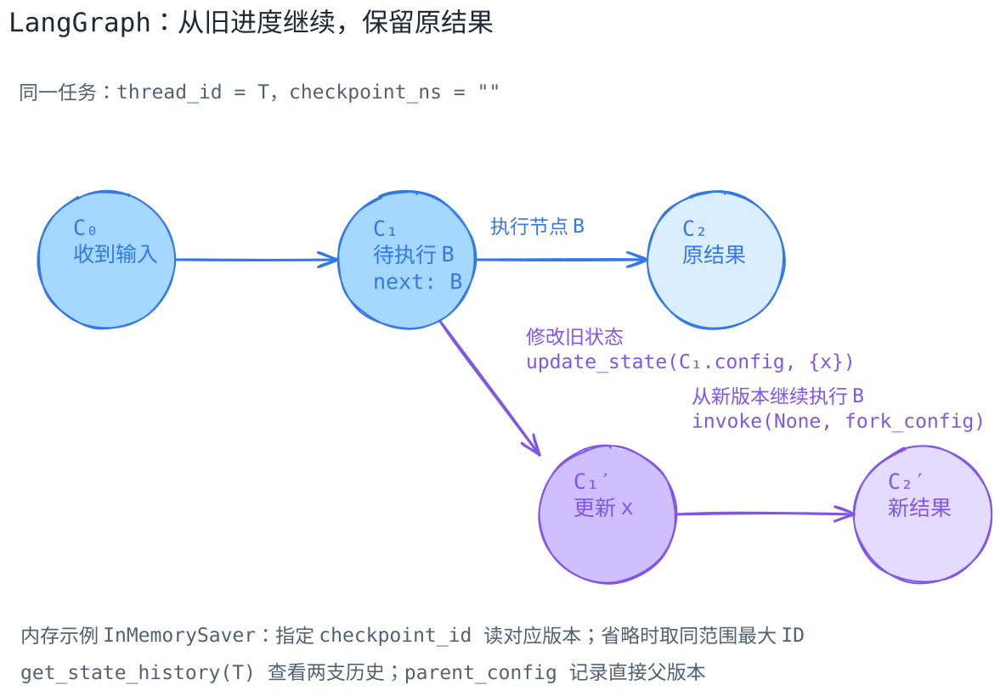

# LangGraph：给任务保存进度，也能从旧进度试另一条路

## 先看一次任务接力

设想一个两步任务：先查资料，再写摘要。资料已经查好时，你想调整写作要求，然后从这里继续。LangGraph 可以保存任务当时的状态，选出这一版进度，再生成一条新分支。

这里的图（graph）是一组按关系连接的任务节点。状态快照（checkpoint）记录图走到哪、留下什么数据，快照存储组件（checkpointer）负责保存和取回这些版本。同一任务的多个版本用 thread 串起来，你可以把它理解为这项任务的进度记录。

快照里有四个容易看懂的字段：`values` 是当前数据，`next` 是待执行节点，`config` 用于再次定位这一版，`parent_config` 指向它从哪一版接过来。[`StateSnapshot` 字段](https://github.com/langchain-ai/langgraph/blob/bdb85b5aa87a21de68371d2e534b81aeed398f57/libs/langgraph/langgraph/types.py#L711-L733)

[可编辑图源](../../../figures/langgraph-checkpoints/scene.excalidraw) · [PNG 预览](../../../figures/langgraph-checkpoints/preview.png) · [图的文字版](../../../figures/langgraph-checkpoints/README.md)

[关键代码走读：checkpoint 创建、读取与分支](code-walkthrough.md)

## 从一个旧快照分叉

1. **先为图配好存储组件。** 编译图时提供 checkpointer，随后就能用 `get_state` 读进度、用 `bulk_update_state` 更新进度。这两个入口会检查是否配置了组件。[`get_state` 要求](https://github.com/langchain-ai/langgraph/blob/bdb85b5aa87a21de68371d2e534b81aeed398f57/libs/langgraph/langgraph/pregel/main.py#L1392-L1414) · [`bulk_update_state` 要求](https://github.com/langchain-ai/langgraph/blob/bdb85b5aa87a21de68371d2e534b81aeed398f57/libs/langgraph/langgraph/pregel/main.py#L1590-L1623)
2. **查看已有进度。** `get_state_history({"configurable": {"thread_id": "T"}})` 调用存储组件的 `list`，将保存的记录整理为 `StateSnapshot`。其中的 `config` 可以再次定位你想选的那一版。[历史读取](https://github.com/langchain-ai/langgraph/blob/bdb85b5aa87a21de68371d2e534b81aeed398f57/libs/langgraph/langgraph/pregel/main.py#L1480-L1537)
3. **选中一版。** `get_state(config)` 交给存储组件的 `get_tuple` 读取。在本文使用的 `InMemorySaver`（内存存储示例）中，给出 `checkpoint_id` 就取指定版本；省略它则取同一任务和命名空间下的最新版本。[图接口](https://github.com/langchain-ai/langgraph/blob/bdb85b5aa87a21de68371d2e534b81aeed398f57/libs/langgraph/langgraph/pregel/main.py#L1392-L1450) · [示例 saver 选择逻辑](https://github.com/langchain-ai/langgraph/blob/bdb85b5aa87a21de68371d2e534b81aeed398f57/libs/checkpoint/langgraph/checkpoint/memory/__init__.py#L230-L309)
4. **调整后，建立新分支。** `update_state(old_snapshot.config, values)` 读取并复制旧状态，按节点的写入规则应用更新，再保存新 checkpoint。新版本记下旧版本的 ID 作为父版本，所以两条路线的来处可以追踪。若无法判断这次更新代表哪个节点，还需用 `as_node` 指定。[更新入口](https://github.com/langchain-ai/langgraph/blob/bdb85b5aa87a21de68371d2e534b81aeed398f57/libs/langgraph/langgraph/pregel/main.py#L2515-L2530) · [读取及复制旧状态](https://github.com/langchain-ai/langgraph/blob/bdb85b5aa87a21de68371d2e534b81aeed398f57/libs/langgraph/langgraph/pregel/main.py#L1640-L1676) · [写新快照](https://github.com/langchain-ai/langgraph/blob/bdb85b5aa87a21de68371d2e534b81aeed398f57/libs/langgraph/langgraph/pregel/main.py#L1990-L2045) · [父版本记录](https://github.com/langchain-ai/langgraph/blob/bdb85b5aa87a21de68371d2e534b81aeed398f57/libs/checkpoint/langgraph/checkpoint/memory/__init__.py#L421-L463)
5. **沿新进度继续。** 用返回的新配置调用 `invoke(None, fork_config)`。仓库测试采用 `node_a → node_b`：从第二个节点还没运行的快照分叉，并检查同一旧快照产生两条分支时各自的结果。本文引用这些上游测试帮助理解，没有重跑它们。[单次分叉用例](https://github.com/langchain-ai/langgraph/blob/bdb85b5aa87a21de68371d2e534b81aeed398f57/libs/langgraph/tests/test_time_travel.py#L143-L179) · [多分叉用例](https://github.com/langchain-ai/langgraph/blob/bdb85b5aa87a21de68371d2e534b81aeed398f57/libs/langgraph/tests/test_time_travel.py#L182-L218)

## 用三个标识找到一份进度

`thread_id` 选任务，`checkpoint_ns` 选命名空间，`checkpoint_id` 选具体版本。`parent_config` 再告诉你这版从哪里来。这样，你既能回看进度，也能对同一个起点尝试不同更新。

继续运行时，后续节点怎样执行，还要看图的连接、reducer（合并多份更新的规则）、尚待处理的写入和中断位置。假如节点已经向外部系统发过邮件，读取旧快照只恢复图的数据；邮件仍要到外部系统核对，避免重复发送。

## 持久性的边界

为了看清键结构，本篇引用 `InMemorySaver`：它按 thread → namespace → checkpoint ID 存储，并有父版本指针。官方类注释明确它用于调试或测试，不适合生产持久化；进程结束后数据不保留。真正长期保存进度时，需要另选生产存储后端，并测试它的事务、故障恢复和跨机器行为。[存储结构与官方限定](https://github.com/langchain-ai/langgraph/blob/bdb85b5aa87a21de68371d2e534b81aeed398f57/libs/checkpoint/langgraph/checkpoint/memory/__init__.py#L33-L86)

下一步应以一个可控两节点图分别使用 InMemorySaver 和生产 saver，记录每次 `config`、`parent_config`、`values`、`next` 以及副作用是否重放；本文尚未做该实验。

## 版本与检查范围

> 核对官方仓库 [`langchain-ai/langgraph@bdb85b5aa87a21de68371d2e534b81aeed398f57`](https://github.com/langchain-ai/langgraph/tree/bdb85b5aa87a21de68371d2e534b81aeed398f57) 的 Python `Pregel`/checkpointer 路径。证据包括源码和仓库内已有测试用例；本文**未运行测试或数据库后端**。图只抽取几个关键快照，不表示真实执行只有这些 checkpoint。
