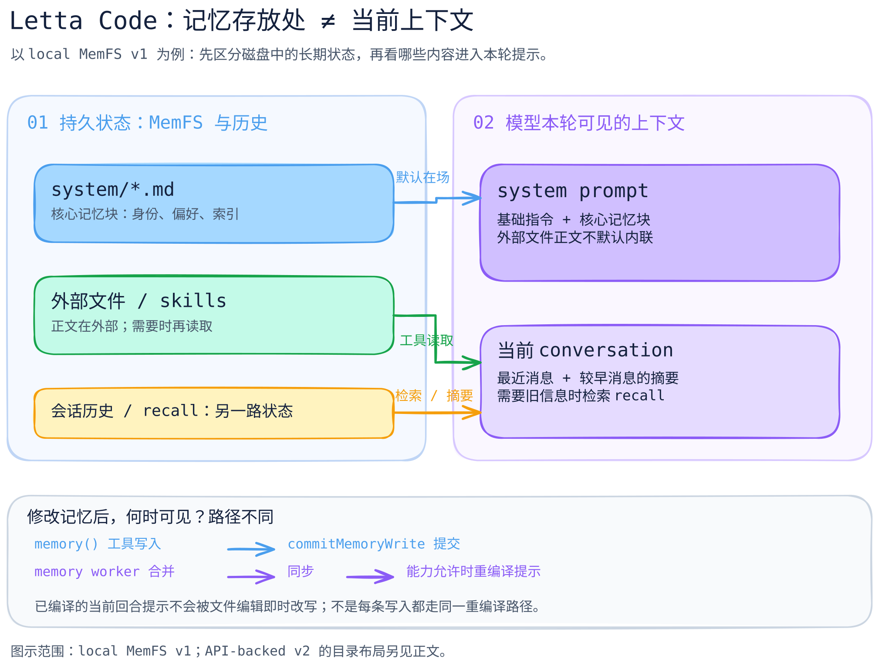

# Letta Code：长期记忆为什么不等于当前上下文

[可编辑图源](../../../figures/letta-memory/scene.excalidraw) · [PNG 预览](../../../figures/letta-memory/preview.png) · [图的文字版](../../../figures/letta-memory/README.md)

[按阅读顺序跟代码](code-walkthrough.md)

> 本篇核对的是 `letta-ai/letta-code` 在 [`1f55d3dc66e238d203757fae288bb53f3adc7cd3`](https://github.com/letta-ai/letta-code/tree/1f55d3dc66e238d203757fae288bb53f3adc7cd3) 的源码与内置提示。图中特意选择 **local MemFS v1**；Letta Code 还有 API-backed MemFS v2 和非 MemFS 模式，不能把这张图当成所有部署的完整拓扑。证据等级是静态源码及内置提示核对，**未做启动后的运行追踪或跨设备同步验证**。

## 先回答一个问题

Agent 把东西“记住”了，究竟是写入了本轮模型可见的提示、存入可检索的文件，还是留在对话历史里？Letta Code 把这些位置分开：核心记忆块在提示中；外部文件和 Skills 通常要按需读取；历史消息由 recall 路径查找。MemFS 的文件修改与已编译的当前回合提示不是同一事件；后续何时可见还取决于具体写入、同步与重编译路径。这个区分比一句“拥有长期记忆”更能解释系统行为。

## 三个问题，三个位置

| 问题 | 本篇 local MemFS v1 中的位置 | 模型何时看见 |
| --- | --- | --- |
| 每轮都应知道的身份、偏好、索引 | `system/` 下的核心记忆 Markdown，映射为 memory blocks | 编入 system prompt；有上下文成本 |
| 详细参考资料与程序化做法 | MemFS 外部 Markdown / Skills | 可由路径或描述帮助发现；正文通过文件/工具按需读取，不默认完整内联 |
| 过去对话里发生过什么 | conversation history / recall | 当前窗口保留近期消息和旧消息摘要；更早细节需检索 |

这张表描述的是内置提示里的设计及对应代码路径，不证明所有模型都遵循“按需读取”的建议，也不证明 recall 的实际命中率。[内置 local MemFS 提示：历史与三类记忆](https://github.com/letta-ai/letta-code/blob/1f55d3dc66e238d203757fae288bb53f3adc7cd3/src/agent/prompts/letta_local_memfs.md#L8-L55)

## 关键代码如何串起来

1. `detectMemoryFormat(memoryDir, localMemfs)`：本地 MemFS 返回 v1；非本地且有根 `MEMORY.md` 才识别为 v2。`isCoreMemoryPath` 因此在 v1 判断 `system/`，在 v2 判断根目录 Markdown。[源码](https://github.com/letta-ai/letta-code/blob/1f55d3dc66e238d203757fae288bb53f3adc7cd3/src/agent/memory-format.ts#L6-L29)
2. `estimateSystemPromptSize` 用同一个格式判断核心记忆的范围：v1 递归统计 `system/`，v2 统计根目录 Markdown。这里是 **4 字节 / token 的粗估**，不是模型计费或真实 token 数。[源码](https://github.com/letta-ai/letta-code/blob/1f55d3dc66e238d203757fae288bb53f3adc7cd3/src/agent/system-prompt-size.ts#L1-L106)
3. `memory()` 工具解析目标目录、核对工作树、执行编辑，并调用 `commitMemoryWrite` 为受影响路径形成 Git 版本。这里要分清**工作树文件已写、Git 版本已形成、后续同步与提示重编译**；它们不是同一个“持久化完成”事件。[工具实现](https://github.com/letta-ai/letta-code/blob/1f55d3dc66e238d203757fae288bb53f3adc7cd3/src/tools/impl/memory.ts#L99-L157) · [Git 提交实现](https://github.com/letta-ai/letta-code/blob/1f55d3dc66e238d203757fae288bb53f3adc7cd3/src/agent/memory-git.ts#L1319-L1358)
4. 对于 memory worker 的合并路径，代码先处理同步，再在能力允许时请求 `recompileAgentSystemPrompt`；内置提示也写明当前回合不会因编辑而立刻改变已编译提示。不能据此泛化为所有工具写入都在同一时机重编译。[worker 路径](https://github.com/letta-ai/letta-code/blob/1f55d3dc66e238d203757fae288bb53f3adc7cd3/src/agent/subagents/memory-worker.ts#L95-L139) · [重编译入口](https://github.com/letta-ai/letta-code/blob/1f55d3dc66e238d203757fae288bb53f3adc7cd3/src/agent/modify.ts#L683-L729)

## v1 与 v2 不要混成一张目录图

当前代码同时保留几种运行配置。API-backed v2 用根 `MEMORY.md` 作为索引标记，核心记忆在根目录 Markdown；local MemFS 则仍按 v1 的 `system/` 识别。v2 子目录还有逐级 `MEMORY.md` 索引要求。这是**源码分支**，不是“老版本已全部淘汰”或“所有部署都已切 v2”。[格式判定与索引约束](https://github.com/letta-ai/letta-code/blob/1f55d3dc66e238d203757fae288bb53f3adc7cd3/src/agent/memory-format.ts#L6-L72) · [创建 Agent 时根块的用途](https://github.com/letta-ai/letta-code/blob/1f55d3dc66e238d203757fae288bb53f3adc7cd3/src/agent/create-agent-request.ts#L170-L205)

## 易误解的地方

- **“存到磁盘 = 下一 token 就会记得”**：错误。当前回合使用已经装载的提示；文件写入、Git 提交、同步、提示重编译是不同事件。
- **“所有长期信息都塞在 system prompt”**：错误。详细文件和 Skills 是外部记忆；核心块要克制，内置提示也建议把可重新查到的细节移出去。
- **“Recall 与 memory block 是一回事”**：错误。前者查历史经验，后者承载可维护的当前核心记忆。
- **“这张图证明记忆有效”**：错误。图只说明所选源码路径的状态分层；准确性、召回率、跨会话持久性仍需实验。

## 下一步核验

在隔离测试 Agent 上分别写入核心块、外部文件和对话事实，记录下一轮的提示重编译结果、实际可见内容、recall 调用与 Git revision；然后对 API-backed v2 重做同样实验。不能用静态阅读替代这些结果。
