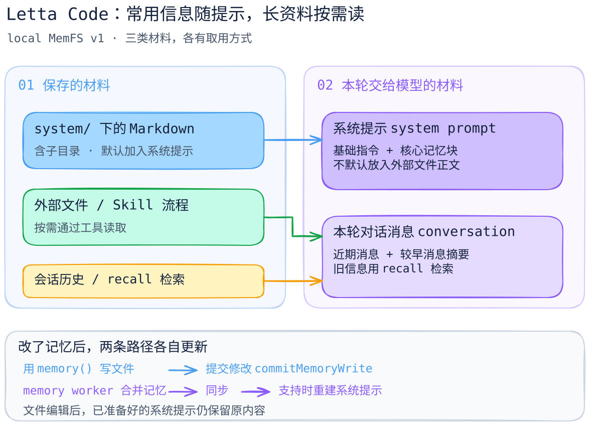

# Letta Code：把常用知识放在身边，把细节按需找回来

## 像整理一张工作台

你让助手帮忙维护一个项目。项目用什么语言、你喜欢怎样看结果，是经常需要的信息；一份很长的排查手册，只在遇到相关问题时才需要；上周讨论过的细节，还可以回头查聊天记录。

Letta Code 按这三种用法安排材料：**常用信息放进提示，详细文件按需读取，旧对话通过 recall（历史检索）找回。** MemFS 是它管理记忆文件的方式。下面只看 local MemFS v1（本地的一种目录配置），先把这三种材料的去处讲清楚。

[可编辑图源](../../../figures/letta-memory/scene.excalidraw) · [PNG 预览](../../../figures/letta-memory/preview.png) · [图的文字版](../../../figures/letta-memory/README.md)

[按阅读顺序跟代码](code-walkthrough.md)

## 常用信息、参考资料、过去对话

| 问题 | 本篇 local MemFS v1 中的位置 | 模型何时看见 |
| --- | --- | --- |
| 经常用的身份、偏好、索引 | `system/` 下的 Markdown，组成核心记忆块 | 准备系统提示时一起装入，占用输入容量 |
| 详细参考资料与操作步骤 | 外部 Markdown 与 Skills（工作方法） | 先通过路径或描述发现，再用工具读取正文 |
| 过去讨论过的细节 | 对话历史与 recall（历史检索） | 近期消息和摘要随当前输入提供，更早细节再查询 |

这套安排来自内置提示及对应代码：常用信息随手可见，长材料留到需要时读。实际能否找到正确细节，可以在任务中观察工具读取和历史检索结果。[内置 local MemFS 提示：历史与三类记忆](https://github.com/letta-ai/letta-code/blob/1f55d3dc66e238d203757fae288bb53f3adc7cd3/src/agent/prompts/letta_local_memfs.md#L8-L55)

## 从文件到下一次模型请求

1. `detectMemoryFormat(memoryDir, localMemfs)`：本地 MemFS 返回 v1；非本地且有根 `MEMORY.md` 才识别为 v2。`isCoreMemoryPath` 因此在 v1 判断 `system/`，在 v2 判断根目录 Markdown。[源码](https://github.com/letta-ai/letta-code/blob/1f55d3dc66e238d203757fae288bb53f3adc7cd3/src/agent/memory-format.ts#L6-L29)
2. `estimateSystemPromptSize` 用同一个格式判断核心记忆的范围：v1 递归统计 `system/`，v2 统计根目录 Markdown。它用 **每 4 字节约算一个 token** 来估计容量，适合做粗略预算；准确的 token 数还要按模型分词方式计算。[源码](https://github.com/letta-ai/letta-code/blob/1f55d3dc66e238d203757fae288bb53f3adc7cd3/src/agent/system-prompt-size.ts#L1-L106)
3. `memory()` 工具解析目标目录、核对工作树、执行编辑，并调用 `commitMemoryWrite` 为受影响路径形成 Git 版本。这一过程留下了文件和 Git 版本，后续再处理同步与提示重编译。可以按这些位置逐步查看更新进度。[工具实现](https://github.com/letta-ai/letta-code/blob/1f55d3dc66e238d203757fae288bb53f3adc7cd3/src/tools/impl/memory.ts#L99-L157) · [Git 提交实现](https://github.com/letta-ai/letta-code/blob/1f55d3dc66e238d203757fae288bb53f3adc7cd3/src/agent/memory-git.ts#L1319-L1358)
4. memory worker（专门整理记忆的执行者）合并改动时，先同步文件，再在支持时请求 `recompileAgentSystemPrompt`，重新准备系统提示。所以，一份新笔记要经过这条更新路径，才进入随后重新编译的提示；其他编辑路径要按各自入口查看。[worker 路径](https://github.com/letta-ai/letta-code/blob/1f55d3dc66e238d203757fae288bb53f3adc7cd3/src/agent/subagents/memory-worker.ts#L95-L139) · [重编译入口](https://github.com/letta-ai/letta-code/blob/1f55d3dc66e238d203757fae288bb53f3adc7cd3/src/agent/modify.ts#L683-L729)

## 换一种配置，文件位置也会变

当前代码同时保留几种运行配置。API-backed v2 用根 `MEMORY.md` 作为索引标记，核心记忆在根目录 Markdown；local MemFS 则仍按 v1 的 `system/` 识别。v2 子目录还有逐级 `MEMORY.md` 索引要求。阅读另一种配置时，先看它采用哪种目录规则，再判断文件怎样进入提示。[格式判定与索引约束](https://github.com/letta-ai/letta-code/blob/1f55d3dc66e238d203757fae288bb53f3adc7cd3/src/agent/memory-format.ts#L6-L72) · [创建 Agent 时根块的用途](https://github.com/letta-ai/letta-code/blob/1f55d3dc66e238d203757fae288bb53f3adc7cd3/src/agent/create-agent-request.ts#L170-L205)

## 用这套安排改善自己的助手

先挑出每次任务都要用的少量信息，放入核心块；把较长、随时可查的细节放到外部文件；需要复盘过去对话时，再用 recall。这样既控制输入长度，也保留了查找细节的入口。

检查一次更新时，沿“文件改动 → Git 版本 → 同步 → 提示重编译”查看。当前回合可能仍在使用之前准备好的提示，立即写入文件和随后读到更新之间有一个过程。记忆内容是否正确、历史是否能找回，仍要通过实际任务检验。

## 下一步核验

在隔离测试 Agent 上分别写入核心块、外部文件和对话事实，记录下一轮的提示重编译结果、实际可见内容、recall 调用与 Git revision；然后对 API-backed v2 重做同样实验。不能用静态阅读替代这些结果。

## 版本与检查范围

> 本篇核对的是 `letta-ai/letta-code` 在 [`1f55d3dc66e238d203757fae288bb53f3adc7cd3`](https://github.com/letta-ai/letta-code/tree/1f55d3dc66e238d203757fae288bb53f3adc7cd3) 的源码与内置提示。图中特意选择 **local MemFS v1**；Letta Code 还有 API-backed MemFS v2 和非 MemFS 模式，不能把这张图当成所有部署的完整拓扑。证据等级是静态源码及内置提示核对，**未做启动后的运行追踪或跨设备同步验证**。
