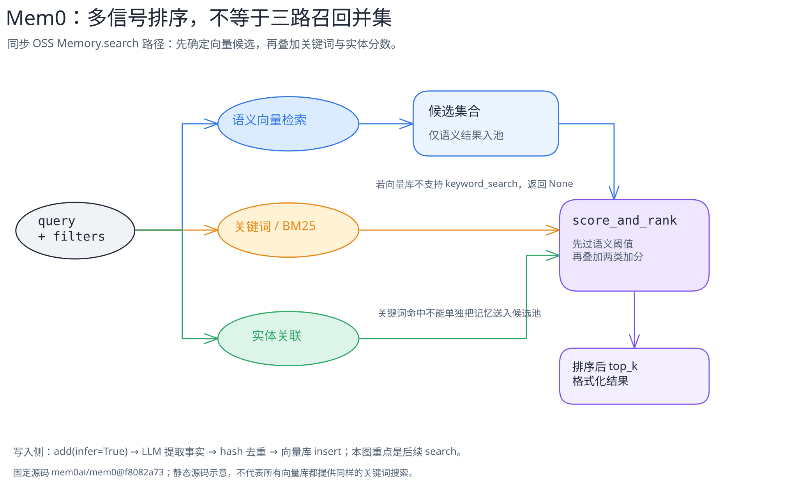

# Mem0：记忆怎样写入，又怎样被找回

[可编辑图源](../../../figures/mem0-retrieval/scene.excalidraw) · [PNG 预览](../../../figures/mem0-retrieval/preview.png) · [图的文字版](../../../figures/mem0-retrieval/README.md)

> 范围：官方开源仓库 [`mem0ai/mem0@f8082a7345dadd9e042ebbc40b57b1498c8f6d63`](https://github.com/mem0ai/mem0/tree/f8082a7345dadd9e042ebbc40b57b1498c8f6d63) 的 Python OSS 同步 `Memory.add(infer=True)` 与 `Memory.search`。这是**源码静态核对**，未运行模型、向量库或基准测试；不覆盖托管平台、异步 API 或所有向量库的具体行为。

## 与 Letta Code 的问题不同

[Letta Code 一篇](../letta/README.md)讲“Agent 自己的核心块、外部文件、历史消息如何进入上下文”。Mem0 在这里是供应用调用的**记忆存取层**：输入消息经提取后成为可检索的记录；检索返回的内容还需由调用方决定怎样放回 Agent 的提示。不要把 Mem0 的 vector-store 记录叫作 Letta 的 in-context memory block。

## 写入：不是把整段对话原样塞进向量库

`Memory.add()` 要求 `user_id`、`agent_id`、`run_id` 至少有一个用于作用域；它把消息正规化后交给 `_add_to_vector_store`。在本篇限定的 `infer=True` 路径中，代码先取同一作用域最近消息和部分已有记忆，调用一次 LLM 提取新事实，再批量 embedding、对检索到的已有记录及本批次按文本 hash 排重，最后批量 `insert` 到向量库并记录历史；即使未提取到事实，也会保存本轮消息。[作用域构造](https://github.com/mem0ai/mem0/blob/f8082a7345dadd9e042ebbc40b57b1498c8f6d63/mem0/memory/main.py#L314-L409) · [`add` 分派](https://github.com/mem0ai/mem0/blob/f8082a7345dadd9e042ebbc40b57b1498c8f6d63/mem0/memory/main.py#L760-L877) · [提取与落库](https://github.com/mem0ai/mem0/blob/f8082a7345dadd9e042ebbc40b57b1498c8f6d63/mem0/memory/main.py#L879-L1067)

注意两个边界：`infer=False` 会走逐消息直接写入路径；procedural memory 也有独立分支。本篇图与正文不能替代它们。当前源码这条推断路径是 **ADD-only**，不是自动 UPDATE/DELETE；`add()` docstring 仍有“决定添加、更新或删除”的旧表述，应以具体执行分支为准。[`infer=False` 与 V3 路径分叉](https://github.com/mem0ai/mem0/blob/f8082a7345dadd9e042ebbc40b57b1498c8f6d63/mem0/memory/main.py#L879-L944) · [项目 README 对新算法的限定](https://github.com/mem0ai/mem0/blob/f8082a7345dadd9e042ebbc40b57b1498c8f6d63/README.md#L49-L76)

## 检索：多信号，但候选先由语义搜索决定

调用 `Memory.search(query, filters={"user_id": ...})` 时，源码验证作用域、阈值与 top-k，再进入 `_search_vector_store`。该方法对 query 做向量 embedding 和语义搜索，也尝试关键词搜索、实体关联加分。**候选列表只由语义搜索结果构造**；`score_and_rank` 对候选先应用语义阈值，再将可用的 BM25 与实体分数叠加排序。关键词搜索命中而未进入语义候选的记忆，不会单独进入结果集。[`search` 入口](https://github.com/mem0ai/mem0/blob/f8082a7345dadd9e042ebbc40b57b1498c8f6d63/mem0/memory/main.py#L1379-L1528) · [检索候选与加分](https://github.com/mem0ai/mem0/blob/f8082a7345dadd9e042ebbc40b57b1498c8f6d63/mem0/memory/main.py#L1628-L1726) · [排序函数](https://github.com/mem0ai/mem0/blob/f8082a7345dadd9e042ebbc40b57b1498c8f6d63/mem0/utils/scoring.py#L60-L143)

关键词路径也不是每个向量库都有：基类 `keyword_search()` 默认返回 `None`，仅部分适配器覆写。因此“Mem0 OSS 一定同时跑 BM25”也不成立。[向量库基类](https://github.com/mem0ai/mem0/blob/f8082a7345dadd9e042ebbc40b57b1498c8f6d63/mem0/vector_stores/base.py#L68-L81)

## 易误解与未验证

- **“多信号检索 = 三路召回取并集”**：不符这条源码路径；关键词、实体用于候选加分。
- **“ADD-only = 永远不会删改任何记录”**：只能说明这里的 `infer=True` 自动提取分支；显式 `update`、`delete` 等 API 另有路径。
- **“README 基准分数就是 OSS 实测”**：README 明确区分托管平台优化与 OSS，不能把托管结果移植到本图。[官方限定](https://github.com/mem0ai/mem0/blob/f8082a7345dadd9e042ebbc40b57b1498c8f6d63/README.md#L49-L76)
- **未知**：不同向量库是否提供真实 keyword search、LLM 提取质量、实体链接命中与最终检索效果，都未在本篇运行核验。

下一步应在隔离环境用一个固定模型和固定向量库跑输入消息、向量记录、候选 ID、BM25/实体分数及最终结果的逐步 trace，再比较另一种向量库；当前章节只提供静态路径地图。
