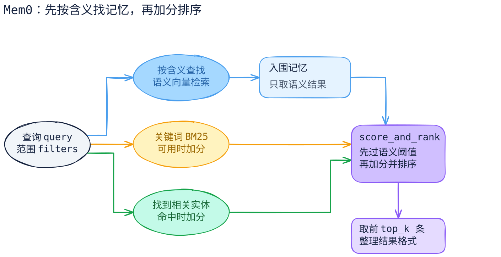

# Mem0：记忆怎样写入，又怎样被找回

## 从一句偏好开始

用户告诉资料助手：“请先给简短结论，再列出处。”应用可以调用 Mem0，从这段消息中提取值得保存的事实。以后回答相关问题时，再检索这条偏好，把它加入模型输入。这里的场景用于解释流程，具体能提取和找回哪些事实取决于模型与配置。

Mem0 负责**保存和找回记忆，应用负责把结果交给模型**。[Letta Code](../letta/README.md)更多讲助手怎样安排核心块、文件和历史；Mem0 这篇跟着两个调用走：写入用 `add`，找回用 `search`。

[可编辑图源](../../../figures/mem0-retrieval/scene.excalidraw) · [PNG 预览](../../../figures/mem0-retrieval/preview.png) · [图的文字版](../../../figures/mem0-retrieval/README.md)

[按阅读顺序跟代码](code-walkthrough.md)

## 写入：先整理事实，再保存

`Memory.add()` 先确定这份记忆属于谁：需要 `user_id`、`agent_id`、`run_id` 至少一个标识。随后整理输入消息，在本文的 `infer=True` 路径中，让大模型结合近期消息和部分已有记忆提取新事实。

提取出的文本经过 **embedding（转换为便于按含义检索的数值表示）**，再与本次读到的已有记录及同批新记录排重，最后写入向量库并记录 ADD 历史。批量写入失败时，会改为逐条尝试；本轮消息也会保存，包括没有提取出新事实的情况。[作用域构造](https://github.com/mem0ai/mem0/blob/f8082a7345dadd9e042ebbc40b57b1498c8f6d63/mem0/memory/main.py#L314-L409) · [`add` 分派](https://github.com/mem0ai/mem0/blob/f8082a7345dadd9e042ebbc40b57b1498c8f6d63/mem0/memory/main.py#L760-L877) · [提取与落库](https://github.com/mem0ai/mem0/blob/f8082a7345dadd9e042ebbc40b57b1498c8f6d63/mem0/memory/main.py#L879-L1067)

本篇选择自动提取事实这一路：它是 **ADD-only（只新增记忆记录）**。显式更新、删除、`infer=False` 的逐消息写入，以及 procedural memory（流程记忆）分别有自己的入口。读代码时以实际分支为准；`add()` 的旧注释仍写着添加、更新或删除，与这里的新实现有差别。[`infer=False` 与 V3 路径分叉](https://github.com/mem0ai/mem0/blob/f8082a7345dadd9e042ebbc40b57b1498c8f6d63/mem0/memory/main.py#L879-L944) · [项目 README 对新算法的限定](https://github.com/mem0ai/mem0/blob/f8082a7345dadd9e042ebbc40b57b1498c8f6d63/README.md#L49-L76)

## 找回：先按含义找候选，再排序

应用调用 `Memory.search(query, filters={"user_id": ...})`，在选定用户的记忆中查询。`top_k` 指希望返回的最多条数。宿主检查参数后，把问题转换为 embedding，先按含义相近程度找到候选。

接着，`score_and_rank` 筛掉语义分数过低的候选，再叠加可用的 BM25（关键词匹配分数）和实体关联加分，排序后取前 `top_k` 条。可以把它理解为“先入围，再加分”：入围名单来自语义搜索，关键词和实体帮助排顺序。[`search` 入口](https://github.com/mem0ai/mem0/blob/f8082a7345dadd9e042ebbc40b57b1498c8f6d63/mem0/memory/main.py#L1379-L1528) · [检索候选与加分](https://github.com/mem0ai/mem0/blob/f8082a7345dadd9e042ebbc40b57b1498c8f6d63/mem0/memory/main.py#L1628-L1726) · [排序函数](https://github.com/mem0ai/mem0/blob/f8082a7345dadd9e042ebbc40b57b1498c8f6d63/mem0/utils/scoring.py#L60-L143)

关键词加分是否可用，要看选定的向量库适配器。基类 `keyword_search()` 默认返回 `None`，部分适配器才提供实现。[向量库基类](https://github.com/mem0ai/mem0/blob/f8082a7345dadd9e042ebbc40b57b1498c8f6d63/mem0/vector_stores/base.py#L68-L81)

## 实际使用前要检查的几件事

- 给正确用户选择过滤条件，并检查检索出来的内容是否适合当前任务；最后由应用加入模型输入。
- 故障时读回存储。逐条写入异常只记入日志，构造的 ADD 返回项仍可能保留；因此应核对对应 ID 的记录是否存在。
- 这条自动提取路径只新增记忆，显式 `update`、`delete` API 另看各自实现。
- 官方 README 区分托管平台与开源版（OSS）的基准结果，读成绩时先核对测的是哪一版。[官方说明](https://github.com/mem0ai/mem0/blob/f8082a7345dadd9e042ebbc40b57b1498c8f6d63/README.md#L49-L76)
- **未知**：不同向量库是否提供真实 keyword search、LLM 提取质量、实体链接命中与最终检索效果，都未在本篇运行核验。

下一步应在隔离环境用一个固定模型和固定向量库跑输入消息、向量记录、候选 ID、BM25/实体分数及最终结果的逐步 trace，再比较另一种向量库；当前章节只提供静态路径地图。

## 版本与检查范围

> 范围：官方开源仓库 [`mem0ai/mem0@f8082a7345dadd9e042ebbc40b57b1498c8f6d63`](https://github.com/mem0ai/mem0/tree/f8082a7345dadd9e042ebbc40b57b1498c8f6d63) 的 Python OSS 同步 `Memory.add(infer=True)` 与 `Memory.search`。这是**源码静态核对**，未运行模型、向量库或基准测试；不覆盖托管平台、异步 API 或所有向量库的具体行为。
