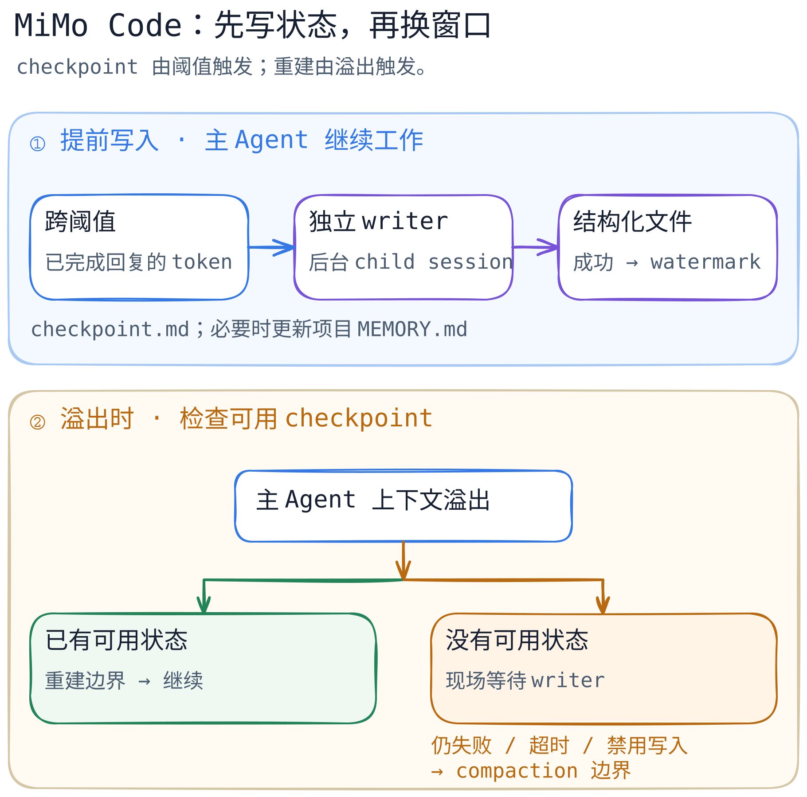

# MiMo Code：把长会话切成可恢复的窗口

[关键代码导读](code-walkthrough.md) · [来源与版本](../../../sources/mimo-code.md)

**读完这一篇，可以判断：**一个编码 Agent 在模型上下文快满时，怎样靠运行时提前提取状态、在磁盘和消息流中留下边界，再让下一窗口继续原任务；以及这条链在哪里可能退化。它说明的是 MiMo Code 的一条实现路径，不是“所有对话都能无损续接”的保证。

假设用户让 Agent 迁移一个模块，已改动几个文件，测试还未通过。模型这次能看见的消息窗口会越用越满；简单丢掉旧消息，下一轮可能忘记用户原话、当前文件和失败原因。MiMo Code 的选择是让**主 Agent 继续干活**，由运行时在窗口尚有余量时启动独立 writer，将可继续执行的状态写成结构化文件。真正需要换窗口时，再用这些文件和最近的原话构造一条新的上下文边界。

> 固定版本：[`XiaomiMiMo/MiMo-Code@a273d3450ee05ba5163320eae59d7716b778e480`](https://github.com/XiaomiMiMo/MiMo-Code/tree/a273d3450ee05ba5163320eae59d7716b778e480)，2026-09-23 获取并静态阅读；仓库根目录 [`LICENSE`](https://github.com/XiaomiMiMo/MiMo-Code/blob/a273d3450ee05ba5163320eae59d7716b778e480/LICENSE) 为 MIT，包含 MiMo Code 与 OpenCode 版权行。本篇未运行该提交的长会话。官方[设计文章](https://mimo.xiaomi.com/blog/mimo-code-long-horizon)与[会话文档](https://mimo.xiaomi.com/mimocode/sessions)是会更新的文档声明，若与固定版代码不同，以本篇所列代码为准。

## 先分清三种“连续”

| 层次 | 保存或传递什么 | 为什么不能混作一件事 |
| --- | --- | --- |
| 原始会话 | 消息与工具调用仍在会话存储中 | 旧消息留存，不代表下一次请求会把它们全部发给模型。 |
| 结构化状态 | session `checkpoint.md`、project `MEMORY.md`，以及任务、笔记等 | writer 提取的是可继续工作的线索，可能遗漏、误读或写入旧状态。 |
| 当前模型输入 | 边界消息中的重建文本与其后的活消息 | 每段有预算；旧工具结果还可能被清理或折叠。 |

`checkpoint.md` 位于会话内存目录，模板规定 11 节，包括原话意图、下一动作、任务树、当前工作、文件、错误与决策；项目记忆另存 `MEMORY.md`。这两个文件的生命周期不同，`notes.md` 则是主 Agent 可写的零散入口。[路径](https://github.com/XiaomiMiMo/MiMo-Code/blob/a273d3450ee05ba5163320eae59d7716b778e480/packages/opencode/src/session/checkpoint-paths.ts#L10-L84) · [模板](https://github.com/XiaomiMiMo/MiMo-Code/blob/a273d3450ee05ba5163320eae59d7716b778e480/packages/opencode/src/session/checkpoint-templates.ts#L1-L100) · [主 Agent 指令](https://github.com/XiaomiMiMo/MiMo-Code/blob/a273d3450ee05ba5163320eae59d7716b778e480/packages/opencode/src/session/llm.ts#L116-L205)。

## 一张图：何时写，何时换窗口？

[图的独立文字版、可编辑源与 PNG](../../../figures/mimo-code/README.md)。图中的实线是固定版源码的主 Agent 路径；分支不是成功保证。**触发 writer 与触发重建是两次不同判断**：前者看已完成 assistant 消息的 token 用量与阈值，后者看上下文溢出；前者异步运行，主任务无需等 writer 完成才继续。[循环入口](https://github.com/XiaomiMiMo/MiMo-Code/blob/a273d3450ee05ba5163320eae59d7716b778e480/packages/opencode/src/session/prompt.ts#L4815-L4889) · [阈值调度](https://github.com/XiaomiMiMo/MiMo-Code/blob/a273d3450ee05ba5163320eae59d7716b778e480/packages/opencode/src/session/prune.ts#L238-L425)。

官方文章用约 **20%、45%、70%** 说明“尽早提取”的思路；此提交的*默认实现*按窗口大小选梯度：25K–200K 为 20/40/60/80%，200K–500K 为 10% 至 90% 每 10% 一档，更大窗口每 5% 一档；小于 25K 无默认 checkpoint 阈值。配置还可覆盖阈值。读版本化源码时，不能把文章的示意数字当作固定实现常量。[源码默认值](https://github.com/XiaomiMiMo/MiMo-Code/blob/a273d3450ee05ba5163320eae59d7716b778e480/packages/opencode/src/session/prune.ts#L24-L58) · [官方文章](https://mimo.xiaomi.com/blog/mimo-code-long-horizon)。

## 设计真正押注的地方

**watermark 只确认一次成功的覆盖位置。**writer 在独立 child session 中运行，却原地编辑父会话的 checkpoint 文件；启动时确定读到哪条消息，只有 actor 成功后才推进父会话的 `last_checkpoint_message_id`。模板文件可能已生成，不能只凭文件存在就判定可重建。[子会话及目标路径](https://github.com/XiaomiMiMo/MiMo-Code/blob/a273d3450ee05ba5163320eae59d7716b778e480/packages/opencode/src/session/checkpoint.ts#L943-L993) · [成功后推进](https://github.com/XiaomiMiMo/MiMo-Code/blob/a273d3450ee05ba5163320eae59d7716b778e480/packages/opencode/src/session/checkpoint.ts#L1009-L1068)。**这不是文件与 DB 的原子事务**：writer 失败前可能已改写文件，而 watermark 仍指向上次成功的位置。代码上的成功门槛不能单独证明普通失败或崩溃后文件内容与旧位置一致，需故障注入验证。

**换窗口时重建的是模型视图，不是删除原始消息。**`rebuildEnsuringCheckpoint` 先尝试已有的可用 checkpoint；首次没有时启动 writer 并有限等待。成功后，`insertRebuildBoundary` 在会话中写一条带 `checkpoint` part 的合成 user 消息，包含预算化的任务、checkpoint、最近用户原话、项目与全局记忆、笔记、索引和必要的最近活动。下一轮的消息投影从这条边界开始，边界后的消息保留。[重建决策](https://github.com/XiaomiMiMo/MiMo-Code/blob/a273d3450ee05ba5163320eae59d7716b778e480/packages/opencode/src/session/prompt.ts#L844-L1055) · [材料装配](https://github.com/XiaomiMiMo/MiMo-Code/blob/a273d3450ee05ba5163320eae59d7716b778e480/packages/opencode/src/session/checkpoint.ts#L1252-L1595) · [边界写入](https://github.com/XiaomiMiMo/MiMo-Code/blob/a273d3450ee05ba5163320eae59d7716b778e480/packages/opencode/src/session/checkpoint.ts#L1644-L1720) · [模型侧投影](https://github.com/XiaomiMiMo/MiMo-Code/blob/a273d3450ee05ba5163320eae59d7716b778e480/packages/opencode/src/session/message-v2.ts#L1270-L1294)。

**失败路径决定“连续”能否成立。**writer 失败或取消时不推进 watermark，下次阈值可尝试重新覆盖同一段；但文件可能已有未确认的改动，不能据此认定旧 checkpoint 内容完好。最后一档仅在可重试错误且仍有窗口空间时才重新触发。溢出时没有可用 checkpoint，系统会先尝试现场写入；仍失败、超时或写入开关关闭，才落到 compaction 边界。此路径可丢弃边界以前的模型视图，源码注释明确说它并非有保证的完整摘要。已有 checkpoint 但边界插入失败时，代码不以 compaction 伪装成功，而让当前请求继续并暴露退化。[writer 失败](https://github.com/XiaomiMiMo/MiMo-Code/blob/a273d3450ee05ba5163320eae59d7716b778e480/packages/opencode/src/session/checkpoint.ts#L1010-L1068) · [最后阈值](https://github.com/XiaomiMiMo/MiMo-Code/blob/a273d3450ee05ba5163320eae59d7716b778e480/packages/opencode/src/session/prune.ts#L350-L416) · [溢出分支](https://github.com/XiaomiMiMo/MiMo-Code/blob/a273d3450ee05ba5163320eae59d7716b778e480/packages/opencode/src/session/prompt.ts#L4871-L4941)。

## 与 Pi、Codex 放在同一把尺上

比较维度限定为**长会话的状态接力与错误边界**，不比较模型能力或成败率。MiMo Code 在固定提交里给主 Agent 安排独立 writer、结构化文件、成功 watermark 与窗口重建；额外模型调用、写盘、等待和验证成本换来更明确的接力点。Pi 的已写剖面显示，它的 `pi-agent-core` 只管理运行循环，coding-agent 另外持久化会话树、在需要时压缩或恢复；因此 MiMo 的 writer 生命周期属于更厚的 harness 策略，而非 Agent loop 的必需部分。[Pi 剖面](../pi/README.md) · [Pi 代码导读](../pi/code-walkthrough.md)。Codex 现有剖面聚焦 `exec_command` 的策略、审批与沙箱重试，没有核验其长会话接力实现；只能说它回答了另一条控制边界，**不能**据此断言 Codex 无相似记忆或重建机制。[Codex 剖面](../codex/README.md)。

MiMo Code 的独特取舍也留下一个可检验的问题：writer 从历史中提炼出的状态会不会偏离用户原意？重建材料包含最近用户原话，能降低“只读摘要”的风险，但不能证明完整保真。历史检索可补找旧细节；它依赖 Agent 主动检索，不能替代本轮上下文。[官方设计说明](https://mimo.xiaomi.com/blog/mimo-code-long-horizon) · [重建材料](https://github.com/XiaomiMiMo/MiMo-Code/blob/a273d3450ee05ba5163320eae59d7716b778e480/packages/opencode/src/session/checkpoint.ts#L1362-L1515)。

## 核验范围与待审

本稿完成固定 SHA 的**静态调用链阅读**及图源本地导出检查；没有在 Bun、真实 provider、长期任务或进程中断下运行此提交。上游自动化测试存在，不能冒充本稿已执行的运行证据。文章中的长任务性能、Max Mode、Goal 和 Dynamic Workflow 不在本篇调用链内，厂商数字未独立复现；设计文章还明确称受约束命令式工具调用格式尚未迁入。后续需第二位审稿者重开源码核对图中每条箭头，再做跨窗口恢复、writer 失败和中断注入实验。公开发布前还需逐项复核许可及第三方内容。

自测：① 为什么 `checkpoint.md` 存在仍可能无法用于重建？② writer 写失败后为何不能前移 watermark？③ 主 Agent 的原始消息留在存储里，为什么下一轮模型仍可能看不到？
