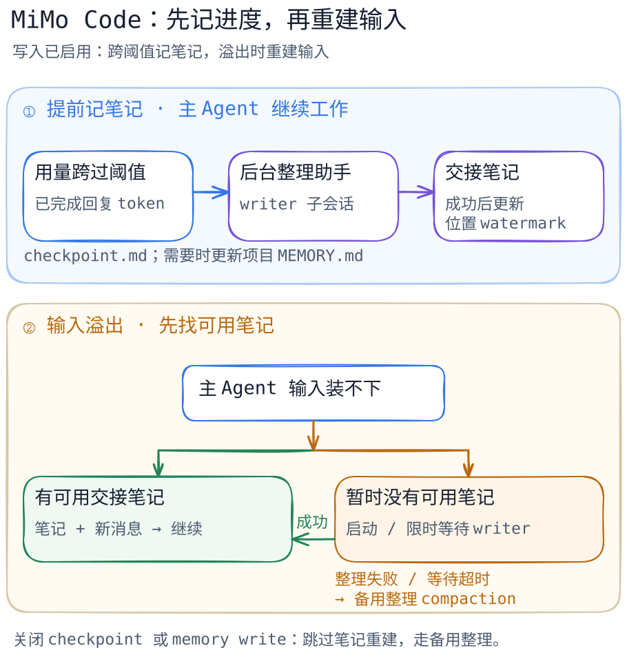

# MiMo Code：把长会话切成可恢复的窗口

[关键代码导读](code-walkthrough.md) · [来源与版本](../../../sources/mimo-code.md)

一次长任务往往要读文件、修改、测试，再根据结果继续。模型每次能收到的材料有容量上限，这就是**上下文窗口**。MiMo Code 的做法是提前整理一份“交接笔记”，等窗口快满时，用笔记和最近的消息准备下一轮输入。读完这篇，你能把提前记笔记、换窗口、继续任务三件事串起来。

假设用户让 Agent 迁移一个模块。它已经改了几个文件，还要继续处理测试失败。主 Agent 负责推进任务，宿主另外安排一个 **writer（笔记整理者）**，把目标、进度、文件和下一步写进结构化文件。需要换窗口时，宿主把这些文件与最近的用户原话重新装成输入，主 Agent 接着做。

## 同一项任务，留下三种材料

| 材料 | 保存什么 | 用在什么时候 |
| --- | --- | --- |
| 原始会话 | 用户消息、模型回复与工具调用 | 回看历史、查找细节 |
| 交接笔记 | 会话的 `checkpoint.md`、项目的 `MEMORY.md`，以及任务与笔记 | 换窗口时整理当前进度 |
| 当前模型输入 | 重建材料和此后的新消息 | 下一次模型请求；每段都有容量预算 |

`checkpoint.md` 位于会话内存目录，模板规定 11 节，包括原话意图、下一动作、任务树、当前工作、文件、错误与决策；项目记忆另存 `MEMORY.md`。这两个文件的生命周期不同，`notes.md` 则是主 Agent 可写的零散入口。[路径](https://github.com/XiaomiMiMo/MiMo-Code/blob/a273d3450ee05ba5163320eae59d7716b778e480/packages/opencode/src/session/checkpoint-paths.ts#L10-L84) · [模板](https://github.com/XiaomiMiMo/MiMo-Code/blob/a273d3450ee05ba5163320eae59d7716b778e480/packages/opencode/src/session/checkpoint-templates.ts#L1-L100) · [主 Agent 指令](https://github.com/XiaomiMiMo/MiMo-Code/blob/a273d3450ee05ba5163320eae59d7716b778e480/packages/opencode/src/session/llm.ts#L116-L205)。

## 先记笔记，再换窗口

[图的文字说明](../../../figures/mimo-code/README.md) · [单独打开 SVG 放大阅读](../../../figures/mimo-code/diagram.svg)。图中的实线跟着主 Agent 的代码路径。宿主做两次判断：**材料用到预设比例，就安排 writer；容量快装不下时，再换窗口。** token 是模型计算输入长度的单位。writer 在后台整理，主任务可以继续。[循环入口](https://github.com/XiaomiMiMo/MiMo-Code/blob/a273d3450ee05ba5163320eae59d7716b778e480/packages/opencode/src/session/prompt.ts#L4815-L4889) · [阈值调度](https://github.com/XiaomiMiMo/MiMo-Code/blob/a273d3450ee05ba5163320eae59d7716b778e480/packages/opencode/src/session/prune.ts#L238-L425)。

官方文章用约 **20%、45%、70%** 说明“尽早提取”的思路；此提交的*默认实现*按窗口大小选梯度：25K–200K 为 20/40/60/80%，200K–500K 为 10% 至 90% 每 10% 一档，更大窗口每 5% 一档；小于 25K 无默认 checkpoint 阈值。配置还可覆盖阈值。这里按固定代码的默认值理解；配置可覆盖这些值，文章中的数字用于解释思路。[源码默认值](https://github.com/XiaomiMiMo/MiMo-Code/blob/a273d3450ee05ba5163320eae59d7716b778e480/packages/opencode/src/session/prune.ts#L24-L58) · [官方文章](https://mimo.xiaomi.com/blog/mimo-code-long-horizon)。

## 宿主怎样把进度交给下一轮

**给整理过的历史标一个位置。** writer 在独立的 child session（子会话）工作，写的是主会话的 checkpoint 文件。启动时，宿主记下这次整理到哪条消息；writer 成功后，才推进 `last_checkpoint_message_id`。这个位置标记叫 watermark，可以理解为“已确认整理到这里”。[子会话及目标路径](https://github.com/XiaomiMiMo/MiMo-Code/blob/a273d3450ee05ba5163320eae59d7716b778e480/packages/opencode/src/session/checkpoint.ts#L943-L993) · [成功后推进](https://github.com/XiaomiMiMo/MiMo-Code/blob/a273d3450ee05ba5163320eae59d7716b778e480/packages/opencode/src/session/checkpoint.ts#L1009-L1068)。要检查一份笔记是否可用，需要同时看文件和位置标记：writer 中途失败时，文件可能已经变了，标记却还停在上次成功的位置。这两处更新没有统一的原子提交，出错后的恢复需要另做试验。

**把交接材料装成下一轮输入。** `rebuildEnsuringCheckpoint` 先检查 checkpoint 和记忆写入开关。开关开启时，优先使用已有的可用笔记；暂时没有，就启动 writer 并限时等待。准备好后，`insertRebuildBoundary` 写入一条特殊用户消息，按各自预算装入任务、checkpoint、最近用户原话、项目与全局记忆、笔记、索引和最近活动。下一轮从这条消息开始读取；旧消息仍保存在会话存储里。[重建决策](https://github.com/XiaomiMiMo/MiMo-Code/blob/a273d3450ee05ba5163320eae59d7716b778e480/packages/opencode/src/session/prompt.ts#L844-L1055) · [材料装配](https://github.com/XiaomiMiMo/MiMo-Code/blob/a273d3450ee05ba5163320eae59d7716b778e480/packages/opencode/src/session/checkpoint.ts#L1252-L1595) · [边界写入](https://github.com/XiaomiMiMo/MiMo-Code/blob/a273d3450ee05ba5163320eae59d7716b778e480/packages/opencode/src/session/checkpoint.ts#L1644-L1720) · [模型侧投影](https://github.com/XiaomiMiMo/MiMo-Code/blob/a273d3450ee05ba5163320eae59d7716b778e480/packages/opencode/src/session/message-v2.ts#L1270-L1294)。

**准备材料失败时，怎样继续。** writer 失败后，成功位置标记保留上次的值，文件则需要读回检查，可能已经留下部分修改。输入窗口装不下时，程序按配置和可用笔记选择重建；满足备用分支条件时，会走 compaction，也就是从新边界整理模型输入，这样可能省略较早的内容。具体开关和重试条件放在[可选代码导读](code-walkthrough.md)，那里也解释了已有笔记却插入失败时的处理。[writer 失败](https://github.com/XiaomiMiMo/MiMo-Code/blob/a273d3450ee05ba5163320eae59d7716b778e480/packages/opencode/src/session/checkpoint.ts#L1010-L1068) · [最后阈值](https://github.com/XiaomiMiMo/MiMo-Code/blob/a273d3450ee05ba5163320eae59d7716b778e480/packages/opencode/src/session/prune.ts#L350-L416) · [溢出分支](https://github.com/XiaomiMiMo/MiMo-Code/blob/a273d3450ee05ba5163320eae59d7716b778e480/packages/opencode/src/session/prompt.ts#L4871-L4941)。

## 与 Pi、Codex 放在同一把尺上

比较维度限定为**长会话的状态接力与错误边界**，不比较模型能力或成败率。MiMo Code 在固定提交里给主 Agent 安排独立 writer、结构化文件、成功 watermark 与窗口重建；额外模型调用、写盘、等待和验证成本换来更明确的接力点。Pi 的已写剖面显示，它的 `pi-agent-core` 只管理运行循环，coding-agent 另外持久化会话树、在需要时压缩或恢复；因此 MiMo 的 writer 生命周期属于更厚的 harness 策略，而非 Agent loop 的必需部分。[Pi 剖面](../pi/README.md) · [Pi 代码导读](../pi/code-walkthrough.md)。Codex 现有剖面聚焦 `exec_command` 的策略、审批与沙箱重试，研究的是执行控制；长会话接力需另查 Codex 的对应实现。[Codex 剖面](../codex/README.md)。

这种设计把一部分工作从主 Agent 移给了笔记整理者，也增加了模型调用、写盘和检查成本。重建材料保留最近的用户原话，便于对照摘要；遗漏的旧细节还可以通过历史检索补找。笔记是否准确、Agent 是否会主动补查，要通过具体任务来测。[官方设计说明](https://mimo.xiaomi.com/blog/mimo-code-long-horizon) · [重建材料](https://github.com/XiaomiMiMo/MiMo-Code/blob/a273d3450ee05ba5163320eae59d7716b778e480/packages/opencode/src/session/checkpoint.ts#L1362-L1515)。

## 核验范围与待审

> 固定版本：[`XiaomiMiMo/MiMo-Code@a273d3450ee05ba5163320eae59d7716b778e480`](https://github.com/XiaomiMiMo/MiMo-Code/tree/a273d3450ee05ba5163320eae59d7716b778e480)，2026-09-23 获取并静态阅读；仓库根目录 [`LICENSE`](https://github.com/XiaomiMiMo/MiMo-Code/blob/a273d3450ee05ba5163320eae59d7716b778e480/LICENSE) 为 MIT，包含 MiMo Code 与 OpenCode 版权行。本篇未运行该提交的长会话。官方[设计文章](https://mimo.xiaomi.com/blog/mimo-code-long-horizon)与[会话文档](https://mimo.xiaomi.com/mimocode/sessions)是会更新的文档声明，若与固定版代码不同，以本篇所列代码为准。

本稿完成固定 SHA 的**静态调用链阅读**及图源本地导出检查。2026-09-24 又以 Bun 1.3.5 复跑消息起点对齐纯函数的 7 项测试，全部通过；[来源记录](../../../sources/mimo-code.md)列明了命令与覆盖范围。没有启动 writer、数据库、真实 provider 或完整重建循环，也未进行长期任务与进程中断实验；这 7 项通过不能证明长会话恢复可靠。文章中的长任务性能、Max Mode、Goal 和 Dynamic Workflow 不在本篇调用链内，厂商数字未独立复现；设计文章还明确称受约束命令式工具调用格式尚未迁入。本次在 2026-10-05 重查了 writer 子会话、位置标记和默认阈值；跨窗口恢复、writer 失败和进程中断仍需运行验证。公开发布前还需逐项复核许可及第三方内容。

自测：① 为什么 `checkpoint.md` 存在仍可能无法用于重建？② writer 写失败后为何不能前移 watermark？③ 主 Agent 的原始消息留在存储里，为什么下一轮模型仍可能看不到？
