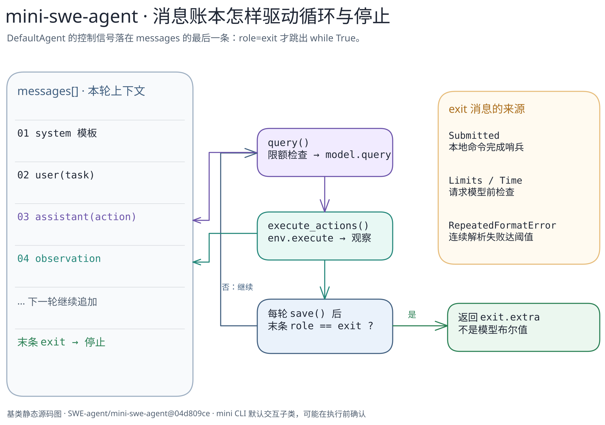

# mini-swe-agent：最小循环的停止契约

> 固定官方仓库 [`SWE-agent/mini-swe-agent@04d809ceab9df28f9adaed044884180159172930`](https://github.com/SWE-agent/mini-swe-agent/tree/04d809ceab9df28f9adaed044884180159172930)。本篇聚焦 `DefaultAgent` 与 `LocalEnvironment` 的一条基类路径；只做静态源码核对，未启动模型或执行命令。

[文字版](../../../figures/mini-swe-loop/README.md) · [可编辑图源](../../../figures/mini-swe-loop/scene.excalidraw) · [关键代码导读](code-walkthrough.md)

## 核心设计

`DefaultAgent.run()` 先向 `self.messages` 加入 system 与 user 任务消息，再不断调用 `step()`。`step()` 几乎就是 `execute_actions(query())`：`query()` 把当前消息列表送给模型并追加 assistant 消息；`execute_actions()` 取 `message.extra.actions` 交给环境执行，再追加格式化的观察消息。每轮 `finally` 都调用 `save()`；若最后一条消息的 `role` 是 `exit`，循环停止并返回它的 `extra`。[run](https://github.com/SWE-agent/mini-swe-agent/blob/04d809ceab9df28f9adaed044884180159172930/src/minisweagent/agents/default.py#L88-L128) · [query / execute](https://github.com/SWE-agent/mini-swe-agent/blob/04d809ceab9df28f9adaed044884180159172930/src/minisweagent/agents/default.py#L130-L157)

因此，这个实现的停止契约是**消息尾部的 `exit` 角色**，并非模型直接返回一个布尔值。`LocalEnvironment` 执行命令后，仅在首行输出恰为 `COMPLETE_TASK_AND_SUBMIT_FINAL_OUTPUT` 且返回码为 0 时抛出 `Submitted`，它携带的 `exit` 消息会被 `run()` 捕获并加入消息列表。[提交哨兵](https://github.com/SWE-agent/mini-swe-agent/blob/04d809ceab9df28f9adaed044884180159172930/src/minisweagent/environments/local.py#L24-L56) · [异常变消息](https://github.com/SWE-agent/mini-swe-agent/blob/04d809ceab9df28f9adaed044884180159172930/src/minisweagent/agents/default.py#L100-L124)

## 停止不只一种

- `query()` 在模型请求前检查 step、成本、墙钟限制；超限抛出携带 `exit` 消息的异常。[限制](https://github.com/SWE-agent/mini-swe-agent/blob/04d809ceab9df28f9adaed044884180159172930/src/minisweagent/agents/default.py#L130-L152)
- 模型输出格式错误并非立即结束：`run()` 把反馈消息加入列表、增加连续错误次数；达到配置阈值时写入 `RepeatedFormatError` 的 `exit` 消息。[格式错误分支](https://github.com/SWE-agent/mini-swe-agent/blob/04d809ceab9df28f9adaed044884180159172930/src/minisweagent/agents/default.py#L100-L115) · [工具调用解析错误](https://github.com/SWE-agent/mini-swe-agent/blob/04d809ceab9df28f9adaed044884180159172930/src/minisweagent/models/utils/actions_toolcall.py#L30-L76)
- 一般未捕获异常也会加入 `exit` 消息，但随后**重新抛出**，不能把它说成正常返回。[异常分支](https://github.com/SWE-agent/mini-swe-agent/blob/04d809ceab9df28f9adaed044884180159172930/src/minisweagent/agents/default.py#L117-L124)

## 范围边界

本图只画 `DefaultAgent` 的最小核心。`mini` CLI 在此提交上默认选择 `InteractiveAgent`，它覆盖 `query()`、`execute_actions()` 等以支持 human / confirm / yolo 和完成确认；不能把基类图当作默认 CLI 的全部行为。[CLI 选择](https://github.com/SWE-agent/mini-swe-agent/blob/04d809ceab9df28f9adaed044884180159172930/src/minisweagent/run/mini.py#L94-L102) · [交互子类](https://github.com/SWE-agent/mini-swe-agent/blob/04d809ceab9df28f9adaed044884180159172930/src/minisweagent/agents/interactive.py#L24-L36) · [覆盖方法](https://github.com/SWE-agent/mini-swe-agent/blob/04d809ceab9df28f9adaed044884180159172930/src/minisweagent/agents/interactive.py#L58-L94)

`save()` 只有 `output_path` 非空才写轨迹文件；异常/中断的实际环境恢复、模型重试和命令安全边界均未实测。[保存条件](https://github.com/SWE-agent/mini-swe-agent/blob/04d809ceab9df28f9adaed044884180159172930/src/minisweagent/agents/default.py#L182-L190)
