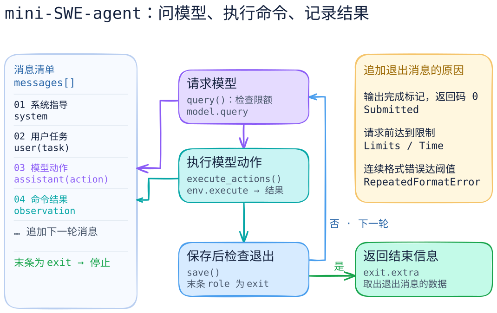

# mini-swe-agent：用一份消息清单串起工作

给助手一个代码任务，它先请求模型，按模型给出的命令执行，再把输出交给模型，继续下一轮。mini-swe-agent 把这条主线写得很短：任务、模型回复和命令结果都放在同一份消息清单里；循环就围绕这份清单工作。

> 固定官方仓库 [`SWE-agent/mini-swe-agent@04d809ceab9df28f9adaed044884180159172930`](https://github.com/SWE-agent/mini-swe-agent/tree/04d809ceab9df28f9adaed044884180159172930)。本篇聚焦 `DefaultAgent` 与 `LocalEnvironment` 的一条基类路径；只做静态源码核对，未启动模型或执行命令。

[文字版](../../../figures/mini-swe-loop/README.md) · [可编辑图源](../../../figures/mini-swe-loop/scene.excalidraw) · [关键代码导读](code-walkthrough.md)

## 每轮只做两件事

`DefaultAgent.run()` 先把系统指导和用户任务加入 `self.messages`。随后，每一轮 `step()` 做两件事：

1. **问模型。** `query()` 发送当前消息清单，并把模型回复（assistant 消息）加到末尾。
2. **执行动作。** `execute_actions()` 取出回复中的 `extra.actions`，交给执行环境，再把命令结果整理成观察消息，加入清单。

下一轮模型就能看到上一轮执行的结果。每轮收尾时，程序还会调用 `save()`，准备保存这次工作的记录。[循环](https://github.com/SWE-agent/mini-swe-agent/blob/04d809ceab9df28f9adaed044884180159172930/src/minisweagent/agents/default.py#L88-L128) · [请求模型与执行动作](https://github.com/SWE-agent/mini-swe-agent/blob/04d809ceab9df28f9adaed044884180159172930/src/minisweagent/agents/default.py#L130-L157)

## 程序怎样知道该结束了

循环检查清单的最后一条消息：角色是 `exit` 时，就停止并返回其中的 `extra`。正常提交是一种产生 `exit` 消息的方法。

在本地执行环境 `LocalEnvironment` 中，程序查看命令输出的第一行，忽略开头和行两端的空白。若这一行是 `COMPLETE_TASK_AND_SUBMIT_FINAL_OUTPUT`，且命令返回码为 0，就发出提交信号 `Submitted`。`run()` 接住它，把携带的 `exit` 消息放进清单，于是循环结束。[识别提交信号](https://github.com/SWE-agent/mini-swe-agent/blob/04d809ceab9df28f9adaed044884180159172930/src/minisweagent/environments/local.py#L24-L56) · [把信号加入清单](https://github.com/SWE-agent/mini-swe-agent/blob/04d809ceab9df28f9adaed044884180159172930/src/minisweagent/agents/default.py#L100-L124)

## 遇到限额或错误时怎样处理

- **超过限额。** 请求模型前检查轮数、成本和已经经过的时间；达到限额时，加入说明原因的 `exit` 消息。[限额检查](https://github.com/SWE-agent/mini-swe-agent/blob/04d809ceab9df28f9adaed044884180159172930/src/minisweagent/agents/default.py#L130-L152)
- **模型回复格式不对。** 先把错误反馈放进清单，让模型下轮有机会改正；连续错误达到设定次数时，以 `RepeatedFormatError` 结束。[加入反馈](https://github.com/SWE-agent/mini-swe-agent/blob/04d809ceab9df28f9adaed044884180159172930/src/minisweagent/agents/default.py#L100-L115) · [解析调用](https://github.com/SWE-agent/mini-swe-agent/blob/04d809ceab9df28f9adaed044884180159172930/src/minisweagent/models/utils/actions_toolcall.py#L30-L76)
- **其他未处理异常。** 先记录 `exit` 消息，再把异常抛给调用方，由外层程序处理。[异常处理](https://github.com/SWE-agent/mini-swe-agent/blob/04d809ceab9df28f9adaed044884180159172930/src/minisweagent/agents/default.py#L117-L124)

## 从核心到实际使用

本图画的是 `DefaultAgent` 核心。命令行界面（CLI）的 `mini` 在这个版本默认使用 `InteractiveAgent`：它在核心上增加人工输入、确认和自动运行等模式，以及完成确认。[命令行选择](https://github.com/SWE-agent/mini-swe-agent/blob/04d809ceab9df28f9adaed044884180159172930/src/minisweagent/run/mini.py#L94-L102) · [交互类](https://github.com/SWE-agent/mini-swe-agent/blob/04d809ceab9df28f9adaed044884180159172930/src/minisweagent/agents/interactive.py#L24-L36) · [交互处理](https://github.com/SWE-agent/mini-swe-agent/blob/04d809ceab9df28f9adaed044884180159172930/src/minisweagent/agents/interactive.py#L58-L94)

要把工作记录写到文件，还需设置非空的 `output_path`。[保存条件](https://github.com/SWE-agent/mini-swe-agent/blob/04d809ceab9df28f9adaed044884180159172930/src/minisweagent/agents/default.py#L182-L190) 阅读记录时，也要区分“程序以什么原因结束”和“代码改得是否正确”：后者仍要看测试与实际结果。本篇尚未运行模型或命令，恢复和权限行为需要另做实验。
