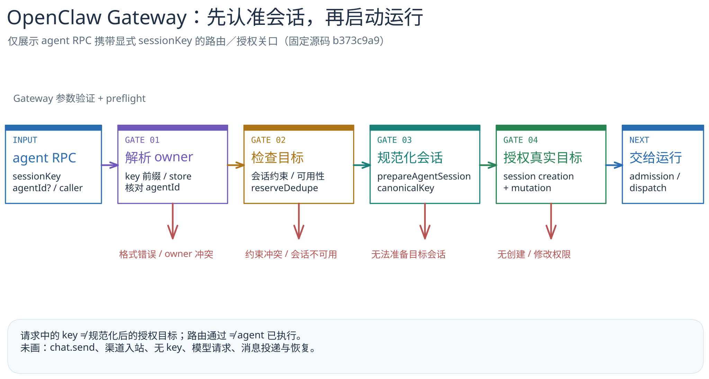

# OpenClaw：Gateway 怎样把一次 `agent` 请求交给正确会话？

[返回系统目录](../README.md) · [关键代码路径](code-walkthrough.md) · [图的文字版](../../../figures/openclaw-session-gates/README.md)

> 固定研究版本：官方 [`openclaw/openclaw@b373c9a9bcd4954ccdab963e3ed71336302b82be`](https://github.com/openclaw/openclaw/tree/b373c9a9bcd4954ccdab963e3ed71336302b82be)，核对日期 2026-09-23。本篇只看 Gateway `agent` RPC 携带**显式 `sessionKey`**时的所有者与会话授权路径；属于**源码静态阅读**，不是运行实测，更不是 Telegram、WhatsApp 等渠道入口的完整架构。

## 30 秒读懂

一次 `agent` RPC 不会仅凭传来的 `sessionKey` 立刻启动模型。Gateway 先验证参数并做 preflight；路由阶段从显式 key 和可选 `agentId` 确定会话所属 Agent，拒绝格式错误、未知 Agent 或两种身份不一致的请求。随后保留去重标识，准备规范化后的会话目标，并以这个**实际将被修改的会话**检查创建和成员权限。只有这些边界通过后，后续 admission/dispatch 才可能启动 agent run。[RPC 入口](https://github.com/openclaw/openclaw/blob/b373c9a9bcd4954ccdab963e3ed71336302b82be/src/gateway/server-methods/agent-run-handler.ts#L10-L51) · [路由](https://github.com/openclaw/openclaw/blob/b373c9a9bcd4954ccdab963e3ed71336302b82be/src/gateway/agent-turn/agent-request-routing.ts#L71-L105) · [规范化后授权](https://github.com/openclaw/openclaw/blob/b373c9a9bcd4954ccdab963e3ed71336302b82be/src/gateway/agent-turn/agent-turn-service.ts#L279-L334)

[可编辑图源](../../../figures/openclaw-session-gates/scene.excalidraw) · [PNG 预览](../../../figures/openclaw-session-gates/preview.png) · [不看图的说明](../../../figures/openclaw-session-gates/README.md)

## 为什么这个边界值得单独画

`agentId` 是请求给出的归属线索，`sessionKey` 可能带 Agent 前缀或对应持久化 store 的所有者；两者不总能简单“取一个就算”。`resolveRequestedSessionAgentId()` 明确检查 Agent 前缀与显式 `agentId` 是否冲突，也会拒绝属于 retired agent 的旧会话、未知所有者或无法唯一选择所有者的情况。[归属解析](https://github.com/openclaw/openclaw/blob/b373c9a9bcd4954ccdab963e3ed71336302b82be/src/gateway/session-request-agent.ts#L112-L207)

更关键的是，路由阶段的 `requestedSessionKey` 还不是授权判定的最终会话事实。`prepareAgentSession()` 得到 `canonicalKey` 与 `canonicalSessionAgentId` 后，Gateway 才对这个规范化结果做 session creation 与 mutation 授权；代码注释也明确指出无 key 请求的默认目标只有在这里才能确定。[规范化与授权](https://github.com/openclaw/openclaw/blob/b373c9a9bcd4954ccdab963e3ed71336302b82be/src/gateway/agent-turn/agent-turn-service.ts#L279-L334)

本图的工程判断是：把“请求中的会话名字”“内部归属身份”“最终授权目标”分成三步，降低把请求文本误当授权对象的风险。它不证明整个系统的访问控制没有漏洞，也不能推断所有渠道适配器使用同一条 RPC 路径。

## 边界与后续

本文不覆盖仅按 `sessionId` 寻址、无 key 请求、显式收件人 `channel + to`、`chat.send`，也不画 admission 等待、agent harness、模型执行、消息投递和恢复。它们在同一源码中有独立分支；把它们画成这个显式 key 主干的必然步骤会误导读者。[其他目标选择分支](https://github.com/openclaw/openclaw/blob/b373c9a9bcd4954ccdab963e3ed71336302b82be/src/gateway/agent-turn/agent-request-routing.ts#L107-L174) · [后续执行入口](https://github.com/openclaw/openclaw/blob/b373c9a9bcd4954ccdab963e3ed71336302b82be/src/gateway/agent-turn/agent-turn-service.ts#L557-L583)

下一步建议研究渠道入站的 `resolveAgentRoute()` 与 Gateway `agent` RPC 之间有哪些汇合/分叉，并单独核对 session lifecycle，而不是把这张局部路由图叫作 OpenClaw 全景。
