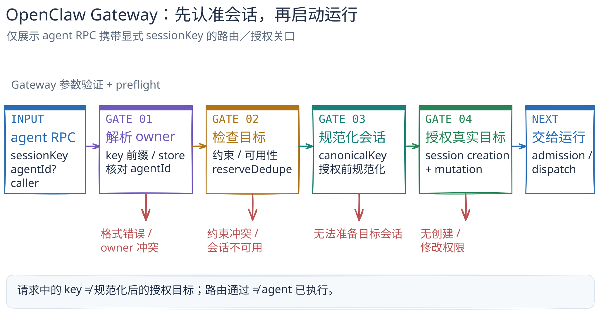

# OpenClaw：把请求送到正确的会话

[返回系统目录](../README.md) · [关键代码路径](code-walkthrough.md) · [图的文字版](../../../figures/openclaw-session-gates/README.md)

## 先确认：这次工作该接在哪段对话上

设想你有两个助手会话，一个维护项目，另一个整理资料。发来一条新任务时，系统要先找到指定的会话，再确认调用者可以在那里开始工作。

OpenClaw 的请求网关（Gateway）处理这项接线工作。本文跟着一次 `agent` RPC（远程调用请求）走：`sessionKey` 是请求给出的会话标识，`agentId` 是可选的助手标识。

正常路径有四步：检查参数和开始前条件；确定会话属于哪个助手；准备系统最终要操作的会话；检查创建或修改权限。通过后，再交给后面的运行调度。模型执行前先完成这些检查，才能把工作送到正确位置。[RPC 入口](https://github.com/openclaw/openclaw/blob/b373c9a9bcd4954ccdab963e3ed71336302b82be/src/gateway/server-methods/agent-run-handler.ts#L10-L51) · [路由](https://github.com/openclaw/openclaw/blob/b373c9a9bcd4954ccdab963e3ed71336302b82be/src/gateway/agent-turn/agent-request-routing.ts#L71-L105) · [规范化后授权](https://github.com/openclaw/openclaw/blob/b373c9a9bcd4954ccdab963e3ed71336302b82be/src/gateway/agent-turn/agent-turn-service.ts#L279-L334)

[可编辑图源](../../../figures/openclaw-session-gates/scene.excalidraw) · [PNG 预览](../../../figures/openclaw-session-gates/preview.png) · [不看图的说明](../../../figures/openclaw-session-gates/README.md)

## 先找到会话归属

请求可能同时给出 `agentId` 和带助手前缀的 `sessionKey`，也可能只给一个不带前缀的会话名。`resolveRequestedSessionAgentId()` 对照这些信息与已保存的会话归属，确定由哪个助手接手。标识冲突、助手已退役或无法确定归属时，返回错误，要求修正请求。[归属解析](https://github.com/openclaw/openclaw/blob/b373c9a9bcd4954ccdab963e3ed71336302b82be/src/gateway/session-request-agent.ts#L112-L207)

## 再对最终目标检查权限

路由先选出 `requestedSessionKey`，随后 `prepareAgentSession()` 将它整理为内部使用的 `canonicalKey` 和 `canonicalSessionAgentId`。Gateway 以这个最终目标检查：调用者可以创建这段会话吗，可以修改它吗？代码注释还指出，省略 key 时的默认目标也要到这里才确定。本文仍只沿显式 key 的分支往下读。[规范化与授权](https://github.com/openclaw/openclaw/blob/b373c9a9bcd4954ccdab963e3ed71336302b82be/src/gateway/agent-turn/agent-turn-service.ts#L279-L334)

可以记住一个顺序：**先找归属，再确定实际目标，最后对这个目标授权。** 它让请求中的会话名字和执行时的权限检查接起来。这是这条路径能提供的设计启发，整个系统的权限效果还需要按实际配置测试。

## 边界与后续

接下来可以分别研究其他入口：按 `sessionId` 寻址、省略 key、指定收件人 `channel + to`，以及 `chat.send`。后面的接纳等待、运行外壳、模型执行、消息投递和恢复也各有分支，本篇先到运行调度的交接处为止。[其他目标选择分支](https://github.com/openclaw/openclaw/blob/b373c9a9bcd4954ccdab963e3ed71336302b82be/src/gateway/agent-turn/agent-request-routing.ts#L107-L174) · [后续执行入口](https://github.com/openclaw/openclaw/blob/b373c9a9bcd4954ccdab963e3ed71336302b82be/src/gateway/agent-turn/agent-turn-service.ts#L557-L583)

想了解渠道消息如何接进来，可从 `resolveAgentRoute()` 继续找它与 Gateway 请求的连接位置，再读会话的创建、继续和结束流程。本篇没有启动 Gateway 或测试各渠道；图展示的是其中一条会话路由。

## 版本与检查范围

> 固定研究版本：官方 [`openclaw/openclaw@b373c9a9bcd4954ccdab963e3ed71336302b82be`](https://github.com/openclaw/openclaw/tree/b373c9a9bcd4954ccdab963e3ed71336302b82be)，核对日期 2026-09-23。本篇只看 Gateway `agent` RPC 携带**显式 `sessionKey`**时的所有者与会话授权路径；属于**源码静态阅读**，不是运行实测，更不是 Telegram、WhatsApp 等渠道入口的完整架构。
