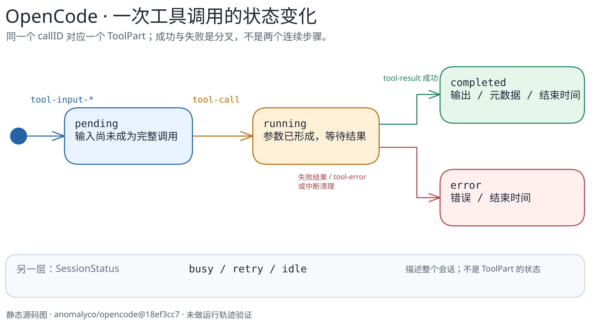

# OpenCode：工具调用为何有自己的状态？

> 源码范围：官方仓库 [`anomalyco/opencode@18ef3cc7c5a25b82114c953a80ccc09f4988f74e`](https://github.com/anomalyco/opencode/tree/18ef3cc7c5a25b82114c953a80ccc09f4988f74e)，仅核对本页涉及的 `packages/opencode/src/session` 路径。本文是静态源码阅读，不是运行实测。

[图的文字版](../../../figures/opencode-tool-state/README.md) · [可编辑图源](../../../figures/opencode-tool-state/scene.excalidraw) · [关键代码导读](code-walkthrough.md)

## 核心问题

Agent 的一次工具调用并非只有“模型要求调用”和“工具返回”两个瞬间。OpenCode 在 assistant message 下维护 `ToolPart`：输入相关流事件可先建立 `pending`；收到完整 `tool-call` 时转为 `running`；工具结果成功或失败后分别成为 `completed` 或 `error`。清理阶段也会把仍未收束的调用记为 `error`。[创建](https://github.com/anomalyco/opencode/blob/18ef3cc7c5a25b82114c953a80ccc09f4988f74e/packages/opencode/src/session/processor.ts#L216-L253) · [运行](https://github.com/anomalyco/opencode/blob/18ef3cc7c5a25b82114c953a80ccc09f4988f74e/packages/opencode/src/session/processor.ts#L331-L354) · [收束](https://github.com/anomalyco/opencode/blob/18ef3cc7c5a25b82114c953a80ccc09f4988f74e/packages/opencode/src/session/processor.ts#L160-L204) · [清理](https://github.com/anomalyco/opencode/blob/18ef3cc7c5a25b82114c953a80ccc09f4988f74e/packages/opencode/src/session/processor.ts#L585-L610)

这给阅读运行轨迹提供了一个比“Agent 正在忙”更细的单位：每个工具调用通过 `callID` 对应一个 part，并保留输入、输出或错误与起止时间。它和 Session 层的 `busy / retry / idle` 是两个不同的观察层，后者由 `SessionStatus` 发布状态事件。[ToolPart 状态](https://github.com/anomalyco/opencode/blob/18ef3cc7c5a25b82114c953a80ccc09f4988f74e/packages/opencode/src/session/processor.ts#L236-L251) · [SessionStatus](https://github.com/anomalyco/opencode/blob/18ef3cc7c5a25b82114c953a80ccc09f4988f74e/packages/opencode/src/session/status.ts#L30-L48)

## 一次执行如何接上这条状态机

`SessionPrompt.prompt()` 记录用户消息后进入 `loop()`；`runLoop()` 读取会话消息、选择 agent/model、解析可用工具，再把消息与工具交给 `SessionProcessor.process()`。[入口](https://github.com/anomalyco/opencode/blob/18ef3cc7c5a25b82114c953a80ccc09f4988f74e/packages/opencode/src/session/prompt.ts#L1042-L1070) · [循环](https://github.com/anomalyco/opencode/blob/18ef3cc7c5a25b82114c953a80ccc09f4988f74e/packages/opencode/src/session/prompt.ts#L1081-L1132) · [处理器调用](https://github.com/anomalyco/opencode/blob/18ef3cc7c5a25b82114c953a80ccc09f4988f74e/packages/opencode/src/session/prompt.ts#L1221-L1286)

`SessionTools.resolve()` 组装工具；在工具执行包装层，`tool.execute.before` 插件钩子、真实 `item.execute`、`tool.execute.after` 按此顺序出现。工具执行结果随后作为流事件进入处理器的 `tool-result` 分支，收束 `ToolPart`。这个描述限于已读到的工具注册与处理器代码，不代表所有 provider 都以完全相同的事件时序实现。[工具包装](https://github.com/anomalyco/opencode/blob/18ef3cc7c5a25b82114c953a80ccc09f4988f74e/packages/opencode/src/session/tools.ts#L92-L132) · [结果事件](https://github.com/anomalyco/opencode/blob/18ef3cc7c5a25b82114c953a80ccc09f4988f74e/packages/opencode/src/session/processor.ts#L383-L419)

## 这篇没有证明什么

- 没有启动 OpenCode、抓取真实事件日志或做中断/重试故障注入；图中状态转换是代码分支，不是实测轨迹。
- 没有审计所有 provider、MCP 工具和插件实现；不推断所有调用都必经相同细节。
- 本图不讲持久化数据库、上下文压缩、子 Agent 或完整插件/Skill 体系；它们需要独立章节及证据。

下一步宜以一次真实工具调用的事件日志核对 `pending → running → completed/error` 的可见顺序，再单独绘制会话级 `busy/retry/idle` 与调用级状态的关系。
