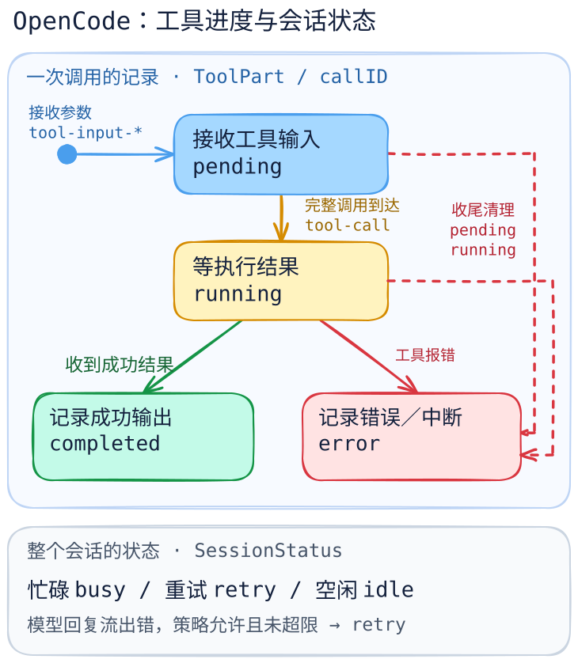

# OpenCode：给每次工具调用记进度

假设助手正在读取一个文件。界面上只显示“正在忙”，你很难知道它是在接收工具参数、等待执行，还是已经拿到了结果。OpenCode 为每次工具调用单独记进度，用四个状态描述它正在做什么。

> 源码范围：官方仓库 [`anomalyco/opencode@18ef3cc7c5a25b82114c953a80ccc09f4988f74e`](https://github.com/anomalyco/opencode/tree/18ef3cc7c5a25b82114c953a80ccc09f4988f74e)，仅核对本页涉及的 `packages/opencode/src/session` 路径。本文是静态源码阅读，不是运行实测。

[图的文字版](../../../figures/opencode-tool-state/README.md) · [可编辑图源](../../../figures/opencode-tool-state/scene.excalidraw) · [关键代码导读](code-walkthrough.md)

## 四个状态，描述一次调用的过程

OpenCode 把一条工具调用记在助手消息的 `ToolPart` 中，可以理解成“这次调用的进度记录”：

- `pending`：正在接收调用输入，先建立记录。
- `running`：已经收到完整工具调用，写入参数和开始时间。
- `completed`：正在运行的调用拿到了成功结果，记下输出和结束时间。
- `error`：正在运行的调用返回错误；或者结束清理时，这次调用仍未完成，被标记为中断。

每次结果都按调用编号 `callID` 找到对应记录，再更新它的状态。[建立记录](https://github.com/anomalyco/opencode/blob/18ef3cc7c5a25b82114c953a80ccc09f4988f74e/packages/opencode/src/session/processor.ts#L216-L253) · [记录运行](https://github.com/anomalyco/opencode/blob/18ef3cc7c5a25b82114c953a80ccc09f4988f74e/packages/opencode/src/session/processor.ts#L331-L354) · [写入结果](https://github.com/anomalyco/opencode/blob/18ef3cc7c5a25b82114c953a80ccc09f4988f74e/packages/opencode/src/session/processor.ts#L160-L204) · [标记中断](https://github.com/anomalyco/opencode/blob/18ef3cc7c5a25b82114c953a80ccc09f4988f74e/packages/opencode/src/session/processor.ts#L585-L610)

这些记录保留输入、输出或错误，以及起止时间，方便查看哪一次调用出了问题。整个会话另有 `busy / retry / idle`（忙碌、重试、空闲）状态，由 `SessionStatus` 管理：前者说的是单个工具，后者说的是整个会话。[ToolPart 内容](https://github.com/anomalyco/opencode/blob/18ef3cc7c5a25b82114c953a80ccc09f4988f74e/packages/opencode/src/session/processor.ts#L236-L251) · [会话状态](https://github.com/anomalyco/opencode/blob/18ef3cc7c5a25b82114c953a80ccc09f4988f74e/packages/opencode/src/session/status.ts#L30-L48)

## 从用户消息到工具结果

用户发来任务后，`SessionPrompt.prompt()` 保存消息并启动循环。`runLoop()` 取出会话消息，选好 Agent 和模型，准备可用工具，再交给 `SessionProcessor.process()` 处理模型逐步返回的内容。[接收输入](https://github.com/anomalyco/opencode/blob/18ef3cc7c5a25b82114c953a80ccc09f4988f74e/packages/opencode/src/session/prompt.ts#L1042-L1070) · [准备这一轮](https://github.com/anomalyco/opencode/blob/18ef3cc7c5a25b82114c953a80ccc09f4988f74e/packages/opencode/src/session/prompt.ts#L1081-L1132) · [交给处理器](https://github.com/anomalyco/opencode/blob/18ef3cc7c5a25b82114c953a80ccc09f4988f74e/packages/opencode/src/session/prompt.ts#L1221-L1286)

`SessionTools.resolve()` 给工具加上插件处理入口。正常执行时，先运行 `tool.execute.before`，再调用真正的工具 `item.execute`，最后运行 `tool.execute.after`。这类前后插入的处理函数叫“钩子”（hook）。处理器收到工具结果事件 `tool-result` 后，更新对应的 `ToolPart`。[工具与插件](https://github.com/anomalyco/opencode/blob/18ef3cc7c5a25b82114c953a80ccc09f4988f74e/packages/opencode/src/session/tools.ts#L92-L132) · [接收结果](https://github.com/anomalyco/opencode/blob/18ef3cc7c5a25b82114c953a80ccc09f4988f74e/packages/opencode/src/session/processor.ts#L383-L419)

## 看图时记住这一点

`running` 表示调用已被记录为正在运行。重复调用可能触发额外许可检查，权限拒绝或中断也可能让它进入错误路径。查看进度时，要连同对应的结果一起看。

这页依据固定版本的会话代码，尚未采集真实运行日志。不同模型服务和插件的细节需要另外核对。数据库、上下文压缩、子 Agent 与完整扩展体系不在这张图的范围内；下一篇先带你找到这四个状态的代码。
